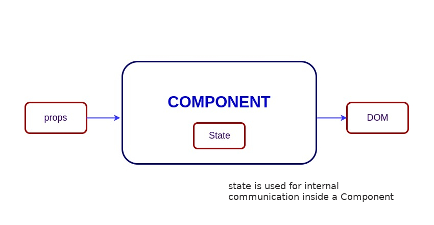
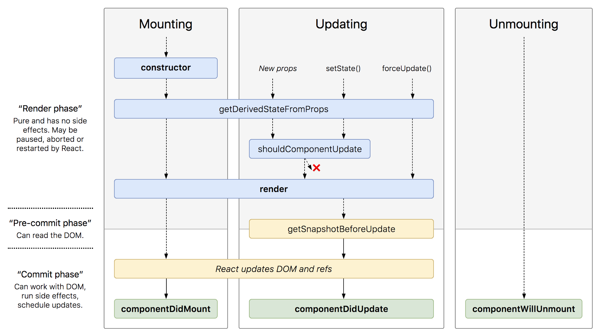
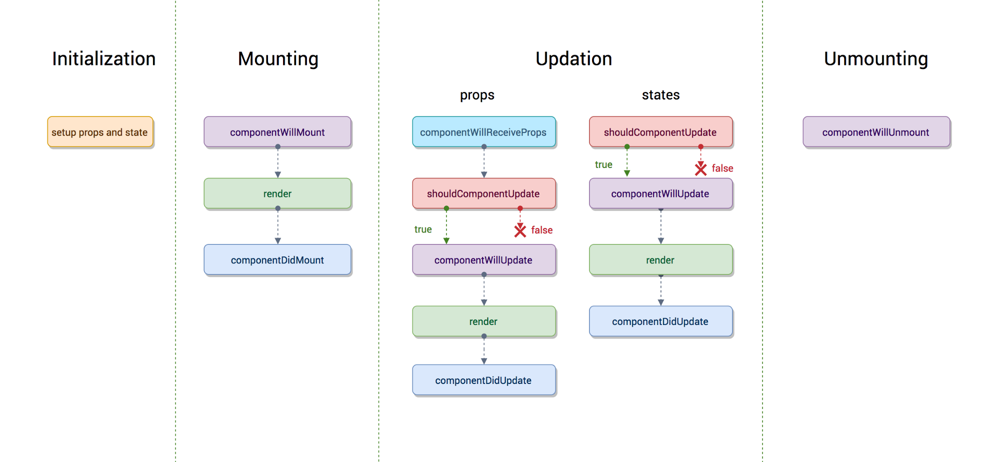

# React Interview Questions & Answers

> Click :star: if you like the project. Pull Requests are highly appreciated. Follow me [@SudheerJonna](https://twitter.com/SudheerJonna) for technical updates.

---

<div>
<p align="center">
  <a href="https://www.greatfrontend.com/questions/react-interview-questions?utm_source=github&utm_medium=referral&utm_campaign=sudheerj-react&fpr=sudheerj&gnrs=sudheerj">
    
  </a>
</p>
</div>

> Practice 280+ JavaScript coding interview questions in-browser. Built by ex-FAANG interviewers. No AI-generated fluff. No fake reviews. [Try GreatFrontEnd →](https://www.greatfrontend.com/questions/react-interview-questions?utm_source=github&utm_medium=referral&utm_campaign=sudheerj-react&fpr=sudheerj&gnrs=sudheerj) 💡

---

<div>
<p align="center">
  <a href="https://resumeloom.com/?ref=FZ818184">
    
  </a>
</p>
</div>

---

**Note:** This repository is specific to ReactJS. Please check [JavaScript Interview Questions](https://github.com/sudheerj/javascript-interview-questions) for core JavaScript questions and [Data Structures and Algorithms](https://github.com/sudheerj/datastructures-algorithms) for DSA-related questions or problems.

### Table of Contents

<details open>
<summary>
Hide/Show table of contents
</summary>

| No. | Questions                                                                                                                                                                                                                        |
| --- | -------------------------------------------------------------------------------------------------------------------------------------------------------------------------------------------------------------------------------- |
|     | **Core React**                                                                                                                                                                                                                   |
| 1   | [What is React?](#what-is-react)                                                                                                                                                                                                 |
| 2   | [What is the history behind React’s evolution?](#what-is-the-history-behind-react-evolution)                                                                                                                                      |
| 3   | [What are the major features of React?](#what-are-the-major-features-of-react)                                                                                                                                                   |
| 4   | [What is JSX?](#what-is-jsx)                                                                                                                                                                                                     |
| 5   | [What is the difference between an Element and a Component?](#what-is-the-difference-between-an-element-and-a-component)                                                                                                              |
| 6   | [How do you create components in React?](#how-to-create-components-in-react)                                                                                                                                                     |
| 7   | [When should you use a Class Component over a Function Component?](#when-to-use-a-class-component-over-a-function-component)                                                                                                    |
| 8   | [What are Pure Components?](#what-are-pure-components)                                                                                                                                                                           |
| 9   | [What is state in React?](#what-is-state-in-react)                                                                                                                                                                               |
| 10  | [What are props in React?](#what-are-props-in-react)                                                                                                                                                                             |
| 11  | [What is the difference between state and props?](#what-is-the-difference-between-state-and-props)                                                                                                                               |
| 12  | [What is the difference between HTML and React event handling?](#what-is-the-difference-between-html-and-react-event-handling)                                                                                                   |
| 13  | [What are synthetic events in React?](#what-are-synthetic-events-in-react)                                                                                                                                                       |
| 14  | [What are inline conditional expressions?](#what-are-inline-conditional-expressions)                                                                                                                                             |
| 15  | [What is the "key" prop and what is its benefit when used in arrays of elements?](#what-is-key-prop-and-what-is-the-benefit-of-using-it-in-arrays-of-elements)                                                                    |
| 16  | [What is the Virtual DOM?](#what-is-virtual-dom)                                                                                                                                                                                 |
| 17  | [How does the Virtual DOM work?](#how-virtual-dom-works)                                                                                                                                                                         |
| 18  | [What is the difference between Shadow DOM and Virtual DOM?](#what-is-the-difference-between-shadow-dom-and-virtual-dom)                                                                                                         |
| 19  | [What is React Fiber?](#what-is-react-fiber)                                                                                                                                                                                     |
| 20  | [What is the main goal of React Fiber?](#what-is-the-main-goal-of-react-fiber)                                                                                                                                                   |
| 21  | [What are controlled components?](#what-are-controlled-components)                                                                                                                                                               |
| 22  | [What are uncontrolled components?](#what-are-uncontrolled-components)                                                                                                                                                           |
| 23  | [What is the difference between createElement and cloneElement?](#what-is-the-difference-between-createelement-and-cloneelement)                                                                                                 |
| 24  | [What is Lifting State Up in React?](#what-is-lifting-state-up-in-react)                                                                                                                                                         |
| 25  | [What are Higher-Order Components?](#what-are-higher-order-components)                                                                                                                                                           |
| 26  | [What is the children prop?](#what-is-children-prop)                                                                                                                                                                             |
| 27  | [How do you write comments in React?](#how-to-write-comments-in-react)                                                                                                                                                           |
| 28  | [What is reconciliation?](#what-is-reconciliation)                                                                                                                                                                               |
| 29  | [Does the lazy function support named exports?](#does-the-lazy-function-support-named-exports)                                                                                                                                   |
| 30  | [Why does React use className instead of the class attribute?](#why-react-uses-classname-over-class-attribute)                                                                                                                   |
| 31  | [What are Fragments?](#what-are-fragments)                                                                                                                                                                                       |
| 32  | [Why are Fragments better than container divs?](#why-fragments-are-better-than-container-divs)                                                                                                                                   |
| 33  | [What are portals in React?](#what-are-portals-in-react)                                                                                                                                                                         |
| 34  | [What are stateless components?](#what-are-stateless-components)                                                                                                                                                                 |
| 35  | [What are stateful components?](#what-are-stateful-components)                                                                                                                                                                   |
| 36  | [How do you apply validation to props in React?](#how-to-apply-validation-on-props-in-react)                                                                                                                                     |
| 37  | [What are the advantages of React?](#what-are-the-advantages-of-react)                                                                                                                                                           |
| 38  | [What are the limitations of React?](#what-are-the-limitations-of-react)                                                                                                                                                         |
| 39  | [What are the recommended ways for static type checking?](#what-are-the-recommended-ways-for-static-type-checking)                                                                                                               |
| 40  | [What is the use of the react-dom package?](#what-is-the-use-of-react-dom-package)                                                                                                                                               |
| 41  | [What is ReactDOMServer?](#what-is-reactdomserver)                                                                                                                                                                               |
| 42  | [How do you use innerHTML in React?](#how-to-use-innerhtml-in-react)                                                                                                                                                             |
| 43  | [How do you apply styles in React?](#how-to-use-styles-in-react)                                                                                                                                                                 |
| 44  | [How are events different in React?](#how-events-are-different-in-react)                                                                                                                                                         |
| 45  | [What is the impact of using indexes as keys?](#what-is-the-impact-of-indexes-as-keys)                                                                                                                                          |
| 46  | [How do you conditionally render components?](#how-do-you-conditionally-render-components)                                                                                                                                       |
| 47  | [Why do we need to be careful when spreading props on DOM elements?](#why-we-need-to-be-careful-when-spreading-props-on-dom-elements)                                                                                             |
| 48  | [How do you memoize a component?](#how-do-you-memoize-a-component)                                                                                                                                                               |
| 49  | [How do you implement Server-Side Rendering (SSR)?](#how-you-implement-server-side-rendering-or-ssr)                                                                                                                              |
| 50  | [How do you enable production mode in React?](#how-to-enable-production-mode-in-react)                                                                                                                                           |
| 51  | [Do Hooks replace render props and higher-order components?](#do-hooks-replace-render-props-and-higher-order-components)                                                                                                         |
| 52  | [What is a switching component?](#what-is-a-switching-component)                                                                                                                                                                 |
| 53  | [What are React Mixins?](#what-are-react-mixins)                                                                                                                                                                                 |
| 54  | [What are the pointer events supported in React?](#what-are-the-pointer-events-supported-in-react)                                                                                                                               |
| 55  | [Why should component names start with a capital letter?](#why-should-component-names-start-with-capital-letter)                                                                                                                  |
| 56  | [Are custom DOM attributes supported in React v16?](#are-custom-dom-attributes-supported-in-react-v16)                                                                                                                           |
| 57  | [How do you loop inside JSX?](#how-to-loop-inside-jsx)                                                                                                                                                                           |
| 58  | [How do you access props within attribute quotes?](#how-do-you-access-props-in-attribute-quotes)                                                                                                                                 |
| 59  | [What is a React PropType array with shape?](#what-is-react-proptype-array-with-shape)                                                                                                                                           |
| 60  | [How do you conditionally apply class attributes?](#how-to-conditionally-apply-class-attributes)                                                                                                                                 |
| 61  | [What is the difference between React and ReactDOM?](#what-is-the-difference-between-react-and-reactdom)                                                                                                                         |
| 62  | [Why is ReactDOM separated from React?](#why-reactdom-is-separated-from-react)                                                                                                                                                   |
| 63  | [How do you use the React label element?](#how-to-use-react-label-element)                                                                                                                                                       |
| 64  | [How do you combine multiple inline style objects?](#how-to-combine-multiple-inline-style-objects)                                                                                                                               |
| 65  | [How do you re-render the view when the browser is resized?](#how-to-re-render-the-view-when-the-browser-is-resized)                                                                                                             |
| 66  | [How do you pretty-print JSON with React?](#how-to-pretty-print-json-with-react)                                                                                                                                                 |
| 67  | [Why can’t you update props in React?](#why-you-cant-update-props-in-react)                                                                                                                                                      |
| 68  | [How do you focus an input element on page load?](#how-to-focus-an-input-element-on-page-load)                                                                                                                                   |
| 69  | [How can you find the version of React at runtime in the browser?](#how-can-we-find-the-version-of-react-at-runtime-in-the-browser)                                                                                              |
| 70  | [How do you add Google Analytics for React Router?](#how-to-add-google-analytics-for-react-router)                                                                                                                               |
| 71  | [How do you apply vendor prefixes to inline styles in React?](#how-do-you-apply-vendor-prefixes-to-inline-styles-in-react)                                                                                                       |
| 72  | [How do you import and export components using React and ES6?](#how-to-import-and-export-components-using-react-and-es6)                                                                                                         |
| 73  | [What are the exceptions to React component naming?](#what-are-the-exceptions-on-react-component-naming)                                                                                                                         |
| 74  | [Is it possible to use async/await in plain React?](#is-it-possible-to-use-asyncawait-in-plain-react)                                                                                                                            |
| 75  | [What are common folder structures for React?](#what-are-the-common-folder-structures-for-react)                                                                                                                                 |
| 76  | [What are popular packages for animation?](#what-are-the-popular-packages-for-animation)                                                                                                                                         |
| 77  | [What are the benefits of style modules?](#what-is-the-benefit-of-styles-modules)                                                                                                                                                |
| 78  | [What are popular React-specific linters?](#what-are-the-popular-react-specific-linters)                                                                                                                                         |
|     | **React Router**                                                                                                                                                                                                                 |
| 79  | [What is React Router?](#what-is-react-router)                                                                                                                                                                                   |
| 80  | [How is React Router different from the history library?](#how-react-router-is-different-from-history-library)                                                                                                                   |
| 81  | [What are the <Router> components of React Router v6?](#what-are-the-router-components-of-react-router-v6)                                                                                                                       |
| 82  | [What is the purpose of the push and replace methods of history?](#what-is-the-purpose-of-push-and-replace-methods-of-history)                                                                                                   |
| 83  | [How do you programmatically navigate using React Router v4?](#how-do-you-programmatically-navigate-using-react-router-v4)                                                                                                       |
| 84  | [How do you get query parameters in React Router v4?](#how-to-get-query-parameters-in-react-router-v4)                                                                                                                           |
| 85  | [Why do you get a "Router may have only one child element" warning?](#why-you-get-router-may-have-only-one-child-element-warning)                                                                                                |
| 86  | [How do you pass params to the history.push method in React Router v4?](#how-to-pass-params-to-historypush-method-in-react-router-v4)                                                                                            |
| 87  | [How do you implement a default or NotFound page?](#how-to-implement-default-or-notfound-page)                                                                                                                                   |
| 88  | [How do you get history in React Router v4?](#how-to-get-history-on-react-router-v4)                                                                                                                                             |
| 89  | [How do you perform an automatic redirect after login?](#how-to-perform-automatic-redirect-after-login)
|     | **React Internationalization**                                                                                                                                                                                                   |
| 90  | [What is React Intl?](#what-is-react-intl)                                                                                                                                                                                       |
| 91  | [What are the main features of React Intl?](#what-are-the-main-features-of-react-intl)                                                                                                                                           |
| 92  | [What are the two ways of formatting in React Intl?](#what-are-the-two-ways-of-formatting-in-react-intl)                                                                                                                         |
| 93  | [How do you use FormattedMessage as a placeholder with React Intl?](#how-to-use-formattedmessage-as-placeholder-using-react-intl)                                                                                                |
| 94  | [How do you access the current locale with React Intl?](#how-to-access-current-locale-with-react-intl)                                                                                                                           |
| 95  | [How do you format a date using React Intl?](#how-to-format-date-using-react-intl)                                                                                                                                               |
|     | **React Testing**                                                                                                                                                                                                                |
| 96  | [What is the Shallow Renderer in React testing?](#what-is-shallow-renderer-in-react-testing)                                                                                                                                     |
| 97  | [What is the TestRenderer package in React?](#what-is-testrenderer-package-in-react)                                                                                                                                             |
| 98  | [What is the purpose of the ReactTestUtils package?](#what-is-the-purpose-of-reacttestutils-package)                                                                                                                             |
| 99  | [What is Jest?](#what-is-jest)                                                                                                                                                                                                   |
| 100 | [What are the advantages of Jest over Jasmine?](#what-are-the-advantages-of-jest-over-jasmine)                                                                                                                                   |
| 101 | [Can you give a simple example of a Jest test case?](#can-you-give-a-simple-example-of-a-jest-test-case)                                                                                                                                   |
|     | **React Redux**                                                                                                                                                                                                                  |
| 102 | [What is Flux?](#what-is-flux)                                                                                                                                                                                                   |
| 103 | [What is Redux?](#what-is-redux)                                                                                                                                                                                                 |
| 104 | [What are the core principles of Redux?](#what-are-the-core-principles-of-redux)                                                                                                                                                 |
| 105 | [What are the downsides of Redux compared to Flux?](#what-are-the-downsides-of-redux-compared-to-flux)                                                                                                                           |
| 106 | [What is the difference between mapStateToProps() and mapDispatchToProps()?](#what-is-the-difference-between-mapstatetoprops-and-mapdispatchtoprops)                                                                             |
| 107 | [Can you dispatch an action in a reducer?](#can-you-dispatch-an-action-in-a-reducer)                                                                                                                                                 |
| 108 | [How do you access the Redux store outside a component?](#how-do-you-access-the-redux-store-outside-a-component)                                                                                                                         |
| 109 | [What are the drawbacks of the MVW pattern?](#what-are-the-drawbacks-of-the-mvw-pattern)                                                                                                                                            |
| 110 | [Are there any similarities between Redux and RxJS?](#are-there-any-similarities-between-redux-and-rxjs)                                                                                                                         |
| 111 | [How do you reset state in Redux?](#how-do-you-reset-state-in-redux)                                                                                                                                                                 |
| 112 | [What is the difference between React Context and React Redux?](#what-is-the-difference-between-react-context-and-react-redux)                                                                                                   |
| 113 | [Why are Redux state functions called reducers?](#why-are-redux-state-functions-called-reducers)                                                                                                                                 |
| 114 | [How do you make an AJAX request in Redux?](#how-do-you-make-an-ajax-request-in-redux)                                                                                                                                                  |
| 115 | [Should you keep all component states in the Redux store?](#should-you-keep-all-component-states-in-the-redux-store)                                                                                                                   |
| 116 | [What is the proper way to access the Redux store?](#what-is-the-proper-way-to-access-the-redux-store)                                                                                                                               |
| 117 | [What is the difference between a component and a container in React Redux?](#what-is-the-difference-between-component-and-container-in-react-redux)                                                                               |
| 118 | [What is the purpose of constants in Redux?](#what-is-the-purpose-of-the-constants-in-redux)                                                                                                                                     |
| 119 | [What are the different ways to write mapDispatchToProps()?](#what-are-the-different-ways-to-write-mapdispatchtoprops)                                                                                                           |
| 120 | [What is the use of the ownProps parameter in mapStateToProps() and mapDispatchToProps()?](#what-is-the-use-of-the-ownprops-parameter-in-mapstatetoprops-and-mapdispatchtoprops)                                                 |
| 121 | [How do you structure Redux top-level directories?](#how-do-you-structure-redux-top-level-directories)                                                                                                                               |
| 122 | [What is Redux Saga?](#what-is-redux-saga)                                                                                                                                                                                       |
| 123 | [What is the mental model of Redux Saga?](#what-is-the-mental-model-of-redux-saga)                                                                                                                                               |
| 124 | [What are the differences between call and put in Redux Saga?](#what-are-the-differences-between-call-and-put-in-redux-saga)                                                                                                     |
| 125 | [What is Redux Thunk?](#what-is-redux-thunk)                                                                                                                                                                                     |
| 126 | [What are the differences between Redux Saga and Redux Thunk?](#what-are-the-differences-between-redux-saga-and-redux-thunk)                                                                                                     |
| 127 | [What is Redux DevTools?](#what-is-redux-devtools)                                                                                                                                                                               |
| 128 | [What are the features of Redux DevTools?](#what-are-the-features-of-redux-devtools)                                                                                                                                             |
| 129 | [What are Redux selectors and why should you use them?](#what-are-redux-selectors-and-why-should-you-use-them)                                                                                                                              |
| 130 | [What is Redux Form?](#what-is-redux-form)                                                                                                                                                                                       |
| 131 | [What are the main features of Redux Form?](#what-are-the-main-features-of-redux-form)                                                                                                                                           |
| 132 | [How do you add multiple middlewares to Redux?](#how-to-add-multiple-middlewares-to-redux)                                                                                                                                       |
| 133 | [How do you set the initial state in Redux?](#how-do-you-set-the-initial-state-in-redux)                                                                                                                                                 |
| 134 | [How is Relay different from Redux?](#how-is-relay-different-from-redux)                                                                                                                                                         |
| 135 | [What is an action in Redux?](#what-is-an-action-in-redux)                                                                                                                                                                       |
|     | **React Native**                                                                                                                                                                                                                 |
| 136 | [What is the difference between React Native and React?](#what-is-the-difference-between-react-native-and-react)                                                                                                                 |
| 137 | [How do you test React Native apps?](#how-to-test-react-native-apps)                                                                                                                                                             |
| 138 | [How do you log in React Native?](#how-do-you-log-in-react-native)                                                                                                                                                            |
| 139 | [How do you debug React Native apps?](#how-do-you-debug-react-native-apps)                                                                                                                                                           |
|     | **React Supported Libraries and Integration**                                                                                                                                                                                    |
| 140 | [What is Reselect and how does it work?](#what-is-reselect-and-how-does-it-work)                                                                                                                                                     |
| 141 | [What is Flow?](#what-is-flow)                                                                                                                                                                                                   |
| 142 | [What is the difference between Flow and PropTypes?](#what-is-the-difference-between-flow-and-proptypes)                                                                                                                         |
| 143 | [How do you use Font Awesome icons in React?](#how-to-use-font-awesome-icons-in-react)                                                                                                                                           |
| 144 | [What is React DevTools?](#what-is-react-devtools)                                                                                                                                                                              |
| 145 | [Why does DevTools not load in Chrome for local files?](#why-is-devtools-not-loading-in-chrome-for-local-files)                                                                                                                  |
| 146 | [How do you use Web Components (like Polymer) in React?](#how-do-you-use-web-components-like-polymer-in-react)                                                                                                                                                                 |
| 147 | [What are the advantages of React over Vue.js?](#what-are-the-advantages-of-react-over-vuejs)                                                                                                                                    |
| 148 | [What is the difference between React and Angular?](#what-is-the-difference-between-react-and-angular)                                                                                                                           |
| 149 | [Why is the React tab not showing up in DevTools?](#why-is-the-react-tab-not-showing-up-in-devtools)                                                                                                                                 |
| 150 | [What are styled-components?](#what-are-styled-components)                                                                                                                                                                       |
| 151 | [Can you give an example of styled-components?](#can-you-give-an-example-of-styled-components)                                                                                                                                           |
| 152 | [What is Relay?](#what-is-relay)                                                                                                                                                                                                 |
|     | **Miscellaneous**                                                                                                                                                                                                                |
| 153 | [What are the main features of the Reselect library?](#what-are-the-main-features-of-the-reselect-library)                                                                                                                           |
| 154 | [Can you give an example of Reselect usage?](#can-you-give-an-example-of-reselect-usage)                                                                                                                                                 |
| 155 | [Can Redux only be used with React?](#can-redux-only-be-used-with-react)                                                                                                                                                         |
| 156 | [Do you need a specific build tool to use Redux?](#do-you-need-a-specific-build-tool-to-use-redux)                                                                                                                     |
| 157 | [How do Redux Form initial values get updated from state?](#how-do-redux-form-initial-values-get-updated-from-state)                                                                                                                 |
| 158 | [How do React PropTypes allow different types for one prop?](#how-do-react-proptypes-allow-different-types-for-one-prop)                                                                                                             |
| 159 | [Can you import an SVG file as a React component?](#can-you-import-an-svg-file-as-a-react-component)                                                                                                                                  |
| 160 | [What is render hijacking in React?](#what-is-render-hijacking-in-react)                                                                                                                                                         |
| 161 | [How do you pass numbers to a React component?](#how-do-you-pass-numbers-to-a-react-component)                                                                                                                                         |
| 162 | [Do you need to keep all state in Redux? Should you ever use React’s internal state?](#do-i-need-to-keep-all-state-in-redux-should-i-ever-use-reacts-internal-state)                                                          |
| 163 | [What is the purpose of registerServiceWorker in React?](#what-is-the-purpose-of-registerserviceworker-in-react)                                                                                                                 |
| 164 | [What is the React.memo function?](#what-is-react-memo-function)                                                                                                                                                                 |
| 165 | [What is the React.lazy function?](#what-is-react-lazy-function)                                                                                                                                                                 |
| 166 | [How do you prevent unnecessary updates using setState?](#how-do-you-prevent-unnecessary-updates-using-setstate)                                                                                                                     |
| 167 | [How do you render arrays, strings, and numbers in React?](#how-do-you-render-arrays-strings-and-numbers-in-react)                                                                                                  |
| 168 | [What are Hooks?](#what-are-hooks)                                                                                                                                                                                               |
| 169 | [What rules must be followed for Hooks?](#what-rules-must-be-followed-for-hooks)                                                                                                                                             |
| 170 | [How do you ensure Hooks follow the rules in your project?](#how-to-ensure-hooks-followed-the-rules-in-your-project)                                                                                                             |
| 171 | [What are the differences between Flux and Redux?](#what-are-the-differences-between-flux-and-redux)                                                                                                                             |
| 172 | [What are the benefits of React Router v4?](#what-are-the-benefits-of-react-router-v4)                                                                                                                                           |
| 173 | [Can you describe the componentDidCatch lifecycle method signature?](#can-you-describe-the-componentdidcatch-lifecycle-method-signature)                                                                                       |
| 174 | [In which scenarios do error boundaries not catch errors?](#in-which-scenarios-do-error-boundaries-not-catch-errors)                                                                                                             |
| 175 | [What is the behavior of uncaught errors in React v16+?](#what-is-the-behavior-of-uncaught-errors-in-react-v16)                                                                                                                    |
| 176 | [What is the proper placement for error boundaries?](#what-is-the-proper-placement-for-error-boundaries)                                                                                                                         |
| 177 | [What is the benefit of a component stack trace from an error boundary?](#what-is-the-benefit-of-component-stack-trace-from-error-boundary)                                                                                       |
| 178 | [What are default props?](#what-are-default-props)                                                                                                                                                                               |
| 179 | [What is the purpose of the displayName class property?](#what-is-the-purpose-of-the-displayname-class-property)                                                                                                                     |
| 180 | [What is the browser support for React applications?](#what-is-the-browser-support-for-react-applications)                                                                                                                       |
| 181 | [What is code-splitting?](#what-is-code-splitting)                                                                                                                                                                               |
| 182 | [What are keyed Fragments?](#what-are-keyed-fragments)                                                                                                                                                                           |
| 183 | [Does React support all HTML attributes?](#does-react-support-all-html-attributes)                                                                                                                                               |
| 184 | [When do component props default to true?](#when-component-props-defaults-to-true)                                                                                                                                               |
| 185 | [What is Next.js and what are its major features?](#what-is-nextjs-and-major-features-of-it)                                                                                                                                     |
| 186 | [How do you pass an event handler to a component?](#how-do-you-pass-an-event-handler-to-a-component)                                                                                                                             |
| 187 | [How do you prevent a function from being called multiple times?](#how-to-prevent-a-function-from-being-called-multiple-times)                                                                                                   |
| 188 | [How does JSX prevent injection attacks?](#how-jsx-prevents-injection-attacks)                                                                                                                                                   |
| 189 | [How do you update rendered elements?](#how-do-you-update-rendered-elements)                                                                                                                                                     |
| 190 | [How do you indicate that props are read-only?](#how-do-you-say-that-props-are-read-only)                                                                                                                                        |
| 191 | [What are the conditions for safely using an index as a key?](#what-are-the-conditions-to-safely-use-the-index-as-a-key)                                                                                                         |
| 192 | [Do keys need to be globally unique?](#is-it-keys-should-be-globally-unique)                                                                                                                                                     |
| 193 | [What is the popular choice for form handling?](#what-is-the-popular-choice-for-form-handling)                                                                                                                                   |
| 194 | [What are the advantages of Formik over the Redux Form library?](#what-are-the-advantages-of-formik-over-redux-form-library)                                                                                                     |
| 195 | [Why are you not required to use inheritance?](#why-do-you-not-required-to-use-inheritance)                                                                                                                                       |
| 196 | [Can you use web components in a React application?](#can-i-use-web-components-in-react-application)                                                                                                                             |
| 197 | [What is a dynamic import?](#what-is-dynamic-import)                                                                                                                                                                             |
| 198 | [What are loadable components?](#what-are-loadable-components)                                                                                                                                                                   |
| 199 | [What is a Suspense component?](#what-is-suspense-component)                                                                                                                                                                     |
| 200 | [What is route-based code splitting?](#what-is-route-based-code-splitting)                                                                                                                                                       |
| 201 | [What is the purpose of the default value in Context?](#what-is-the-purpose-of-default-value-in-context)                                                                                                                         |
| 202 | [What is the diffing algorithm?](#what-is-diffing-algorithm)                                                                                                                                                                     |
| 203 | [What rules are covered by the diffing algorithm?](#what-are-the-rules-covered-by-diffing-algorithm)                                                                                                                             |
| 204 | [When do you need to use refs?](#when-do-you-need-to-use-refs)                                                                                                                                                                   |
| 205 | [Must a prop be named "render" for render props?](#is-it-prop-must-be-named-as-render-for-render-props)                                                                                                                          |
| 206 | [What are the problems with using render props with Pure Components?](#what-are-the-problems-of-using-render-props-with-pure-components)                                                                                         |
| 207 | [What is the windowing technique?](#what-is-windowing-technique)                                                                                                                                                                 |
| 208 | [How do you print falsy values in JSX?](#how-do-you-print-falsy-values-in-jsx)                                                                                                                                                   |
| 209 | [What is the typical use case for portals?](#what-is-the-typical-use-case-of-portals)                                                                                                                                           |
| 210 | [How do you set a default value for an uncontrolled component?](#how-do-you-set-default-value-for-uncontrolled-component)                                                                                                         |
| 211 | [What is your favorite React stack?](#what-is-your-favorite-react-stack)                                                                                                                                                         |
| 212 | [What is the difference between the real DOM and the Virtual DOM?](#what-is-the-difference-between-real-dom-and-virtual-dom)                                                                                                     |
| 213 | [How do you add Bootstrap to a React application?](#how-to-add-bootstrap-to-a-react-application)                                                                                                                                 |
| 214 | [Can you list the top websites or applications using React as a front-end framework?](#can-you-list-down-top-websites-or-applications-using-react-as-front-end-framework)                                                         |
| 215 | [Is it recommended to use the CSS-in-JS technique in React?](#is-it-recommended-to-use-css-in-js-technique-in-react)                                                                                                             |
| 216 | [Do you need to rewrite all class components with Hooks?](#do-i-need-to-rewrite-all-my-class-components-with-hooks)                                                                                                              |
| 217 | [How do you fetch data with React Hooks?](#how-to-fetch-data-with-react-hooks)                                                                                                                                                   |
| 218 | [Do Hooks cover all use cases for classes?](#is-hooks-cover-all-use-cases-for-classes)                                                                                                                                           |
| 219 | [What is the stable release for Hooks support?](#what-is-the-stable-release-for-hooks-support)                                                                                                                                   |
| 220 | [Why do we use array destructuring (square bracket notation) in useState?](#why-do-we-use-array-destructuring-square-brackets-notation-in-usestate)                                                                               |
| 221 | [What sources were used for introducing Hooks?](#what-are-the-sources-used-for-introducing-hooks)                                                                                                                                |
| 222 | [How do you access the imperative API of web components?](#how-do-you-access-imperative-api-of-web-components)                                                                                                                   |
| 223 | [What is Formik?](#what-is-formik)                                                                                                                                                                                               |
| 224 | [What are typical middleware choices for handling asynchronous calls in Redux?](#what-are-typical-middleware-choices-for-handling-asynchronous-calls-in-redux)                                                                     |
| 225 | [Do browsers understand JSX code?](#do-browsers-understand-jsx-code)                                                                                                                                                             |
| 226 | [Can you describe data flow in React?](#describe-about-data-flow-in-react)                                                                                                                                                       |
| 227 | [What is MobX?](#what-is-mobx)                                                                                                                                                                                                   |
| 228 | [What are the differences between Redux and MobX?](#what-are-the-differences-between-redux-and-mobx)                                                                                                                             |
| 229 | [Should you learn ES6 before learning ReactJS?](#should-i-learn-es6-before-learning-reactjs)                                                                                                                                     |
| 230 | [What is concurrent rendering?](#what-is-concurrent-rendering)                                                                                                                                                                   |
| 231 | [What is the difference between async mode and concurrent mode?](#what-is-the-difference-between-async-mode-and-concurrent-mode)                                                                                                 |
| 232 | [Can you use JavaScript URLs in React v16.9?](#can-i-use-javascript-urls-in-react169)                                                                                                                                            |
| 233 | [What is the purpose of the ESLint plugin for Hooks?](#what-is-the-purpose-of-eslint-plugin-for-hooks)                                                                                                                           |
| 234 | [What is the difference between imperative and declarative programming in React?](#what-is-the-difference-between-imperative-and-declarative-in-react)                                                                             |
| 235 | [What are the benefits of using TypeScript with ReactJS?](#what-are-the-benefits-of-using-typescript-with-reactjs)                                                                                                               |
| 236 | [How do you ensure a user remains authenticated on page refresh while using Context API state management?](#how-do-you-make-sure-that-user-remains-authenticated-on-page-refresh-while-using-context-api-state-management)         |
| 237 | [What are the benefits of the new JSX transform?](#what-are-the-benefits-of-new-jsx-transform)                                                                                                                                   |
| 238 | [How is the new JSX transform different from the old transform?](#how-is-the-new-jsx-transform-different-from-old-transform)                                                                                                     |
| 239 | [What are React Server Components?](#what-are-react-server-components)                                                                                                                                                           |
| 240 | [What is prop drilling?](#what-is-prop-drilling)                                                                                                                                                                                 |
| 241 | [What is the difference between the useState and useRef Hooks?](#what-is-the-difference-between-usestate-and-useref-hook)                                                                                                       |
| 242 | [What is a wrapper component?](#what-is-a-wrapper-component)                                                                                                                                                                     |
| 243 | [What are the differences between the useEffect and useLayoutEffect Hooks?](#what-are-the-differences-between-useeffect-and-uselayouteffect-hooks)                                                                               |
| 244 | [What are the differences between functional and class components?](#what-are-the-differences-between-functional-and-class-components)                                                                                           |
| 245 | [What is Strict Mode in React?](#what-is-strict-mode-in-react)                                                                                                                                                                   |
| 246 | [What is the benefit of Strict Mode?](#what-is-the-benefit-of-strict-mode)                                                                                                                                                       |
| 247 | [Why does Strict Mode render twice in React?](#why-does-strict-mode-render-twice-in-react)                                                                                                                                       |
| 248 | [What are the rules of JSX?](#what-are-the-rules-of-jsx)                                                                                                                                                                         |
| 249 | [What is the reason multiple JSX tags must be wrapped?](#what-is-the-reason-behind-multiple-jsx-tags-to-be-wrapped)                                                                                                              |
| 250 | [How do you prevent mutating array variables?](#how-do-you-prevent-mutating-array-variables)                                                                                                                                     |
| 251 | [What are capture phase events?](#what-are-capture-phase-events)                                                                                                                                                                 |
| 252 | [How does React update the screen in an application?](#how-does-react-updates-screen-in-an-application)                                                                                                                          |
| 253 | [How does React batch multiple state updates?](#how-does-react-batch-multiple-state-updates)                                                                                                                                     |
| 254 | [Is it possible to prevent automatic batching?](#is-it-possible-to-prevent-automatic-batching)                                                                                                                                   |
| 255 | [What is React hydration?](#what-is-react-hydration)                                                                                                                                                                             |
| 256 | [How do you update objects inside state?](#how-do-you-update-objects-inside-state)                                                                                                                                               |
| 257 | [How do you update nested objects inside state?](#How-do-you-update-nested-objects-inside-state)                                                                                                                                 |
| 258 | [How do you update arrays inside state?](#how-do-you-update-arrays-inside-state)                                                                                                                                                 |
| 259 | [How do you use the Immer library for state updates?](#how-do-you-use-immer-library-for-state-updates)                                                                                                                           |
| 260 | [What are the benefits of preventing direct state mutations?](#what-are-the-benefits-of-preventing-the-direct-state-mutations)                                                                                                 |
| 261 | [What are the preferred and non-preferred array operations for updating state?](#what-are-the-preferred-and-non-preferred-array-operations-for-updating-the-state)                                                             |
| 262 | [What will happen when defining nested function components?](#what-will-happen-by-defining-nested-function-components)                                                                                                         |
| 263 | [Can I use keys for non-list items?](#can-i-use-keys-for-non-list-items)                                                                                                                                                         |
| 264 | [What are the guidelines to follow for writing reducers?](#what-are-the-guidelines-to-be-followed-for-writing-reducers)                                                                                                       |
|     | **Hooks**                                                                                                                                                                                                                 |
| 265 | [What is useReducer hook? Can you describe its usage?](#what-is-use-reducer-hook-can-you-describe-its-usage)                                                                                                               |
| 266 | [How do you compare useState and useReducer?](#how-do-you-compare-use-state-and-use-reducer)                                                                                                                                     |
| 267 | [How does Context work with the useContext hook?](#how-does-context-works-using-usecontext-hook)                                                                                                                                 |
| 268 | [What are the use cases of the useContext hook?](#what-are-the-use-cases-of-usecontext-hook)                                                                                                                                     |
| 269 | [When should you use client and server components?](#when-to-use-client-and-server-components)                                                                                                                                   |
| 270 | [What are the differences between the Page Router and App Router in Next.js?](#what-are-the-differences-between-page-router-and-app-router-in-nextjs)                                                                            |
| 271 | [Can you describe the useMemo() Hook?](#can-you-describe-the-usememo-hook)                                                                                                                                                       |
| 272 | [Can Hooks be used in class components?](#can-hooks-be-used-in-class-components)                                                                                                                                                 |
| 273 | [What is an updater function? Should an updater function be used in all cases?](#what-is-an-updater-function-should-an-updater-function-be-used-in-all-cases)                                                                    |
| 274 | [Can useState take a function as an initial value?](#can-usestate-take-a-function-as-an-initial-value)                                                                                                                           |
| 275 | [What types of values can useState hold?](#what-types-of-values-can-usestate-hold)                                                                                                                                               |
| 276 | [What happens if you call useState conditionally?](#what-happens-if-you-call-usestate-conditionally)                                                                                                                             |
| 277 | [Is useState Synchronous or Asynchronous?](#is-usestate-synchronous-or-asynchronous)                                                                                                                                             |
| 278 | [Can you explain how useState works internally?](#can-you-explain-how-usestate-works-internally)                                                                                                                                 |
| 279 | [What is useReducer? Why do you use useReducer?](#what-is-usereducer-why-do-you-use-usereducer)                                                                                                                                   |
| 280 | [How does useReducer work? Explain with an example](#how-does-usereducer-works-explain-with-an-example)                                                                                                                          |
| 281 | [Can you combine useReducer with useContext?](#can-you-combine-usereducer-with-usecontext)                                                                                                                                       |
| 282 | [Can you dispatch multiple actions in a row with useReducer?](#can-you-dispatch-multiple-actions-in-a-row-with-usereducer)                                                                                                       |
| 283 | [Is dispatch from useReducer asynchronous and does it update state immediately?](#is-dispatch-from-usereducer-asynchronous-and-does-it-update-state-immediately)                                                                 |
| 284 | [How does useContext work? Explain with an example](#how-does-usecontext-works-explain-with-an-example)                                                                                                                          |
| 285 | [Can you use multiple Contexts in one component?](#can-you-use-multiple-contexts-in-one-component)                                                                                                                               |
| 286 | [What's a common pitfall when using useContext with objects?](#whats-a-common-pitfall-when-using-usecontext-with-objects)                                                                                                        |
| 287 | [What would the context value be for no matching provider?](#what-would-the-context-value-be-for-no-matching-provider)                                                                                                           |
| 288 | [How do reactive dependencies in the useEffect dependency array affect its execution behavior?](#how-do-reactive-dependencies-in-the-useeffect-dependency-array-affect-its-execution-behavior)                                   |
| 289 | [When and how often does React invoke the setup and cleanup functions inside a useEffect hook?](#when-and-how-often-does-react-invoke-the-setup-and-cleanup-functions-inside-a-useeffect-hook)                                   |
| 290 | [What happens if you return a Promise from useEffect?](#what-happens-if-you-return-a-promise-from-useeffect)                                                                                                                     |
| 291 | [Can you have multiple useEffect hooks in a single component?](#can-you-have-multiple-useeffect-hooks-in-a-single-component)                                                                                                     |
| 292 | [How to prevent infinite loops with useEffect?](#how-to-prevent-infinite-loops-with-useeffect)                                                                                                                                   |
| 293 | [What are the use cases of useLayoutEffect?](#what-are-the-usecases-of-uselayouteffect)                                                                                                                                          |
| 294 | [How does useLayoutEffect work during server-side rendering (SSR)?](#how-does-uselayouteffect-work-during-server-side-rendering-ssr)                                                                                             |
| 295 | [What happens if you use useLayoutEffect for non-layout logic?](#what-happens-if-you-use-uselayouteffect-for-non-layout-logic)                                                                                                   |
| 296 | [How does useLayoutEffect cause layout thrashing?](#how-does-uselayouteffect-cause-layout-thrashing)                                                                                                                             |
| 297 | [How do you use useRef to access a DOM element in React? Give an example](#how-do-you-use-useref-to-access-a-dom-element-in-react-give-an-example)                                                                               |
| 298 | [Can you use useRef to persist values across renders?](#can-you-use-useref-to-persist-values-across-renders)                                                                                                                     |
| 299 | [Can useRef be used to store previous values?](#can-useref-be-used-to-store-previous-values)                                                                                                                                     |
| 300 | [Is it possible to access a ref in the render method?](#is-it-possible-to-access-a-ref-in-the-render-method)                                                                                                                     |
| 301 | [What are the common use cases of useRef hook?](#what-are-the-common-usecases-of-useref-hook)                                                                                                                                    |
| 302 | [What is useImperativeHandle Hook? Give an example](#what-is-useimperativehandle-hook-give-an-example)                                                                                                                           |
| 303 | [When should you use useImperativeHandle?](#when-should-you-use-useimperativehandle)                                                                                                                                             |
| 304 | [Is it possible to use useImperativeHandle without forwardRef?](#is-that-possible-to-use-useimperativehandle-without-forwardref)                                                                                                 |
| 305 | [How is useMemo different from useCallback?](#how-is-usememo-different-from-usecallback)                                                                                                                                         |
| 306 | [Does useMemo prevent re-rendering of child components?](#does-usememo-prevent-re-rendering-of-child-components)                                                                                                                 |
| 307 | [What is useCallback and why is it used?](#what-is-usecallback-and-why-is-it-used)                                                                                                                                               |
| 308 | [What are Custom React Hooks, and how can you develop one?](#what-are-custom-react-hooks-and-how-can-you-develop-one)                                                                                                            |
| 309 | [How does React Fiber work? Explain in detail](#how-does-react-fiber-works-explain-in-detail)                                                                                                                                    |
| 310 | [What is the useId hook and when should you use it?](#what-is-the-useid-hook-and-when-should-you-use-it)                                                                                                                         |
| 311 | [What is the useDeferredValue hook?](#what-is-the-usedeferredvalue-hook)                                                                                                                                                         |
| 312 | [What is the useTransition hook and how does it differ from useDeferredValue?](#what-is-the-usetransition-hook-and-how-does-it-differ-from-usedeferredvalue)                                                                     |
| 313 | [What is the useSyncExternalStore hook?](#what-is-the-usesyncexternalstore-hook)                                                                                                                                                 |
| 314 | [What is the useInsertionEffect hook?](#what-is-the-useinsertioneffect-hook)                                                                                                                                                     |
| 315 | [How do you share state logic between components using custom hooks?](#how-do-you-share-state-logic-between-components-using-custom-hooks)                                                                                       |
| 316 | [What is the useDebugValue hook?](#what-is-the-usedebugvalue-hook)                                                                                                                                                               |
| 317 | [How do you handle cleanup in useEffect?](#how-do-you-handle-cleanup-in-useeffect)                                                                                                                                               |
| 318 | [What are the differences between useEffect and useEvent (experimental)?](#what-are-the-differences-between-useeffect-and-useevent-experimental)                                                                                 |
| 319 | [What are the best practices for using React Hooks?](#what-are-the-best-practices-for-using-react-hooks)                                                                                                                         |

</details>

### Table of Contents

<details open>
<summary>
Hide/Show table of contents
</summary>

| No. | Questions                                                                                                                                                                                  |
| --- | ------------------------------------------------------------------------------------------------------------------------------------------------------------------------------------------ |
|     | **Old Q&A**                                                                                                                                                                                |
| 1   | [Why should we not update the state directly?](#why-should-we-not-update-the-state-directly)                                                                                               |
| 2   | [What is the purpose of callback function as an argument of setState()?](#what-is-the-purpose-of-callback-function-as-an-argument-of-setstate)                                             |
| 3   | [How to bind methods or event handlers in JSX callbacks?](#how-to-bind-methods-or-event-handlers-in-jsx-callbacks)                                                                         |
| 4   | [How to pass a parameter to an event handler or callback?](#how-to-pass-a-parameter-to-an-event-handler-or-callback)                                                                       |
| 5   | [What is the use of refs?](#what-is-the-use-of-refs)                                                                                                                                       |
| 6   | [How to create refs?](#how-to-create-refs)                                                                                                                                                 |
| 7   | [What are forward refs?](#what-are-forward-refs)                                                                                                                                           |
| 8   | [Which is preferred option with in callback refs and findDOMNode()?](#which-is-preferred-option-with-in-callback-refs-and-finddomnode)                                                     |
| 9   | [Why are String Refs legacy?](#why-are-string-refs-legacy)                                                                                                                                 |
| 10  | [What are the different phases of component lifecycle?](#what-are-the-different-phases-of-component-lifecycle)                                                                             |
| 11  | [What are the lifecycle methods of React?](#what-are-the-lifecycle-methods-of-react)                                                                                                       |
| 12  | [How to create props proxy for HOC component?](#how-to-create-props-proxy-for-hoc-component)                                                                                               |
| 13  | [What is context?](#what-is-context)                                                                                                                                                       |
| 14  | [What is the purpose of using super constructor with props argument?](#what-is-the-purpose-of-using-super-constructor-with-props-argument)                                                 |
| 15  | [How to set state with a dynamic key name?](#how-to-set-state-with-a-dynamic-key-name)                                                                                                     |
| 16  | [What would be the common mistake of function being called every time the component renders?](#what-would-be-the-common-mistake-of-function-being-called-every-time-the-component-renders) |
| 17  | [What are error boundaries in React v16](#what-are-error-boundaries-in-react-v16)                                                                                                          |
| 18  | [How are error boundaries handled in React v15?](#how-are-error-boundaries-handled-in-react-v15)                                                                                           |
| 19  | [What is the purpose of render method of react-dom?](#what-is-the-purpose-of-render-method-of-react-dom)                                                                                   |
| 20  | [What will happen if you use setState in constructor?](#what-will-happen-if-you-use-setstate-in-constructor)                                                                               |
| 21  | [Is it good to use setState() in componentWillMount() method?](#is-it-good-to-use-setstate-in-componentwillmount-method)                                                                   |
| 22  | [What will happen if you use props in initial state?](#what-will-happen-if-you-use-props-in-initial-state)                                                                                 |
| 23  | [How you use decorators in React?](#how-you-use-decorators-in-react)                                                                                                                       |
| 24  | [What is CRA and its benefits?](#what-is-cra-and-its-benefits)                                                                                                                             |
| 25  | [What is the lifecycle methods order in mounting?](#what-is-the-lifecycle-methods-order-in-mounting)                                                                                       |
| 26  | [What are the lifecycle methods going to be deprecated in React v16?](#what-are-the-lifecycle-methods-going-to-be-deprecated-in-react-v16)                                                 |
| 27  | [What is the purpose of getDerivedStateFromProps() lifecycle method?](#what-is-the-purpose-of-getderivedstatefromprops-lifecycle-method)                                                   |
| 28  | [What is the purpose of getSnapshotBeforeUpdate() lifecycle method?](#what-is-the-purpose-of-getsnapshotbeforeupdate-lifecycle-method)                                                     |
| 29  | [What is the recommended way for naming components?](#what-is-the-recommended-way-for-naming-components)                                                                                   |
| 30  | [What is the recommended ordering of methods in component class?](#what-is-the-recommended-ordering-of-methods-in-component-class)                                                         |
| 31  | [Why we need to pass a function to setState()?](#why-we-need-to-pass-a-function-to-setstate)                                                                                               |
| 32  | [Why is isMounted() an anti-pattern and what is the proper solution?](#why-is-ismounted-an-anti-pattern-and-what-is-the-proper-solution)                                                   |
| 33  | [What is the difference between constructor and getInitialState?](#what-is-the-difference-between-constructor-and-getinitialstate)                                                         |
| 34  | [Can you force a component to re-render without calling setState?](#can-you-force-a-component-to-re-render-without-calling-setstate)                                                       |
| 35  | [What is the difference between super() and super(props) in React using ES6 classes?](#what-is-the-difference-between-super-and-superprops-in-react-using-es6-classes)                     |
| 36  | [What is the difference between setState and replaceState methods?](#what-is-the-difference-between-setstate-and-replacestate-methods)                                                     |
| 37  | [How to listen to state changes?](#how-to-listen-to-state-changes)                                                                                                                         |
| 38  | [What is the recommended approach of removing an array element in react state?](#what-is-the-recommended-approach-of-removing-an-array-element-in-react-state)                             |
| 39  | [Is it possible to use React without rendering HTML?](#is-it-possible-to-use-react-without-rendering-html)                                                                                 |
| 40  | [What are the possible ways of updating objects in state?](#what-are-the-possible-ways-of-updating-objects-in-state)                                                                       |
| 41  | [What are the approaches to include polyfills in your create-react-app?](#what-are-the-approaches-to-include-polyfills-in-your-create-react-app)                                           |
| 42  | [How to use https instead of http in create-react-app?](#how-to-use-https-instead-of-http-in-create-react-app)                                                                             |
| 43  | [How to avoid using relative path imports in create-react-app?](#how-to-avoid-using-relative-path-imports-in-create-react-app)                                                             |
| 44  | [How to update a component every second?](#how-to-update-a-component-every-second)                                                                                                         |
| 45  | [Why is a component constructor called only once?](#why-is-a-component-constructor-called-only-once)                                                                                       |
| 46  | [How to define constants in React?](#how-to-define-constants-in-react)                                                                                                                     |
| 47  | [How to programmatically trigger click event in React?](#how-to-programmatically-trigger-click-event-in-react)                                                                             |
| 48  | [How to make AJAX call and In which component lifecycle methods should I make an AJAX call?](#how-to-make-ajax-call-and-in-which-component-lifecycle-methods-should-i-make-an-ajax-call)   |
| 49  | [What are render props?](#what-are-render-props)                                                                                                                                           |
| 50  | [How to dispatch an action on load?](#how-to-dispatch-an-action-on-load)                                                                                                                   |
| 51  | [How to use connect from React Redux?](#how-to-use-connect-from-react-redux)                                                                                                               |
| 52  | [Whats the purpose of at symbol in the redux connect decorator?](#whats-the-purpose-of-at-symbol-in-the-redux-connect-decorator)                                                           |
| 53  | [How to use TypeScript in create-react-app application?](#how-to-use-typescript-in-create-react-app-application)                                                                           |
| 54  | [Does the statics object work with ES6 classes in React?](#does-the-statics-object-work-with-es6-classes-in-react)                                                                         |
| 55  | [Why are inline ref callbacks or functions not recommended?](#why-are-inline-ref-callbacks-or-functions-not-recommended)                                                                   |
| 56  | [What are HOC factory implementations?](#what-are-hoc-factory-implementations)                                                                                                             |
| 57  | [How to use class field declarations syntax in React classes?](#how-to-use-class-field-declarations-syntax-in-react-classes)                                                               |
| 58  | [Why do you not need error boundaries for event handlers?](#why-do-you-not-need-error-boundaries-for-event-handlers)                                                                       |
| 59  | [What is the difference between try catch block and error boundaries?](#what-is-the-difference-between-try-catch-block-and-error-boundaries)                                               |
| 60  | [What is the required method to be defined for a class component?](#what-is-the-required-method-to-be-defined-for-a-class-component)                                                       |
| 61  | [What are the possible return types of render method?](#what-are-the-possible-return-types-of-render-method)                                                                               |
| 62  | [What is the main purpose of constructor?](#what-is-the-main-purpose-of-constructor)                                                                                                       |
| 63  | [Is it mandatory to define constructor for React component?](#is-it-mandatory-to-define-constructor-for-react-component)                                                                   |
| 64  | [Why should not call setState in componentWillUnmount?](#why-should-not-call-setstate-in-componentwillunmount)                                                                             |
| 65  | [What is the purpose of getDerivedStateFromError?](#what-is-the-purpose-of-getderivedstatefromerror)                                                                                       |
| 66  | [What is the methods order when component re-rendered?](#what-is-the-methods-order-when-component-re-rendered)                                                                             |
| 67  | [What are the methods invoked during error handling?](#what-are-the-methods-invoked-during-error-handling)                                                                                 |
| 68  | [What is the purpose of unmountComponentAtNode method?](#what-is-the-purpose-of-unmountcomponentatnode-method)                                                                             |
| 69  | [What are the limitations with HOCs?](#what-are-the-limitations-with-hocs)                                                                                                                 |
| 70  | [How to debug forwardRefs in DevTools?](#how-to-debug-forwardrefs-in-devtools)                                                                                                             |
| 71  | [Is it good to use arrow functions in render methods?](#is-it-good-to-use-arrow-functions-in-render-methods)                                                                               |
| 72  | [How do you say that state updates are merged?](#how-do-you-say-that-state-updates-are-merged)                                                                                             |
| 73  | [How do you pass arguments to an event handler?](#how-do-you-pass-arguments-to-an-event-handler)                                                                                           |
| 74  | [How to prevent component from rendering?](#how-to-prevent-component-from-rendering)                                                                                                       |
| 75  | [Give an example on How to use context?](#give-an-example-on-how-to-use-context)                                                                                                           |
| 76  | [How do you use contextType?](#how-do-you-use-contexttype)                                                                                                                                 |
| 77  | [What is a consumer?](#what-is-a-consumer)                                                                                                                                                 |
| 78  | [How do you solve performance corner cases while using context?](#how-do-you-solve-performance-corner-cases-while-using-context)                                                           |
| 79  | [What is the purpose of forward ref in HOCs?](#what-is-the-purpose-of-forward-ref-in-hocs)                                                                                                 |
| 80  | [Is it ref argument available for all functions or class components?](#is-it-ref-argument-available-for-all-functions-or-class-components)                                                 |
| 81  | [Why do you need additional care for component libraries while using forward refs?](#why-do-you-need-additional-care-for-component-libraries-while-using-forward-refs)                     |
| 82  | [How to create react class components without ES6?](#how-to-create-react-class-components-without-es6)                                                                                     |
| 83  | [Is it possible to use react without JSX?](#is-it-possible-to-use-react-without-jsx)                                                                                                       |
| 84  | [How do you create HOC using render props?](#how-do-you-create-hoc-using-render-props)                                                                                                     |
| 85  | [What is react scripts?](#what-is-react-scripts)                                                                                                                                           |
| 86  | [What are the features of create react app?](#what-are-the-features-of-create-react-app)                                                                                                   |
| 87  | [What is the purpose of renderToNodeStream method?](#what-is-the-purpose-of-rendertonodestream-method)                                                                                     |
| 88  | [How do you get redux scaffolding using create-react-app?](#how-do-you-get-redux-scaffolding-using-create-react-app)                                                                       |
| 89  | [What is state mutation and how to prevent it?](#what-is-state-mutation-and-how-to-prevent-it)                                                                                             |

</details>

## Core React

1.  ### What is React?

    React (aka React.js or ReactJS) is an **open-source front-end JavaScript library** for building user interfaces based on components. It's used for handling the view layer in web and mobile applications, and allows developers to create reusable UI components and manage the state of those components efficiently.

    React was created by [Jordan Walke](https://github.com/jordwalke), a software engineer at Facebook (now Meta). It was first deployed on Facebook's News Feed in 2011 and on Instagram in 2012. The library was open-sourced in May 2013 and has since become one of the most popular JavaScript libraries for building modern user interfaces.

    **[⬆ Back to Top](#table-of-contents)**

   2.  ### What is the history behind React evolution?
       The history of ReactJS started in 2010 with the creation of **XHP**. XHP is a PHP extension which improved the syntax of the language such that XML document fragments become valid PHP expressions and the primary purpose was used to create custom and reusable HTML elements.

       The main principle of this extension was to make front-end code easier to understand and to help avoid cross-site scripting attacks. The project was successful to prevent the malicious content submitted by the scrubbing user.

       But there was a different problem with XHP in which dynamic web applications require many roundtrips to the server, and XHP did not solve this problem. Also, the whole UI was re-rendered for small change in the application. Later, the initial prototype of React is created with the name **FaxJ** by Jordan inspired from XHP. Finally after sometime React has been introduced as a new library into JavaScript world.

       <details>
           <summary><b>See deep-dive answer</b></summary>
           The evolution of React has a fascinating history that spans over a decade:

       **2010-2011: The Origins**
       - The journey began with **XHP**, a PHP extension created at Facebook that allowed HTML components to be used in PHP code
       - XHP improved front-end code readability and helped prevent cross-site scripting (XSS) attacks
       - However, XHP had limitations with dynamic web applications, requiring frequent server roundtrips and complete UI re-renders for small changes

       **2011-2012: Early Development**
       - Jordan Walke created the first prototype called **FaxJS** (later renamed to React), inspired by XHP's component model
       - The key innovation was bringing XHP's component model to JavaScript with performance improvements
       - React introduced the Virtual DOM concept to solve the performance issues of full page re-renders
       - First deployed internally on Facebook's News Feed in 2011 and Instagram in 2012

       **2013: Public Release**
       - React was officially open-sourced at JSConf US in May 2013
       - Initial public reception was mixed, with some developers skeptical about the JSX syntax and the approach of mixing markup with JavaScript

       **2014-2015: Growing Adoption**
       - React Native was announced in 2015, extending React's paradigm to mobile app development
       - The ecosystem began to grow with tools like Redux for state management
       - Companies beyond Facebook began adopting React for production applications

       **2016-2018: Maturation**
       - React 16 ("Fiber") was released in 2017 with a complete rewrite of the core architecture
       - Introduction of new features like Error Boundaries, Portals, and improved server-side rendering
       - React 16.3 introduced the Context API for easier state management

       **2019-Present: Modern React**
       - React Hooks were introduced in React 16.8 (February 2019), revolutionizing state management in functional components
       - React 17 (October 2020) focused on making React upgrades easier
       - React 18 (March 2022) introduced concurrent rendering and automatic batching
       - React continues to evolve with Server Components, the new React compiler (React Forget), and other performance improvements
       </details>

       **Note:** JSX, React's syntax extension, was indeed inspired by XHP's approach of embedding XML-like syntax in code.

       **[⬆ Back to Top](#table-of-contents)**

3.  ### What are the major features of React?

    React offers a powerful set of features that have made it one of the most popular JavaScript libraries for building user interfaces:

    **Core Features:**

    - **Component-Based Architecture**: React applications are built using components - independent, reusable pieces of code that return HTML via a render function. This modular approach enables better code organization, reusability, and maintenance.

    - **Virtual DOM**: React creates an in-memory data structure cache, computes the resulting differences, and efficiently updates only the changed parts in the browser DOM. This approach significantly improves performance compared to direct DOM manipulation.

    - **JSX (JavaScript XML)**: A syntax extension that allows writing HTML-like code in JavaScript. JSX makes the code more readable and expressive while providing the full power of JavaScript.

    - **Unidirectional Data Flow**: React follows a one-way data binding model where data flows from parent to child components. This makes the code more predictable and easier to debug.

    - **Declarative UI**: React allows you to describe what your UI should look like for a given state, and it handles the DOM updates when the underlying data changes.

    **Advanced Features:**

    - **React Hooks**: Introduced in React 16.8, hooks allow using state and other React features in functional components without writing classes.

    - **Context API**: Provides a way to share values between components without explicitly passing props through every level of the component tree.

    - **Error Boundaries**: Components that catch JavaScript errors anywhere in their child component tree and display fallback UI instead of crashing.

    - **Server-Side Rendering (SSR)**: Enables rendering React components on the server before sending HTML to the client, improving performance and SEO.

    - **Concurrent Mode**: A set of new features (in development) that help React apps stay responsive and gracefully adjust to the user's device capabilities and network speed.

    - **React Server Components**: A new feature that allows components to be rendered entirely on the server, reducing bundle size and improving performance.

    - **Suspense**: A feature that lets your components "wait" for something before rendering, supporting code-splitting and data fetching with cleaner code.

    These features collectively make React powerful for building everything from small widgets to complex, large-scale web applications.

    **[⬆ Back to Top](#table-of-contents)**

4.  ### What is JSX?

    _JSX_ stands for _JavaScript XML_ and it is an XML-like syntax extension to ECMAScript. Basically it just provides the syntactic sugar for the `React.createElement(type, props, ...children)` function, giving us expressiveness of JavaScript along with HTML like template syntax.

    In the example below, the text inside `<h1>` tag is returned as JavaScript function to the render function.

    ```jsx harmony
    export default function App() {
      return <h1 className="greeting">{"Hello, this is a JSX Code!"}</h1>;
    }
    ```

    If you don't use JSX syntax then the respective JavaScript code should be written as below,

    ```javascript
    import { createElement } from "react";

    export default function App() {
      return createElement(
        "h1",
        { className: "greeting" },
        "Hello, this is a JSX Code!"
      );
    }
    ```

     <details><summary><b>See Class</b></summary>
     <p>

    ```jsx harmony
    class App extends React.Component {
      render() {
        return <h1 className="greeting">{"Hello, this is a JSX Code!"}</h1>;
      }
    }
    ```

     </p>
     </details>

    **Note:** JSX is stricter than HTML

    **[⬆ Back to Top](#table-of-contents)**

5.  ### What is the difference between an Element and a Component?

      **Element:**
      - A React **Element** is a plain JavaScript object that describes what you want to see on the UI. It represents a DOM node or a component at a specific point in time.
      - Elements are immutable: once created, you cannot change their properties. Instead, you create new elements to reflect updates.
      - Elements can be nested within other elements through their `props`.
      - Creating an element is a fast, lightweight operation—it does **not** create any actual DOM nodes or render anything to the screen directly.

        **Example (without JSX):**
        ```js
        const element = React.createElement("button", { id: "login-btn" }, "Login");
        ```

        **Equivalent JSX syntax:**
        ```jsx
        <button id="login-btn">Login</button>
        ```

        **The object returned by `React.createElement`:**
        ```js
        {
          type: 'button',
          props: {
            id: 'login-btn',
            children: 'Login'
          }
        }
        ```
        Elements are then passed to the React DOM renderer (e.g., `ReactDOM.render()`), which translates them to actual DOM nodes.

        ---

      **Component:**
      - A **Component** is a function or class that returns an element (or a tree of elements) to describe part of the UI. Components can accept inputs (called **props**) and manage their own state (in case of class or function components with hooks).
      - Components allow you to split the UI into independent, reusable pieces, each isolated and composable.
      - You can define a component using a function or a class:

        **Example (Function Component with JSX):**
        ```jsx
        const Button = ({ handleLogin }) => (
          <button id="login-btn" onClick={handleLogin}>
            Login
          </button>
        );
        ```

        When JSX is compiled, it's transformed into a tree of `React.createElement` calls:

        ```js
        const Button = ({ handleLogin }) =>
          React.createElement(
            "button",
            { id: "login-btn", onClick: handleLogin },
            "Login"
          );
        ```

        ---

      **In summary:**
      - **Elements** are the smallest building blocks in React—objects that describe what you want to see.
      - **Components** are functions or classes that return elements and encapsulate logic, structure, and behavior for parts of your UI.

       > Think of **elements** as the instructions for creating UI, and **components** as reusable blueprints that combine logic and structure to generate those instructions.

    **[⬆ Back to Top](#table-of-contents)**

6.  ### How to create components in React?

    Components are the building blocks of creating User Interfaces(UI) in React. There are two possible ways to create a component.

    1. **Function Components:** This is the simplest way to create a component. Those are pure JavaScript functions that accept props object as the one and only one parameter and return React elements to render the output:

       ```jsx harmony
       function Greeting({ message }) {
         return <h1>{`Hello, ${message}`}</h1>;
       }
       ```

    2. **Class Components:** You can also use ES6 class to define a component. The above function component can be written as a class component:

       ```jsx harmony
       class Greeting extends React.Component {
         render() {
           return <h1>{`Hello, ${this.props.message}`}</h1>;
         }
       }
       ```

    **[⬆ Back to Top](#table-of-contents)**

7.  ### When to use a Class Component over a Function Component?

    With the introduction of **React Hooks** in version 16.8, it is now recommended to use **Function Components** for almost all use cases. Hooks allow function components to manage state, handle side effects, and access other React features that were previously only possible in Class Components.

    However, there are still a few specific scenarios where you might use or encounter Class Components:

    1.  **Error Boundaries:** Currently, there are no hook equivalents for the lifecycle methods `getDerivedStateFromError` or `componentDidCatch`. To create an Error Boundary component, you must use a Class Component (or use a library like `react-error-boundary`).
    2.  **Legacy Codebases:** Many older React projects are built with Class Components. When maintaining or extending these projects, you may continue using classes for consistency, though it's often recommended to write new components as functions.
    3.  **Third-Party Libraries:** Some older libraries might still require class components for integration, though this is increasingly rare.

    **Why Prefer Function Components?**
    - **Simplicity:** They require less boilerplate code (no `this` keyword, no manual binding of event handlers).
    - **Readability:** Hooks like `useEffect` allow you to group related logic together rather than splitting it across multiple lifecycle methods.
    - **Performance:** While the performance difference is often negligible, function components can be easier for React to optimize.
    - **Future-Proof:** React's newer features (like Server Components and certain optimizations) are primarily designed with function components in mind.

    **Note:** You can also use reusable [react error boundary](https://github.com/bvaughn/react-error-boundary) third-party component without writing any class. i.e, No need to use class components for Error boundaries.

    The usage of Error boundaries from the above library is quite straight forward.

    > **_Note when using react-error-boundary:_** ErrorBoundary is a client component. You can only pass props to it that are serializable or use it in files that have a `"use client";` directive.

    ```jsx
    "use client";

    import { ErrorBoundary } from "react-error-boundary";

    <ErrorBoundary fallback={<div>Something went wrong</div>}>
      <ExampleApplication />
    </ErrorBoundary>;
    ```

    **[⬆ Back to Top](#table-of-contents)**

8.  ### What are Pure Components?

    Pure components are the components which render the same output for the same state and props. In function components, you can achieve these pure components through memoized `React.memo()` API wrapping around the component. This API prevents unnecessary re-renders by comparing the previous props and new props using shallow comparison. So it will be helpful for performance optimizations.

    But at the same time, it won't compare the previous state with the current state because function component itself prevents the unnecessary rendering by default when you set the same state again.

    The syntactic representation of memoized components looks like below,

    ```jsx
    const MemoizedComponent = memo(SomeComponent, arePropsEqual?);
    ```

    Below is the example of how child component(i.e., EmployeeProfile) prevents re-renders for the same props passed by parent component(i.e.,EmployeeRegForm).

    ```jsx
    import { memo, useState } from "react";

    const EmployeeProfile = memo(function EmployeeProfile({ name, email }) {
      return (
        <>
          <p>Name:{name}</p>
          <p>Email: {email}</p>
        </>
      );
    });
    export default function EmployeeRegForm() {
      const [name, setName] = useState("");
      const [email, setEmail] = useState("");
      return (
        <>
          <label>
            Name:{" "}
            <input value={name} onChange={(e) => setName(e.target.value)} />
          </label>
          <label>
            Email:{" "}
            <input value={email} onChange={(e) => setEmail(e.target.value)} />
          </label>
          <hr />
          <EmployeeProfile name={name} />
        </>
      );
    }
    ```

    In the above code, the email prop has not been passed to child component. So there won't be any re-renders for email prop change.

    In class components, the components extending _`React.PureComponent`_ instead of _`React.Component`_ become the pure components. When props or state changes, _PureComponent_ will do a shallow comparison on both props and state by invoking `shouldComponentUpdate()` lifecycle method.

    **Note:** `React.memo()` is a higher-order component.

    **[⬆ Back to Top](#table-of-contents)**

9.  ### What is state in React?

    _State_ of a component is an object that holds some information that may change over the lifetime of the component. The important point is whenever the state object changes, the component re-renders. It is always recommended to make our state as simple as possible and minimize the number of stateful components.

    

    Let's take an example of **User** component with `message` state. Here, **useState** hook has been used to add state to the User component and it returns an array with current state and function to update it.

    ```jsx harmony
    import { useState } from "react";

    function User() {
      const [message, setMessage] = useState("Welcome to React world");

      return (
        <div>
          <h1>{message}</h1>
        </div>
      );
    }
    ```

    Whenever React calls your component or access `useState` hook, it gives you a snapshot of the state for that particular render.

    <details><summary><b>See Class</b></summary>
    <p>

    ```jsx harmony
    import React from "react";
    class User extends React.Component {
      constructor(props) {
        super(props);

        this.state = {
          message: "Welcome to React world",
        };
      }

      render() {
        return (
          <div>
            <h1>{this.state.message}</h1>
          </div>
        );
      }
    }
    ```

    </p>
    </details>

    State is similar to props, but it is private and fully controlled by the component ,i.e., it is not accessible to any other component till the owner component decides to pass it.

    **[⬆ Back to Top](#table-of-contents)**

10. ### What are props in React?

    _Props_ are inputs to components. They are single values or objects containing a set of values that are passed to components on creation similar to HTML-tag attributes. Here, the data is passed down from a parent component to a child component.

    The primary purpose of props in React is to provide following component functionality:

    1. Pass custom data to your component.
    2. Trigger state changes.
    3. Use via `this.props.reactProp` inside component's `render()` method.

    For example, let us create an element with `reactProp` property:

    ```jsx harmony
    <Element reactProp={"1"} />
    ```

    This `reactProp` (or whatever you came up with) attribute name then becomes a property attached to React's native props object which originally already exists on all components created using React library.

    ```jsx harmony
    props.reactProp;
    ```

    For example, the usage of props in function component looks like below:

    ```jsx
    import React from "react";
    import ReactDOM from "react-dom";

    const ChildComponent = (props) => {
      return (
        <div>
          <p>{props.name}</p>
          <p>{props.age}</p>
          <p>{props.gender}</p>
        </div>
      );
    };

    const ParentComponent = () => {
      return (
        <div>
          <ChildComponent name="John" age="30" gender="male" />
          <ChildComponent name="Mary" age="25" geneder="female" />
        </div>
      );
    };
    ```

The properties from props object can be accessed directly using destructing feature from ES6 (ECMAScript 2015). It is also possible to fallback to default value when the prop value is not specified. The above child component can be simplified like below.

```jsx harmony
const ChildComponent = ({ name, age, gender = "male" }) => {
  return (
    <div>
      <p>{name}</p>
      <p>{age}</p>
      <p>{gender}</p>
    </div>
  );
};
```

**Note:** The default value won't be used if you pass `null` or `0` value. i.e, default value is only used if the prop value is missed or `undefined` value has been passed.

  <details><summary><b>See Class</b></summary>
     The Props accessed in Class Based Component as below

```jsx
import React from "react";
import ReactDOM from "react-dom";

class ChildComponent extends React.Component {
  render() {
    return (
      <div>
        <p>{this.props.name}</p>
        <p>{this.props.age}</p>
        <p>{this.props.gender}</p>
      </div>
    );
  }
}

class ParentComponent extends React.Component {
  render() {
    return (
      <div>
        <ChildComponent name="John" age="30" gender="male" />
        <ChildComponent name="Mary" age="25" gender="female" />
      </div>
    );
  }
}
```

  </details>

**[⬆ Back to Top](#table-of-contents)**

11. ### What is the difference between state and props?

    In React, both **state** and **props** are plain JavaScript objects, but they serve different purposes and have distinct behaviors:

    ### State
    - **Definition:**
      State is a data structure that is managed within a component. It represents information that can change over the lifetime of the component.
    - **Mutability:**
      State is mutable, meaning it can be changed using the setter function (`setState` in class components or the updater function from `useState` in functional components).
    - **Scope:**
      State is local to the component where it is defined. Only that component can modify its own state.
    - **Usage:**
      State is typically used for data that needs to change in response to user actions, network responses, or other dynamic events.
    - **Re-rendering:**
      Updating the state triggers a re-render of the component and its descendants.

    ### Props
    - **Definition:**
      Props (short for “properties”) are inputs to a component, provided by its parent component.
    - **Mutability:**
      Props are read-only. A component cannot modify its own props; they are immutable from the component’s perspective.
    - **Scope:**
      Props are used to pass data and event handlers down the component tree, enabling parent components to configure or communicate with their children.
    - **Usage:**
      Props are commonly used to make components reusable and configurable. They allow the same component to be rendered with different data or behavior.
    - **Analogy:**
      Think of props as arguments to a function, whereas state is like variables declared inside the function.

    ### Summary Table

    | Feature   | State                               | Props                             |
    |-----------|-------------------------------------|-----------------------------------|
    | Managed by| The component itself                | Parent component                  |
    | Mutable   | Yes                                 | No (read-only)                    |
    | Scope     | Local to the component              | Passed from parent to child       |
    | Usage     | Manage dynamic data and UI changes  | Configure and customize component |
    | Update    | Using setState/useState             | Cannot be updated by the component|

    ---

    **[⬆ Back to Top](#table-of-contents)**

12. ### What is the difference between HTML and React event handling?

    Below are the main differences between HTML and React event handling:

    1.  **Naming Convention:**
        - **HTML:** Event names are written in **lowercase** (e.g., `onclick`, `onchange`).
        - **React:** Event names use **camelCase** (e.g., `onClick`, `onChange`).

    2.  **Event Handler Syntax:**
        - **HTML:** You pass a **string** as the event handler, which typically invokes the function.
          ```html
          <button onclick="activateLasers()">Activate Lasers</button>
          ```
        - **React:** You pass a **function reference** (the function itself) wrapped in curly braces.
          ```jsx
          <button onClick={activateLasers}>Activate Lasers</button>
          ```

    3.  **Preventing Default Behavior:**
        - **HTML:** You can return `false` from the handler to prevent default behavior (like page refresh on form submit).
          ```html
          <a href="#" onclick="console.log('Clicked'); return false;">Click Me</a>
          ```
        - **React:** You cannot return `false` to prevent default behavior. You must explicitly call `event.preventDefault()` on the event object.
          ```jsx
          function ActionLink() {
            function handleClick(e) {
              e.preventDefault();
              console.log('The link was clicked.');
            }

            return (
              <a href="#" onClick={handleClick}>
                Click Me
              </a>
            );
          }
          ```

    4.  **Synthetic Events:**
        - **HTML:** Uses native browser events, which can behave differently across browsers.
        - **React:** Uses a cross-browser wrapper called **SyntheticEvent**. This ensures the event behaves identically in all browsers (W3C spec compliant).

    ### Comparison Table

    | Feature | HTML Event Handling | React Event Handling |
    | :--- | :--- | :--- |
    | **Naming** | Lowercase (e.g., `onclick`) | camelCase (e.g., `onClick`) |
    | **Handler Type** | String (e.g., `"handleClick()"`) | Function (e.g., `{handleClick}`) |
    | **Prevent Default** | Can return `false` | Must call `e.preventDefault()` |
    | **Event Type** | Native Browser Event | SyntheticEvent (Wrapper) |
    | **Execution** | Global scope or inline | Component scope |

    **[⬆ Back to Top](#table-of-contents)**


13. ### What are synthetic events in React?

    `SyntheticEvent` is a cross-browser wrapper around the browser's native event. Its API is the same as the browser's native event, including `stopPropagation()` and `preventDefault()`, except the events work identically across all browsers. The native events can be accessed directly from synthetic events using `nativeEvent` attribute.

    Let's take an example of `BookStore` title search component with the ability to get all native event properties

    ```js
    function BookStore() {
      function handleTitleChange(e) {
        console.log("The new title is:", e.target.value);
        console.log('Synthetic event:', e); // React SyntheticEvent
        console.log('Native event:', e.nativeEvent); // Browser native event
        e.stopPropagation();
        e.preventDefault();
      }

      return <input name="title" onChange={handleTitleChange} />;
    }
    ```

    List of common synthetic events are:

    *   `onClick`
    *   `onChange`
    *   `onSubmit`
    *   `onKeyDown`, `onKeyUp`
    *   `onFocus`, `onBlur`
    *   `onMouseEnter`, `onMouseLeave`
    *   `onTouchStart`, `onTouchEnd`

    **[⬆ Back to Top](#table-of-contents)**

14. ### What are inline conditional expressions?

    You can use either _if statements_ or _ternary expressions_ which are available in JavaScript to conditionally render content in JSX. By wrapping expressions in curly braces `{}`, you can embed logic directly into your components. The logical `&&` operator is also commonly used for short-circuiting to render elements only when a condition is true.

    ```jsx
    function MessageStatus({ messages, isLogin }) {
      return (
        <div>
          <h1>Hello!</h1>
          {messages.length > 0 && !isLogin ? (
            <h2>You have {messages.length} unread messages.</h2>
          ) : (
            <h2>You don't have unread messages.</h2>
          )}
        </div>
      );
    }
    ```

    **[⬆ Back to Top](#table-of-contents)**

15. ### What is "key" prop and what is the benefit of using it in arrays of elements?

    A `key` is a special prop that should be added to elements created from an array. It gives each rendered item a stable identity so React can compare the previous list with the next list during reconciliation.

    Keys should be unique among their siblings. Most often, you should use a stable ID from your data:

    ```jsx harmony
    const todoItems = todos.map((todo) => <li key={todo.id}>{todo.text}</li>);
    ```

    When you don't have stable IDs, you may use the item index as a key only as a last resort:

    ```jsx harmony
    const todoItems = todos.map((todo, index) => (
      <li key={index}>{todo.text}</li>
    ));
    ```
    **Benefits of key:**
      *   Helps React detect which items were added, removed, or reordered.
      *   Improves reconciliation by allowing React to reuse existing DOM nodes and component instances where possible.
      *   Helps preserve the correct state for each list item, such as input values or component state.

    **Note:**

    1. Using _indexes_ for _keys_ is **not recommended** if the order of items may change. This can negatively impact performance and may cause issues with component state.
    2. If you extract a list item into a separate component, apply the `key` on the component in the array, not inside the extracted component.
    3. There will be a warning message in the console if the `key` prop is not present on list items.
    4. The `key` prop accepts a string or number and React stores it internally as a string.
    5. Don't generate keys on the fly, such as `key={Math.random()}`. The keys will be different on every render, so React will recreate the items instead of matching them correctly.

    **[⬆ Back to Top](#table-of-contents)**

16. ### What is Virtual DOM?

    The _Virtual DOM_ (VDOM) is a lightweight, in-memory representation of the _Real DOM_. React keeps this representation in memory and uses it to decide how the browser DOM should change when a component renders.

    When state or props change, React creates a new Virtual DOM tree, compares it with the previous one, and updates only the necessary parts of the Real DOM. This process is part of _reconciliation_.

    **[⬆ Back to Top](#table-of-contents)**

17. ### How Virtual DOM works?

    The _Virtual DOM_ works in five simple steps:

    **1. Initial Render**
        When a component renders for the first time, it returns JSX. React converts that JSX into a Virtual DOM tree and then uses it to create the Real DOM in the browser.

    **2. State or Props Change**
        When the component's state or props change, React creates a new Virtual DOM tree that represents the updated UI. It does not immediately replace the Real DOM; it first prepares the update in memory.

      

    **3. Diffing Algorithm**
        React compares the new Virtual DOM tree with the previous one using a process called diffing. It determines what changed and identifies the minimal set of updates needed.

       

    **4. Reconciliation**
        Based on the diffing result, React decides which parts of the Real DOM should be updated. It avoids recreating the entire DOM and updates only the elements that changed.

       

    **5. Efficient DOM Updates**
        This process of using the Virtual DOM, diffing, and selective updates makes UI rendering more efficient than manually manipulating the Real DOM for every change.

    **[⬆ Back to Top](#table-of-contents)**

18. ### What is the difference between Shadow DOM and Virtual DOM?

    The _Shadow DOM_ is a browser technology used mainly by Web Components to encapsulate markup, styles, and behavior. The _Virtual DOM_ is a JavaScript programming concept used by libraries such as React to optimize UI updates.

    The key differences are shown below:

    | Feature | Shadow DOM | Virtual DOM |
    | --- | --- | --- |
    | Purpose | Encapsulation for Web Components | Efficient UI rendering |
    | Managed by | Browser | JS frameworks (e.g., React) |
    | DOM Type | Part of real DOM (scoped) | In-memory representation |
    | Encapsulation | Yes | No |
    | Use Case | Web Components, scoped styling | UI diffing and minimal DOM updates |

    **[⬆ Back to Top](#table-of-contents)**

19. ### What is React Fiber?

    **React Fiber** is React's reconciliation engine, introduced in React 16. It is a rewrite of React's older stack-based reconciliation algorithm for rendering and updating the UI.

    Fiber allows React to split rendering work into smaller units, assign priority to different updates, pause or resume work, and reuse or discard work when needed. This helps React keep applications more responsive, especially during complex updates, animations, and user interactions.

    **[⬆ Back to Top](#table-of-contents)**

20. ### What is the main goal of React Fiber?

    The main goal of _React Fiber_ is to make React better suited for responsive user interfaces, especially for areas like animation, layout, gestures, and high-priority user interactions. Its headline feature is **incremental rendering**, which means React can split rendering work into chunks and spread that work across multiple frames.

    Its main goals are:

    *   **Incremental Rendering:** Breaks work into chunks for smoother updates.
    *   **Interruptible Rendering:** Pauses and resumes rendering to keep the UI responsive.
    *   **Prioritization:** Handles high-priority updates, such as typing or animations, before lower-priority work.
    *   **Concurrency Support:** Enables React to work on multiple UI versions and commit the most appropriate one.
    *   **Better Error Handling:** Supports component-level error boundaries.
    *   **Suspense Support:** Allows React to wait for asynchronous work before rendering parts of the UI.
    *   **Improved DevTools:** Enables better debugging and performance tracking.

    **[⬆ Back to Top](#table-of-contents)**

21. ### What are controlled components?

    A **controlled component** is a form element (such as `<input>`, `<textarea>`, or `<select>`) whose value is controlled by React state. In a controlled component, the React state serves as the **"single source of truth"** for the input's value, rather than the DOM itself.

    ### How it works:
    1.  **State Initialization:** Initialize a state variable to hold the input value.
    2.  **Value Binding:** Bind the `value` attribute of the form element to that state variable.
    3.  **Event Handling:** Use an `onChange` event handler to update the state whenever the user interacts with the input.
    4.  **UI Sync:** React re-renders the component with the new state, and the input reflects the updated value.

    ### Example (Functional Component):

    ```jsx
    import React, { useState } from "react";

    function UserProfile() {
      const [username, setUsername] = useState("");

      const handleChange = (e) => {
        setUsername(e.target.value);
      };

      return (
        <form>
          <label>
            Name:
            <input type="text" value={username} onChange={handleChange} />
          </label>
        </form>
      );
    }
    ```

    <details><summary><b>See Class Component</b></summary>
    <p>

    ```jsx
    import React from "react";

    class UserProfile extends React.Component {
      constructor(props) {
        super(props);
        this.state = { username: "" };
      }

      handleChange = (e) => {
        this.setState({ username: e.target.value });
      };

      render() {
        return (
          <form>
            <label>
              Name:
              <input 
                type="text" 
                value={this.state.username} 
                onChange={this.handleChange} 
              />
            </label>
          </form>
        );
      }
    }
    ```

    </p>
    </details>

    ### Benefits of Controlled Components:
    *   **Data Synchronization:** The UI and the component state are always in sync.
    *   **Instant Validation:** You can validate input on every keystroke (e.g., enforcing character limits or formats).
    *   **Conditional UI:** You can easily enable/disable buttons or show live feedback based on the input.
    *   **Predictability:** Form data is easier to debug and test since it resides entirely within the React state.

    **[⬆ Back to Top](#table-of-contents)**

22. ### What are uncontrolled components?

    **Uncontrolled components** are form elements (such as `<input>`, `<textarea>`, or `<select>`) that manage their own state through the DOM. Instead of using React state to drive the input's value, you query the DOM using a **ref** to retrieve its current value when needed.

    ### How it works:
    1.  **Ref Creation:** Create a ref using the `useRef` hook (functional) or `React.createRef()` (class).
    2.  **Ref Attachment:** Attach the ref to the form element using the `ref` attribute.
    3.  **Direct Access:** Access the value directly from the DOM node via `ref.current.value` during events (like a form submission).
    4.  **Source of Truth:** The DOM remains the single source of truth for the input data.

    ### Example (Functional Component):

    ```jsx
    import React, { useRef } from "react";

    function UserProfile() {
      const usernameRef = useRef(null);

      const handleSubmit = (event) => {
        event.preventDefault();
        alert("Submitted Name: " + usernameRef.current.value);
      };

      return (
        <form onSubmit={handleSubmit}>
          <label>
            Username:
            <input type="text" ref={usernameRef} />
          </label>
          <button type="submit">Submit</button>
        </form>
      );
    }
    ```

    <details><summary><b>See Class Component</b></summary>
    <p>

    ```jsx
    import React from "react";

    class UserProfile extends React.Component {
      constructor(props) {
        super(props);
        this.usernameRef = React.createRef();
      }

      handleSubmit = (event) => {
        event.preventDefault();
        alert("Submitted Name: " + this.usernameRef.current.value);
      };

      render() {
        return (
          <form onSubmit={this.handleSubmit}>
            <label>
              Name:
              <input type="text" ref={this.usernameRef} />
            </label>
            <button type="submit">Submit</button>
          </form>
        );
      }
    }
    ```

    </p>
    </details>

    ### Benefits and Use Cases:
    *   **Performance:** Better performance in very large forms as it avoids re-renders on every keystroke.
    *   **Integration:** Easier to integrate with non-React code (e.g., jQuery plugins or vanilla JS libraries).
    *   **Less Boilerplate:** Requires less code for simple forms since you don't need `useState` or `onChange` handlers for every field.
    *   **File Inputs:** File inputs (`<input type="file" />`) are always uncontrolled in React because their value is read-only.

    **Note:** While uncontrolled components are easier to set up for simple forms, **controlled components** are generally recommended for most use cases as they offer better control over validation and UI synchronization.

    **[⬆ Back to Top](#table-of-contents)**

23. ### What is the difference between createElement and cloneElement?
    Both `React.createElement` and `React.cloneElement` are used to work with React elements, but they serve different purposes.

    #### **createElement:**
    Creates a new React element from scratch. JSX is transpiled to `React.createElement()` calls, which create React elements that represent the UI.
    **Syntax:**
    ```jsx
    React.createElement(type, props, ...children)
    ```
    **Example:**
    ```jsx
    React.createElement('button', { className: 'btn' }, 'Click Me')
    ```
    #### **cloneElement:**
     The `cloneElement` method clones an existing React element and optionally adds, replaces, or overrides props.

    **Syntax:**
    ```jsx
    React.cloneElement(element, newProps, ...children)
    ```
    **Example:**
    ```jsx
    const button = <button className="btn">Click Me</button>;
    const cloned = React.cloneElement(button, { className: 'btn-primary' });
    // Result: <button className="btn-primary">Click Me</button>
    ```
    **[⬆ Back to Top](#table-of-contents)**

24. ### What is Lifting State Up in React?

    When several components need to share the same changing data, it is recommended to _lift the shared state up_ to their closest common ancestor. This means the parent component owns the state and passes the data and update handlers down to the child components through props, instead of each child maintaining its own separate copy of the same state.

    **[⬆ Back to Top](#table-of-contents)**

25. ### What are Higher-Order Components?

    A _higher-order component_ (_HOC_) is a function that takes a component and returns a new enhanced component with additional props, behavior, or data. It is a design pattern based on React's compositional nature and is used to reuse logic across multiple components without modifying their internals.

    HOCs should be implemented as pure functions. They should not mutate the original component; instead, they wrap it, enhance it, and pass through the necessary props. The wrapped component remains decoupled and reusable.

    ```javascript
    const EnhancedComponent = higherOrderComponent(WrappedComponent);
    ```
    Let's take an example of a `withAuth` higher-order component in React. This HOC checks whether a user is authenticated and either renders the wrapped component or redirects the user to the login page.

    **withAuth HOC Example:**
    ```jsx
    import React from 'react';
    import { Navigate } from 'react-router-dom'; // For redirection (assuming React Router v6)

    const isAuthenticated = () => {
      // e.g., check for a valid token in localStorage or context
      return !!localStorage.getItem('authToken');
    };

    function withAuth(WrappedComponent) {
      return function AuthenticatedComponent(props) {
        if (!isAuthenticated()) {
          // User is NOT authenticated, redirect to login page
          return <Navigate to="/login" replace />;
        }

        // User is authenticated, render the wrapped component
        return <WrappedComponent {...props} />;
      };
    }

    export default withAuth;
    ```
    **Usage**
    ```jsx
    import React from 'react';
    import withAuth from './withAuth';

    function Dashboard() {
      return <h1>Welcome to the Dashboard!</h1>;
    }

    // Wrap Dashboard with withAuth HOC
    export default withAuth(Dashboard);
    ```

    HOCs can be used for many use cases:

    1. Code reuse and logic abstraction (e.g., fetching data, permissions, theming).
    2. Render hijacking (e.g., conditional rendering or layout changes).
    3. State abstraction and manipulation (e.g., handling form logic).
    4. Props manipulation (e.g., injecting additional props or filtering them).

    Some real-world examples of HOCs in the React ecosystem are:
    1. `connect()` from React Redux
    2. `withRouter()` from React Router v5
    3. `withTranslation()` from react-i18next
    4. `withApollo()` from Apollo Client
    5. `withFormik()` from Formik
    6. `withTheme()` from styled-components

    **[⬆ Back to Top](#table-of-contents)**

26. ### What is children prop?
    The `children` prop is a special prop in React used to pass content between the opening and closing tags of a component. It is commonly used in layout and wrapper components.

    A simple usage of the `children` prop looks like this:

    ```jsx harmony
    function MyDiv({ children }){
        return (
          <div>
            {children}
          </div>
        );
    }

    export default function Greeting() {
      return (
        <MyDiv>
          <span>{"Hello"}</span>
          <span>{"World"}</span>
        </MyDiv>
      );
    }
    ```
    Here, everything inside `<MyDiv>...</MyDiv>` is passed as `children` to the custom `MyDiv` component.

    `children` can be text, JSX elements, fragments, arrays, or functions for advanced use cases such as render props.

    <details><summary><b>See Class</b></summary>
    <p>

    ```jsx harmony
    const MyDiv = React.createClass({
      render: function () {
        return <div>{this.props.children}</div>;
      },
    });

    ReactDOM.render(
      <MyDiv>
        <span>{"Hello"}</span>
        <span>{"World"}</span>
      </MyDiv>,
      node
    );
    ```

    </p>
    </details>

    **Note:** There are several methods available in the legacy React API to work with this prop. These include `React.Children.map`, `React.Children.forEach`, `React.Children.count`, `React.Children.only`, `React.Children.toArray`.

    **[⬆ Back to Top](#table-of-contents)**

27. ### How to write comments in React?

    Comments in React JSX are similar to JavaScript comments, but they must be wrapped in curly braces.

    **Single-line comments:**

    ```jsx harmony
    <div>
      {/* Single-line comment */}
      {`Welcome ${user}, let's play React`}
    </div>
    ```

    **Multi-line comments:**

    ```jsx harmony
    <div>
      {/* Multi-line comments for more than
       one line */}
      {`Welcome ${user}, let's play React`}
    </div>
    ```

    You can use `//` and `/* */` in JS logic, hooks, and functions.

    **[⬆ Back to Top](#table-of-contents)**

28. ### What is reconciliation?

    `Reconciliation` is the process React uses to update the browser DOM when a component's state or props change. React creates a new Virtual DOM tree, compares it with the previous tree using its diffing algorithm, and determines the smallest set of changes needed.

    After that comparison, React updates only the parts of the Real DOM that actually changed instead of recreating the whole DOM tree. This makes UI updates more predictable and efficient.

    **[⬆ Back to Top](#table-of-contents)**

29. ### Does the lazy function support named exports?

    No. `React.lazy` supports default exports only. If you want to lazy-load a named export, create an intermediate module that re-exports that component as the default export. This also helps tree shaking continue to work correctly so unused components are not pulled into the bundle.

    Let's take a component file that exports multiple named components:

    ```javascript
    // MoreComponents.js
    export const SomeComponent = /* ... */;
    export const UnusedComponent = /* ... */;
    ```

    Re-export the required component as the default export from an intermediate file:

    ```javascript
    // IntermediateComponent.js
    export { SomeComponent as default } from "./MoreComponents.js";
    ```

    Now you can import the module using `lazy`:

    ```javascript
    import React, { lazy } from "react";
    const SomeComponent = lazy(() => import("./IntermediateComponent.js"));
    ```

    **[⬆ Back to Top](#table-of-contents)**

30. ### Why React uses `className` over `class` attribute?

    React uses **`className`** instead of **`class`** primarily because JSX is an extension of JavaScript, and `class` is a **reserved keyword** in JavaScript.

    Here are the main reasons:

    1.  **Reserved Keyword:** In JavaScript (ES6+), `class` is used to define classes. Since JSX is transpiled into regular JavaScript objects, using `class` as a key would have been problematic in older JavaScript environments and remains confusing.
        ```javascript
        // JavaScript Reserved Keyword
        class MyComponent extends React.Component { ... }
        ```

    2.  **Consistency with DOM API:** React's design aligns with **DOM properties** rather than HTML attributes. In the browser's DOM API, the property used to set or get CSS classes is `.className`, not `.class`.
        ```javascript
        const element = document.querySelector('.header');
        element.className = 'header-active'; // DOM property name
        ```

    3.  **Transpilation (JSX to JS):** JSX is essentially a shorthand for `React.createElement()` calls. The attributes you write are passed as a JavaScript object.
        ```jsx
        // JSX
        <div className="btn">Submit</div>

        // Transpiled to JavaScript
        React.createElement('div', { className: 'btn' }, 'Submit');
        ```

    **Note:** Similarly, React uses **`htmlFor`** instead of the `for` attribute for `<label>` elements, because `for` is also a reserved keyword in JavaScript (used in loops).

    **[⬆ Back to Top](#table-of-contents)**

31. ### What are fragments?

    It is common in React for a component to return multiple elements. _Fragments_ let you group a list of children without adding extra nodes to the DOM.
    You can use either `<Fragment>` or the shorter empty tag syntax (`<></>`).

    Below is an example of how to use a fragment inside a _Story_ component.

    ```jsx harmony
    function Story({ title, description, date }) {
      return (
        <Fragment>
          <h2>{title}</h2>
          <p>{description}</p>
          <p>{date}</p>
        </Fragment>
      );
    }
    ```

    It is also possible to render a list of fragments inside a loop by supplying the required **key** attribute.

    ```jsx harmony
    function StoryBook() {
      return stories.map((story) => (
        <Fragment key={story.id}>
          <h2>{story.title}</h2>
          <p>{story.description}</p>
          <p>{story.date}</p>
        </Fragment>
      ));
    }
    ```

    Usually, you can use the short syntax unless you need to pass a `key` to the fragment. The shorter syntax looks like this:

    ```jsx harmony
    function Story({ title, description, date }) {
      return (
        <>
          <h2>{title}</h2>
          <p>{description}</p>
          <p>{date}</p>
        </>
      );
    }
    ```

    **[⬆ Back to Top](#table-of-contents)**

32. ### Why fragments are better than container divs?

    Fragments are generally preferred over container `<div>` elements because they allow you to group multiple children without adding unnecessary nodes to the DOM.

    Here are the primary advantages:

    1.  **Maintains CSS Layout Integrity:** Many CSS layout systems like **Flexbox** and **CSS Grid** rely on direct parent-child relationships. Adding a wrapper `<div>` can break these layouts or require extra styling to fix. Fragments solve this by disappearing in the final DOM.
    2.  **Semantic HTML:** Fragments allow you to write valid, semantic HTML. For example, a component returning multiple `<td>` elements must not wrap them in a `<div>`, as that would be invalid HTML inside a `<tr>`.
        ```jsx
        // Valid Semantic HTML with Fragments
        <table>
          <tr>
            <Columns />
          </tr>
        </table>

        function Columns() {
          return (
            <>
              <td>Column 1</td>
              <td>Column 2</td>
            </>
          );
        }
        ```
    3.  **Performance Optimization:** Since Fragments do not create a real DOM node, they are slightly faster and use less memory. This benefit is most noticeable in large-scale applications with very deep or complex component trees.
    4.  **Cleaner DOM Tree:** Using fragments prevents "div soup" (excessive, nested `div` elements), making the DOM tree cleaner and easier to debug in browser DevTools.

    **[⬆ Back to Top](#table-of-contents)**

33. ### What are portals in React?

    **Portals** provide a way to render children into a DOM node that exists outside the DOM hierarchy of the parent component. While the child is rendered in a different part of the DOM, it still behaves like a standard React child in terms of state, context, and event handling.

    **Syntax:**
    ```javascript
    ReactDOM.createPortal(child, container);
    ```
    *   `child`: Any renderable React child (JSX, strings, fragments, etc.).
    *   `container`: A physical DOM element (e.g., `document.getElementById('modal-root')`).

    ### Key Features:
    1.  **Event Bubbling:** An event fired from inside a portal will bubble up to ancestors in the **React tree**, even if those elements are not ancestors in the **DOM tree**. This is crucial for managing global interactions.
    2.  **Breaking CSS Constraints:** Portals are essential for UI elements like **modals, tooltips, and popovers** that need to "break out" of a parent container that has `overflow: hidden` or specific `z-index` stacking contexts.
    3.  **Context Preservation:** Components rendered via portals still have access to the same **Context** providers as their parents in the React tree.

    **Example: Creating a Modal**
    ```jsx
    import ReactDOM from "react-dom";

    function Modal({ children }) {
      // Renders 'children' into document.body instead of the current parent
      return ReactDOM.createPortal(
        <div className="modal-overlay">
          <div className="modal-content">{children}</div>
        </div>,
        document.body
      );
    }
    ```

    **[⬆ Back to Top](#table-of-contents)**

34. ### What are stateless components?

    **Stateless components** (also known as **Presentational components**) are components that do not manage or store their own internal state. They receive data strictly via `props` and render the UI based on those props.

    #### **Key Characteristics:**
    1.  **Pure Functions:** They behave like pure functions; given the same props, they always render the same output.
    2.  **No Hooks/State:** They do not use `useState`, `useReducer`, or `this.state`.
    3.  **Focus on UI:** Their primary responsibility is "how things look."
    4.  **Highly Reusable:** Since they are decoupled from logic, they are easier to test and reuse across the application.

    **Example:**
    ```jsx
    const UserProfile = ({ name, email }) => (
      <div>
        <h2>{name}</h2>
        <p>{email}</p>
      </div>
    );
    ```

    **[⬆ Back to Top](#table-of-contents)**

35. ### What are stateful components?

    **Stateful components** (also known as **Container components**) are components that manage and maintain their own internal state. They track changes in data over time and trigger re-renders whenever that state is updated.

    #### **Key Characteristics:**
    1.  **State Management:** They use React Hooks (like `useState` or `useReducer`) or class-based `this.state` to hold data.
    2.  **Logic & Side Effects:** They often handle complex logic, data fetching (API calls), and event handling.
    3.  **Data Providers:** They usually pass their state down to stateless child components as props.
    4.  **Focus on Behavior:** Their primary responsibility is "how things work" rather than how they look.

    **Example (Functional with Hooks):**
    ```jsx
    import React, { useState } from 'react';

    const Counter = () => {
      const [count, setCount] = useState(0);

      return (
        <div>
          <p>Count: {count}</p>
          <button onClick={() => setCount(count + 1)}>Increment</button>
        </div>
      );
    };
    ```

    <details><summary><b>See Class Example</b></summary>
    <p>

    The equivalent class component initializes state in the `constructor`.

    ```jsx
    import React, { Component } from 'react';

    class Counter extends Component {
      constructor(props) {
        super(props);
        this.state = { count: 0 };
      }

      handleIncrement = () => {
        // Using functional setState to ensure reliability
        this.setState((prevState) => ({ count: prevState.count + 1 }));
      };

      render() {
        return (
          <div>
            <p>Count: {this.state.count}</p>
            <button onClick={this.handleIncrement}>Increment</button>
          </div>
        );
      }
    }
    ```

    </p>
    </details>

    **[⬆ Back to Top](#table-of-contents)**

36. ### How to apply validation on props in React?

    In React, prop validation can be performed in two primary ways: **Runtime validation** (using the `prop-types` library) and **Static type checking** (using **TypeScript** or Flow).

    #### **1. Runtime Validation (PropTypes)**
    Before React 15.5, `PropTypes` were built-in, but now they reside in a separate library called `prop-types`. It checks the types of props at runtime during **development mode** and prints warnings to the console if there is a mismatch.

    **Commonly used PropTypes:**
    *   `PropTypes.string`, `PropTypes.number`, `PropTypes.bool`, `PropTypes.func`, `PropTypes.array`, `PropTypes.object`
    *   `PropTypes.node`: Anything that can be rendered (numbers, strings, elements, or fragments).
    *   `PropTypes.element`: A React element.
    *   `PropTypes.oneOfType([types])`: A prop that can be one of several types.
    *   `anyProp: PropTypes.any.isRequired`: Makes the prop mandatory.

    **Example (Functional Component):**
    ```jsx
    import PropTypes from 'prop-types';

    function User({ name, age }) {
      return <h1>{name} is {age} years old.</h1>;
    }

    User.propTypes = {
      name: PropTypes.string.isRequired,
      age: PropTypes.number
    };
    ```

    **Example (Class Component):**
    ```jsx
    import React, { Component } from 'react';
    import PropTypes from 'prop-types';

    class User extends Component {
      static propTypes = {
        name: PropTypes.string.isRequired,
        age: PropTypes.number
      };

      render() {
        return <h1>{this.props.name}</h1>;
      }
    }
    ```

    #### **2. Static Type Checking (TypeScript)**
    **TypeScript** is currently the industry standard for React development. It provides type safety at **compile-time**, catching errors before the code even runs in the browser.

    **Example (TypeScript):**
    ```tsx
    interface UserProps {
      name: string;
      age?: number; // Optional prop
    }

    const User: React.FC<UserProps> = ({ name, age }) => {
      return <h1>{name}</h1>;
    };
    ```

    **Note:** `PropTypes` are still useful if you are working in a plain JavaScript codebase or building a library where you want to provide runtime warnings to consumers who might not be using TypeScript.

    **[⬆ Back to Top](#table-of-contents)**

37. ### What are the advantages of React?

    React offers several key advantages that make it a top choice for web development:

    1.  **Virtual DOM:** React uses a Virtual DOM to minimize direct interaction with the Real DOM, which significantly improves application performance and rendering speed.
    2.  **Component-Based Architecture:** Encourages the creation of reusable, modular, and self-contained components, making the codebase easier to maintain and scale.
    3.  **Unidirectional Data Flow:** Data flows in one direction (parent to child), making state management more predictable and debugging easier.
    4.  **Declarative UI:** You describe *what* the UI should look like for a given state, and React handles the *how* of updating the DOM.
    5.  **SEO Friendly:** With Server-Side Rendering (SSR) and Static Site Generation (SSG) frameworks like Next.js, React apps are easily indexable by search engines.
    6.  **Vast Ecosystem:** A massive community provides a wealth of libraries (for routing, state management, UI kits), tools, and documentation.

    **[⬆ Back to Top](#table-of-contents)**

38. ### What are the limitations of React?

    While powerful, React does have some limitations to consider:

    1.  **Just a Library, Not a Framework:** React only handles the view layer. You often need additional libraries for routing (React Router), state management (Redux/Zustand), and form handling.
    2.  **Fast-Paced Development:** The React ecosystem evolves very quickly. New features (like Hooks or Server Components) arrive frequently, which can make older tutorials and documentation obsolete.
    3.  **JSX Learning Curve:** For developers accustomed to strict separation of HTML and JavaScript, the JSX syntax can feel unfamiliar or confusing at first.
    4.  **Complexity of Tooling:** Setting up a modern React project often requires complex build tools like Webpack, Babel, or Vite, though tools like Vite and Next.js have simplified this greatly.

    **[⬆ Back to Top](#table-of-contents)**

39. ### What are the recommended ways for static type checking?

    **TypeScript** is the current industry standard and the most recommended way for static type checking in React applications. It catches type-related errors at compile-time (during development) rather than at runtime in the browser.

    Other options include:
    1.  **Flow:** A static type checker developed by Meta (formerly Facebook). It was popular in the past but has largely been surpassed by TypeScript in the React community.
    2.  **PropTypes:** While strictly for **runtime validation** (not static checking), it is still used in plain JavaScript projects to catch prop-related bugs during development.

    **[⬆ Back to Top](#table-of-contents)**

40. ### What is the use of `react-dom` package?

    The `react-dom` package provides DOM-specific methods that can be used at the top level of your app to manage the rendering of React components into the browser's DOM. It serves as the "glue" between React's core logic and the web platform.

    **Key APIs include:**
    1.  **`createRoot()` (React 18+):** Creates a root to display React components inside a browser DOM node. This replaces the legacy `render()` method.
    2.  **`hydrateRoot()`:** Used for "hydrating" a container whose HTML contents were rendered by `ReactDOMServer`.
    3.  **`createPortal()`:** Allows you to render a component into a DOM node that exists outside the hierarchy of the parent component (useful for modals and tooltips).

    Separating `react` from `react-dom` allows the core React logic (components, hooks, reconciliation) to be platform-independent, while `react-dom` handles the specific requirements of the web.

    **[⬆ Back to Top](#table-of-contents)**

41. ### What is ReactDOMServer?

    The `ReactDOMServer` object enables you to render React components to HTML on the server. It is mainly used for _server-side rendering_ (SSR). Common APIs include:

    1. `renderToString()`
    2. `renderToStaticMarkup()`

    For example, you can run a Node-based web server like Express, Hapi, or Koa and call `renderToString` to render your root component to a string, which you then send as a response.

    ```javascript
    // using Express
    import { renderToString } from "react-dom/server";
    import MyPage from "./MyPage";

    app.get("/", (req, res) => {
      res.write(
        "<!DOCTYPE html><html><head><title>My Page</title></head><body>"
      );
      res.write('<div id="content">');
      res.write(renderToString(<MyPage />));
      res.write("</div></body></html>");
      res.end();
    });
    ```

    **[⬆ Back to Top](#table-of-contents)**

42. ### How to use innerHTML in React?

    In React, the `innerHTML` attribute is replaced by **`dangerouslySetInnerHTML`**. It is used to render raw HTML strings directly into a component.

    React requires you to pass an object with a `__html` key containing the string. This specific naming is a deliberate "warning" to developers that setting HTML from code is risky.

    **Example Usage:**
    ```jsx
    function MyComponent() {
      const htmlContent = { __html: "First &middot; Second" };

      return <div dangerouslySetInnerHTML={htmlContent} />;
    }
    ```

    ### Key Points to Remember:
    1.  **Security Risk (XSS):** Directly setting HTML can expose your application to **Cross-Site Scripting (XSS)** attacks if the content comes from an untrusted source (like user input or an external API).
    2.  **Sanitization:** Always sanitize HTML using a library like **DOMPurify** before passing it to `dangerouslySetInnerHTML`.
        ```javascript
        import DOMPurify from "dompurify";

        const cleanHTML = DOMPurify.sanitize(dirtyHTML);
        return <div dangerouslySetInnerHTML={{ __html: cleanHTML }} />;
        ```
    3.  **Virtual DOM Bypass:** When using this prop, React skips the reconciliation process for the children of that element. It simply replaces the inner content of the DOM node.
    4.  **Use Cases:** It should be used sparingly, primarily for rendering content from a CMS or trusted formatted strings.

    **[⬆ Back to Top](#table-of-contents)**

43. ### How to use styles in React?

    In React, the **`style`** attribute accepts a **JavaScript object** rather than a standard CSS string. The property names must be written in **camelCase** to align with the DOM `style` property API.

    **Example Usage:**
    ```jsx
    const divStyle = {
      color: "blue",
      backgroundColor: "lightgray", // camelCase instead of background-color
      fontSize: 16,                // Numbers are automatically converted to "px"
      padding: "10px 20px"
    };

    function HelloWorld() {
      return <div style={divStyle}>Hello World!</div>;
    }
    ```

    ### Key Rules for Inline Styles:
    1.  **CamelCase Property Names:** CSS properties with hyphens (e.g., `text-align`) must be converted to camelCase (e.g., `textAlign`).
    2.  **Automatic 'px' Suffix:** For most numeric properties (like `width`, `height`, `fontSize`), React automatically appends `px` to the value. Some properties (like `opacity` or `lineHeight`) remain unitless.
    3.  **JavaScript Expressions:** Since styles are objects, you can use JavaScript logic like ternary operators for dynamic styling:
        ```jsx
        <div style={{ display: isVisible ? "block" : "none" }}>Content</div>
        ```

    ### Common Styling Alternatives:
    While inline styles are great for dynamic values, they lack support for media queries and pseudo-classes. Most developers use:
    *   **External CSS / SCSS:** Using `import "./App.css"` and the `className` attribute.
    *   **CSS Modules:** Provides local scoping to prevent class name collisions.
    *   **Styled Components / Emotion:** (CSS-in-JS) Allows writing actual CSS inside JavaScript components.
    *   **Tailwind CSS:** A utility-first CSS framework for rapid UI development.

    **[⬆ Back to Top](#table-of-contents)**

44. ### How events are different in React?

    Handling events in React has several key differences from standard HTML:

    1.  **Naming Convention:** React events are named using **camelCase** (e.g., `onClick`) instead of lowercase (e.g., `onclick`).
    2.  **Function vs String:** In JSX, you pass a **function reference** as the event handler rather than a string.
        ```jsx
        // React
        <button onClick={handleClick}>Activate</button>
        ```
    3.  **Synthetic Events:** React wraps the browser's native events in a **`SyntheticEvent`** object. This ensures cross-browser consistency and provides the same interface as native events (like `stopPropagation()` and `preventDefault()`).
    4.  **Preventing Default:** You cannot return `false` to prevent default behavior. You must explicitly call **`e.preventDefault()`**.
    5.  **Event Delegation:** For performance, React doesn't attach handlers to individual nodes. Instead, it uses a single event listener at the root of the application to manage all events.

    **[⬆ Back to Top](#table-of-contents)**

45. ### What is the impact of indexes as keys?

    Using indexes as keys is considered an **anti-pattern** if the list can be modified (items added, removed, or reordered).

    **Negative Impacts:**
    1.  **Performance Issues:** If an item is added at the beginning, every subsequent item's index changes. React will re-render all those items unnecessarily because it thinks they have "changed."
    2.  **State Mismatches:** If list items have internal state (like an `<input>` or a checkbox), that state might stay with the index rather than the data. This can cause the wrong item to appear as "checked" after a reorder.
    3.  **Bugs in Reordering:** Sorting or filtering a list with index keys often leads to visual glitches where data and UI elements get out of sync.

    **When is it safe?**
    It is only safe to use the index as a key if the list is **static** (never changes, filters, or reorders) and the items do not have a unique ID.

    **[⬆ Back to Top](#table-of-contents)**

46. ### How do you conditionally render components?

    In React, you can render UI based on logic using standard JavaScript patterns:

    1.  **Short-circuit Operator (`&&`):** Best for "if true, render this" scenarios.
        ```jsx
        {isLoggedIn && <LogoutButton />}
        ```
        *Note: Avoid numeric conditions like `count && <p>{count}</p>`. If count is 0, React will render "0" in the UI. Use `count > 0 && ...` instead.*

    2.  **Ternary Operator (`? :`):** Best for "if-else" scenarios.
        ```jsx
        {isAdmin ? <AdminPanel /> : <UserPanel />}
        ```

    3.  **If-Else or Switch Statements:** Used outside the `return` block for complex logic.
        ```jsx
        let content;
        if (isLoading) content = <Spinner />;
        else content = <DataView />;

        return <div>{content}</div>;
        ```

    4.  **Early Return:** Return `null` to prevent a component from rendering.
        ```jsx
        if (!isVisible) return null;
        ```

    **[⬆ Back to Top](#table-of-contents)**

47. ### Why we need to be careful when spreading props on DOM elements?

    When you *spread props* (`...props`) directly onto a DOM element, every property in that object is passed to the HTML. This can lead to several issues:

    1.  **Invalid Attribute Warnings:** React will log warnings if you pass non-standard HTML attributes (e.g., `<div myCustomProp="val">`).
    2.  **Overwriting Attributes:** You might accidentally overwrite critical attributes like `className` or `id` if they are included in the spread object.
    3.  **Security Risks:** You might unintentionally expose sensitive data or internal logic to the DOM as plain text attributes.

    **Best Practice:** Destructure component-specific props first, and pass only the remaining "rest" to the DOM.
    ```jsx
    const MyButton = ({ label, isPrimary, ...domProps }) => (
      <button {...domProps} className={isPrimary ? "btn-p" : "btn-s"}>
        {label}
      </button>
    );
    ```

    **[⬆ Back to Top](#table-of-contents)**

48. ### How do you memoize a component?

    In React, you can memoize a functional component using the **`React.memo`** Higher-Order Component (HOC). It prevents a component from re-rendering if its props haven't changed.

    **Key Features:**
    1.  **Shallow Comparison:** By default, it only performs a shallow comparison of props.
    2.  **Custom Comparison:** You can pass a second argument—a comparison function—to manually control the re-render logic.
        ```jsx
        const MemoizedComponent = React.memo(MyComponent, (prev, next) => {
          return prev.id === next.id; // Only re-render if ID changes
        });
        ```
    3.  **Pairing with Hooks:** To keep prop references stable, `React.memo` is often used alongside **`useMemo`** (for objects/arrays) and **`useCallback`** (for functions).

    *Note: Do not wrap every component in `React.memo`. Use it only for expensive components that re-render frequently with the same props.*

    **[⬆ Back to Top](#table-of-contents)**

49. ### How you implement Server Side Rendering or SSR?

    Server-Side Rendering (SSR) involves rendering your React components into HTML on the server and sending that HTML to the browser for faster initial loading and SEO.

    **Core Implementation:**
    1.  **Server Rendering:** On a Node.js server, use **`ReactDOMServer.renderToString()`** (standard) or **`renderToPipeableStream()`** (React 18+ streaming) to generate HTML.
    2.  **Hydration:** On the client, use **`hydrateRoot()`** to attach event listeners and make the server-rendered HTML interactive.
        ```javascript
        // Client-side hydration (React 18)
        import { hydrateRoot } from "react-dom/client";
        hydrateRoot(document.getElementById("root"), <App />);
        ```
    3.  **Frameworks:** It is highly recommended to use frameworks like **Next.js** or **Remix**, which handle the complexities of SSR, routing, and data fetching automatically.

    **[⬆ Back to Top](#table-of-contents)**

50. ### How to enable production mode in React?

    React includes development-only warnings and checks that are removed in production for better performance.

    **Ways to enable it:**
    1.  **Build Command:** Use your tool's build command (e.g., `npm run build` for Vite or Create React App). This sets **`process.env.NODE_ENV`** to `"production"`.
    2.  **Webpack/Vite Config:** In Webpack, set `mode: "production"`. In Vite, it is the default for the build command.
    3.  **Minification:** Production builds automatically minify code and remove dead code (tree-shaking) to reduce bundle size.
    4.  **Verification:** Use the **React Developer Tools** browser extension. A **black background** icon indicates production mode, while **orange** indicates development.

    **[⬆ Back to Top](#table-of-contents)**

51. ### Do Hooks replace render props and higher-order components?

    **Hooks** primarily replace the need for render props and HOCs when it comes to **sharing stateful logic**. They allow you to reuse logic without changing your component hierarchy or adding "wrapper" components.

    However, they do not completely replace these patterns because:
    1.  **Render Props:** Are still ideal for **UI composition** and "slot" patterns where a component delegates part of its rendering to the consumer.
    2.  **Higher-Order Components (HOCs):** Remain useful for logic that needs to be applied at the component definition level or when integrating with certain legacy libraries.

    In modern React, **Hooks are the first choice** for logic sharing. Render props and HOCs should be reserved for specific UI patterns where Hooks aren't the best fit.

    **[⬆ Back to Top](#table-of-contents)**

52. ### What is a switching component?

    A **switching component** is a pattern where a component renders one of several possible components based on a prop or state value. It is essentially a dynamic form of conditional rendering.

    Using an **object mapping** is the most readable and maintainable way to implement this, as it avoids complex `if-else` or `switch` blocks inside the JSX.

    **Example:**
    ```jsx
    import HomePage from "./HomePage";
    import AboutPage from "./AboutPage";
    import ServicesPage from "./ServicesPage";
    import ContactPage from "./ContactPage";

    const PAGES = {
      home: HomePage,
      about: AboutPage,
      services: ServicesPage,
      contact: ContactPage,
    };

    const Page = ({ page, ...props }) => {
      // Dynamically select the handler/component
      const Component = PAGES[page] || ContactPage;

      return <Component {...props} />;
    };
    ```

    **[⬆ Back to Top](#table-of-contents)**

53. ### What are React Mixins?

    **Mixins** were an early React feature used to share common functionality between components created with `React.createClass`. They are now **deprecated** and considered an anti-pattern in modern React.

    ### Why were they deprecated?
    1.  **Implicit Dependencies:** It was hard to trace where a method or piece of state came from.
    2.  **Name Clashes:** Multiple mixins could have conflicting property or method names.
    3.  **Fragility:** Modifying a mixin could break multiple components in unexpected ways.

    **Modern Solution:** Use **Custom Hooks** for stateful logic sharing, or **HOCs/Render Props** for UI-related patterns.

    **[⬆ Back to Top](#table-of-contents)**

54. ### What are the pointer events supported in React?

    **Pointer Events** provide a unified way to handle inputs from various pointing devices (mouse, touch, pen). React supports the following pointer events:

    - `onPointerDown`
    - `onPointerMove`
    - `onPointerUp`
    - `onPointerCancel`
    - `onGotPointerCapture`
    - `onLostPointerCapture`
    - `onPointerEnter`
    - `onPointerLeave`
    - `onPointerOver`
    - `onPointerOut`

    These events allow developers to build interfaces that are naturally responsive to both mouse and touch interactions without writing separate logic for each.

    **[⬆ Back to Top](#table-of-contents)**

55. ### Why should component names start with a capital letter?

    React requires component names to start with a **capital letter** so it can distinguish between standard HTML elements and custom components during the JSX transpilation process.

    - **Lowercase names** (e.g., `<div />`) are treated as built-in HTML or SVG tags and are passed as **strings** to `React.createElement('div')`.
    - **Capitalized names** (e.g., `<MyComponent />`) are treated as custom components and are passed as **variables/identifiers** (e.g., `React.createElement(MyComponent)`).

    **Example:**
    ```jsx
    // Correct - treated as a custom component
    function Welcome() {
      return <h1>Hello!</h1>;
    }

    // Incorrect - would be treated as an HTML tag <welcome> (which doesn't exist)
    function welcome() {
      return <h1>Hello!</h1>;
    }
    ```

    **[⬆ Back to Top](#table-of-contents)**

56. ### Are custom DOM attributes supported in React v16?

    Yes. Starting with **React v16**, any unknown or custom attributes are passed through directly to the DOM.

    In previous versions (v15 and below), React would strip out any attributes that were not part of the standard HTML spec. This change makes it much easier to integrate with third-party libraries, use browser-specific non-standard attributes, or use data/aria attributes.

    **Example:**
    ```jsx
    // Results in <div my-custom-attr="value"></div> in the DOM
    <div my-custom-attr="value" />
    ```

    **[⬆ Back to Top](#table-of-contents)**

57. ### How to loop inside JSX?

    You must use **JavaScript expressions** that return an array of elements. The standard approach is using **`Array.prototype.map()`**.

    **Example:**
    ```jsx
    <ul>
      {items.map((item) => (
        <li key={item.id}>{item.text}</li>
      ))}
    </ul>
    ```

    **Note:** You cannot use a `for` loop directly inside JSX because it is a **statement**, not an expression. If you need a `for` loop, you must run it outside the `return` block and store the results in an array.

    ```jsx
    const listItems = [];
    for (let i = 0; i < items.length; i++) {
      listItems.push(<li key={items[i].id}>{items[i].text}</li>);
    }

    return <ul>{listItems}</ul>;
    ```

    **[⬆ Back to Top](#table-of-contents)**

58. ### How do you access props in attribute quotes?

    JSX does not support string interpolation (like `${}`) inside standard quotes for attributes. Instead, you must use **curly braces `{}`** to pass a JavaScript expression as the attribute value.

    **Incorrect:**
    ```jsx
    
    ```

    **Correct (Template String):**
    ```jsx
    
    ```

    **Correct (Concatenation):**
    ```jsx
    
    ```

    **[⬆ Back to Top](#table-of-contents)**

59. ### What is a React PropType array with shape?

    If you want to validate that a prop is an array of objects where each object follows a specific structure, you combine **`PropTypes.arrayOf`** with **`PropTypes.shape`**.

    **Example:**
    ```javascript
    import PropTypes from "prop-types";

    MyComponent.propTypes = {
      userList: PropTypes.arrayOf(
        PropTypes.shape({
          id: PropTypes.number.isRequired,
          name: PropTypes.string.isRequired,
          email: PropTypes.string,
        })
      ).isRequired,
    };
    ```

    This ensures that the array contains only objects with the specified keys and types.

    **[⬆ Back to Top](#table-of-contents)**

60. ### How to conditionally apply class attributes?

    In React, conditional classes are applied by passing a JavaScript expression to the `className` prop using curly braces `{}`.

    ### Common Patterns:

    1.  **Template Literals (Cleanest):**
        ```jsx
        <div className={`btn ${isActive ? 'btn-active' : 'btn-idle'}`}>
          Submit
        </div>
        ```

    2.  **Logical AND (For single conditions):**
        ```jsx
        <div className={`btn ${error && 'btn-error'}`}>
          Save
        </div>
        ```

    3.  **Using `clsx` or `classnames` (Industry Standard):**
        For many conditional classes, libraries like `clsx` keep the code readable.
        ```javascript
        import clsx from 'clsx';
        <div className={clsx('btn', isActive && 'active', error && 'error')}>...</div>
        ```

    **[⬆ Back to Top](#table-of-contents)**

61. ### What is the difference between React and ReactDOM?

    **React** is a JavaScript library for building user interfaces. It contains the core logic for components, state, hooks, and reconciliation. It is **platform-independent**, meaning the same core React logic can be used for web, mobile (React Native), or even VR.

    **ReactDOM** is the **renderer** specifically built for the browser. It provides the glue between React's component logic and the web's DOM. It handles things like rendering elements to the page, hydrating server-rendered HTML, and managing portals.

    **[⬆ Back to Top](#table-of-contents)**

62. ### Why was ReactDOM separated from React?

    The React team split the library (starting in v0.14) to make the core logic **reusable across different environments**. 

    By separating the core (React) from the renderer (ReactDOM), developers can use the same component-based model for various platforms:
    - **ReactDOM:** For web browsers.
    - **React Native:** For native iOS and Android apps.
    - **React VR:** For virtual reality experiences.
    - **React-ART:** For drawing vector graphics.

    This separation ensures that the essence of React (components, props, state) remains pure and agnostic of the underlying rendering technology.

    **[⬆ Back to Top](#table-of-contents)**

63. ### How to use the React label element?

    In JSX, you must use **`htmlFor`** instead of the standard HTML `for` attribute. This is because `for` is a reserved keyword in JavaScript.

    **Example:**
    ```jsx
    <label htmlFor="user-input">Username:</label>
    <input type="text" id="user-input" />
    ```

    When React renders this to the DOM, it automatically converts `htmlFor` back into the standard `for` attribute.

    **[⬆ Back to Top](#table-of-contents)**

64. ### How to combine multiple inline style objects?

    You can combine multiple style objects using the **spread operator** (`...`).

    **React DOM (Web):**
    ```jsx
    const combinedStyle = { ...styles.base, ...styles.overrides };
    <button style={combinedStyle}>Submit</button>
    ```

    **React Native:**
    React Native specifically supports an **array notation** for combining styles, which is often cleaner for conditional styling:
    ```jsx
    <View style={[styles.base, styles.active && styles.activeBorder]} />
    ```

    **[⬆ Back to Top](#table-of-contents)**

65. ### How to re-render the view when the browser is resized?

    You can use the `useState` hook to store dimensions and the `useEffect` hook to attach a listener to the `window` resize event.

    **Example:**
    ```jsx
    import { useState, useEffect } from "react";

    function WindowDimensions() {
      const [width, setWidth] = useState(window.innerWidth);

      useEffect(() => {
        const handleResize = () => setWidth(window.innerWidth);
        window.addEventListener("resize", handleResize);

        // Cleanup the listener on unmount
        return () => window.removeEventListener("resize", handleResize);
      }, []);

      return <span>Window Width: {width}</span>;
    }
    ```

    **Performance Tip:** For simple layout changes (e.g., hiding a sidebar), prefer **CSS Media Queries** over JavaScript-based re-rendering. JS resize listeners can cause "layout thrashing" and performance issues if not throttled or debounced.

    **[⬆ Back to Top](#table-of-contents)**

66. ### How to pretty print JSON with React?

    You can use the `<pre>` tag to preserve whitespace, combined with `JSON.stringify()`'s formatting arguments.

    **Example:**
    ```jsx
    const UserData = ({ data }) => {
      return (
        <pre>
          {JSON.stringify(data, null, 2)}
        </pre>
      );
    };
    ```

    In `JSON.stringify(data, replacer, space)`, the `2` represents the number of spaces used for indentation, making the output human-readable.

    **[⬆ Back to Top](#table-of-contents)**

67. ### Why can't you update props in React?

    React follows a **Unidirectional Data Flow** (one-way data binding). Props are **read-only** (immutable) to the component receiving them. 

    ### Key Reasons:
    1.  **Predictability:** React components should act like **pure functions**—they should not modify their inputs. This ensures that for the same props, the output remains consistent.
    2.  **State Management:** If a child component could modify its props, the parent component (the source of truth) would lose track of its own state, leading to hard-to-debug "side effects."
    3.  **Data Flow:** Changes should always be requested by calling a **callback function** passed down by the parent.

    **[⬆ Back to Top](#table-of-contents)**

68. ### How to focus an input element on page load?

    The simplest way is using the HTML **`autoFocus`** attribute. For more programmatic control, you can use **`useRef`** and **`useEffect`**.

    **Example (Programmatic):**
    ```jsx
    import { useEffect, useRef } from "react";

    const App = () => {
      const inputRef = useRef(null);

      useEffect(() => {
        inputRef.current?.focus();
      }, []);

      return <input ref={inputRef} placeholder="Focused on load" />;
    };
    ```

    **Note:** When using `autoFocus`, React will focus the element immediately after it mounts. It's often preferred for simplicity unless you need to delay the focus or apply it conditionally.

    **[⬆ Back to Top](#table-of-contents)**

69. ### How can we find the version of React at runtime in the browser?

    You can access the version of the React library currently in use via the **`React.version`** property.

    **Example:**
    ```jsx
    import React from 'react';

    console.log(React.version); // e.g., "18.2.0"

    const App = () => <div>React Version: {React.version}</div>;
    ```

    **[⬆ Back to Top](#table-of-contents)**

70. ### How to add Google Analytics for React Router?

    In a Single Page Application (SPA), you need to manually track page views when the route changes. You can achieve this by listening to location changes using the **`useLocation`** hook.

    **Example (GA4 with gtag):**
    ```jsx
    import { useEffect } from "react";
    import { useLocation } from "react-router-dom";

    function AnalyticsTracker() {
      const location = useLocation();

      useEffect(() => {
        // Track page view
        window.gtag("event", "page_view", {
          page_path: location.pathname + location.search,
        });
      }, [location]);

      return null;
    }

    // Usage: Place <AnalyticsTracker /> inside your <Router>
    ```

    **[⬆ Back to Top](#table-of-contents)**

71. ### How do you apply vendor prefixes to inline styles in React?

    React **does not** automatically add vendor prefixes to inline styles. You must add them manually using camelCase for the property names.

    **Example:**
    ```jsx
    <div style={{
      transform: 'rotate(90deg)',
      WebkitTransform: 'rotate(90deg)', // Note the capital 'W'
      msTransform: 'rotate(90deg)'     // 'ms' is the only lowercase prefix
    }} />
    ```

    **Tip:** In modern development, it is recommended to use **CSS modules** or **CSS-in-JS** libraries (like Styled Components or Emotion) which handle autoprefixing automatically using tools like Autoprefixer.

    **[⬆ Back to Top](#table-of-contents)**

72. ### How to import and export components using ES6?

    You can use either **Default Exports** or **Named Exports** to share components between files.

    1.  **Default Export:**
        Useful for a single main component in a file.
        ```jsx
        // Export
        export default function UserProfile() { ... }
        // Import
        import UserProfile from './UserProfile';
        ```

    2.  **Named Export:**
        Useful for exporting multiple components or utilities from a single file.
        ```jsx
        // Export
        export const Button = () => { ... }
        export const Input = () => { ... }
        // Import
        import { Button, Input } from './Components';
        ```

    **[⬆ Back to Top](#table-of-contents)**

73. ### What are the exceptions on React component naming?

    The general rule is that React components must start with an **uppercase letter**. However, there is one main exception: **Property Access (Member Expressions)**.

    If a component is accessed as a property of an object (e.g., `MyComponents.button`), JSX treats it as a component reference even if the property itself starts with a lowercase letter.

    **Example:**
    ```jsx
    const UI = {
      button: (props) => <button {...props} />
    };

    function App() {
      // This is valid even though 'button' is lowercase
      return <UI.button>Click Me</UI.button>;
    }
    ```

    **[⬆ Back to Top](#table-of-contents)**

74. ### Is it possible to use async/await in React?

    Yes. You can use `async/await` within React components, typically inside **`useEffect`** or event handlers. However, since `useEffect` cannot directly return a Promise, you must define the async function inside the effect and call it.

    **Example:**
    ```jsx
    useEffect(() => {
      const fetchData = async () => {
        const response = await fetch('https://api.example.com/data');
        const result = await response.json();
        setData(result);
      };

      fetchData();
    }, []);
    ```

    Most modern environments and bundlers (Vite, Next.js, Create React App) support `async/await` out of the box without extra configuration.

    **[⬆ Back to Top](#table-of-contents)**

75. ### What are the common folder structures for React?

    React doesn't enforce a specific folder structure. However, there are two common patterns used in the industry:

    1.  **Grouping by Feature/Module:**
        Keeping all files related to a specific feature (JS, CSS, Tests) together in one folder. This is highly scalable for large teams.
        ```text
        common/
          Avatar.js
          Avatar.css
        profile/
          Profile.js
          ProfileHeader.js
          Profile.css
        ```

    2.  **Grouping by File Type:**
        Organizing files based on their type (components, hooks, services). This is simpler for smaller projects.
        ```text
        components/
          Button.js
          Header.js
        hooks/
          useAuth.js
        services/
          api.js
        ```

    **[⬆ Back to Top](#table-of-contents)**

76. ### What are the popular packages for animation?

    The most widely used animation libraries in React are:
    - **Framer Motion:** The current industry favorite. It provides a simple, declarative API for complex orchestrations.
    - **React Spring:** Based on physics-based animations (spring dynamics) rather than durations.
    - **GSAP (GreenSock):** A powerful, industry-standard animation engine used for highly complex or timeline-based animations.
    - **React Transition Group:** A lower-level library used primarily for entering/leaving transitions.

    **[⬆ Back to Top](#table-of-contents)**

77. ### What is the benefit of CSS Modules?

    **CSS Modules** provide a way to scope CSS locally to a specific component, solving the problem of **global namespace collisions** in standard CSS.

    ### Key Benefits:
    1.  **Local Scoping:** Class names are automatically hashed (e.g., `.button` becomes `.button_abc123`), ensuring they don't leak into other components.
    2.  **Explicit Dependencies:** You import the CSS file directly into the component, making it clear which styles belong to which file.
    3.  **No Conflicts:** You can use generic class names like `.container` in every component without fear of styles overwriting each other.

    **[⬆ Back to Top](#table-of-contents)**

78. ### What are the popular React-specific linters?

    **ESLint** is the industry standard for linting React applications. The most important plugins are:
    1.  **`eslint-plugin-react`:** Provides rules for general React best practices (e.g., missing keys, prop-types).
    2.  **`eslint-plugin-react-hooks`:** **Critical.** Enforces the "Rules of Hooks" (e.g., calling hooks only at the top level).
    3.  **`eslint-plugin-jsx-a11y`:** Checks for common accessibility issues (e.g., missing `alt` text on images).

    **[⬆ Back to Top](#table-of-contents)**

## React Router

**[⬆ Back to Top](#table-of-contents)**

79. ### What is React Router?

    **React Router** is the standard routing library for React applications. It enables **client-side routing**, allowing your application to navigate between different views without refreshing the entire page. It keeps the UI in sync with the browser URL and supports features like nested routes, URL parameters, and programmatic navigation.

    **[⬆ Back to Top](#table-of-contents)**

80. ### How is React Router different from the history library?

    The **`history`** library is a low-level dependency of React Router that provides a consistent API for managing session history across different environments (browser, memory, hash).

    **React Router** is a high-level library built *on top* of `history`. It adds the actual routing logic, such as:
    - **Route Matching:** Deciding which component to render based on the URL.
    - **Navigation Components:** `<Link>`, `<NavLink>`, and `<Navigate>`.
    - **Hooks:** `useNavigate`, `useLocation`, and `useParams`.

    **[⬆ Back to Top](#table-of-contents)**

81. ### What are the standard <Router> components in React Router v6?

    React Router v6 provides several router components depending on the environment:

    1.  **`<BrowserRouter>`:** The most common router for web applications. It uses the HTML5 history API to keep the UI in sync with the URL.
    2.  **`<HashRouter>`:** Uses the hash portion of the URL (`#/`) to manage routing. Useful for legacy browsers or static hosting environments.
    3.  **`<MemoryRouter>`:** Keeps the history of your "URL" in memory. Primarily used for testing and non-browser environments like React Native.
    4.  **`<StaticRouter>`:** Used for **Server-Side Rendering (SSR)** to provide the location prop manually.

**[⬆ Back to Top](#table-of-contents)**

82. ### What is the difference between `push()` and `replace()`?

    These methods represent two different ways to interact with the browser's session history stack:

    - **`push()`:** Adds a **new entry** to the history stack. If the user clicks the "Back" button, they will return to the previous page.
    - **`replace()`:** **Overwrites** the current entry on the history stack. If the user clicks the "Back" button, they will skip the current page and return to the page *before* it.

    **Use Case for `replace()`:** Commonly used after a successful login or a form submission to prevent the user from navigating back to the login page.

**[⬆ Back to Top](#table-of-contents)**

83. ### How do you programmatically navigate in React Router v6?

    In React Router v6, the `withRouter` HOC and `useHistory` hook have been replaced by the **`useNavigate`** hook.

    **Example:**
    ```jsx
    import { useNavigate } from "react-router-dom";

    function Home() {
      const navigate = useNavigate();

      const handleClick = () => {
        // Equivalent to history.push('/about')
        navigate("/about");
        
        // Equivalent to history.replace('/about')
        // navigate("/about", { replace: true });
      };

      return <button onClick={handleClick}>Go to About</button>;
    }
    ```

**[⬆ Back to Top](#table-of-contents)**

84. ### How do you get query parameters in React Router v6?

    React Router v6 provides a built-in **`useSearchParams`** hook to easily access and manipulate query strings.

    **Example:**
    ```jsx
    import { useSearchParams } from "react-router-dom";

    function UserList() {
      const [searchParams, setSearchParams] = useSearchParams();
      
      // Get a specific parameter
      const name = searchParams.get("name"); // e.g., ?name=John

      return (
        <div>
          <p>Search Name: {name}</p>
          <button onClick={() => setSearchParams({ name: "Jane" })}>
            Set to Jane
          </button>
        </div>
      );
    }
    ```

**[⬆ Back to Top](#table-of-contents)**

85. ### How do you handle the "Router may have only one child element" warning?

    In older versions of React Router (v4/v5), a `<Router>` could only have one child. To solve this, you would wrap all `<Route>` components in a `<Switch>`.

    In **React Router v6**, this is handled by the **`<Routes>`** component. All `<Route>` components must now be children of a `<Routes>` block, which handles the matching logic and renders only the first match.

    **Example (v6):**
    ```jsx
    <BrowserRouter>
      <Routes>
        <Route path="/" element={<Home />} />
        <Route path="/about" element={<About />} />
      </Routes>
    </BrowserRouter>
    ```

**[⬆ Back to Top](#table-of-contents)**

86. ### How to pass state to `navigate()` in React Router v6?

    You can pass data (state) to a new location using the second argument of the `navigate` function. This state is not visible in the URL and can be retrieved using the `useLocation` hook.

    **Example (Navigation):**
    ```javascript
    const navigate = useNavigate();
    
    navigate("/details", { state: { from: "home", id: 123 } });
    ```

    **Example (Retrieving State):**
    ```javascript
    const location = useLocation();
    const { from, id } = location.state || {};
    ```

**[⬆ Back to Top](#table-of-contents)**

87. ### How to implement a "NotFound" page in React Router v6?

    In React Router v6, you create a "catch-all" route by setting the path to **`*`**. This route will match any URL that hasn't been matched by previous routes.

    **Example:**
    ```jsx
    <Routes>
      <Route path="/" element={<Home />} />
      <Route path="/about" element={<About />} />
      {/* Catch-all route for 404 */}
      <Route path="*" element={<NotFound />} />
    </Routes>
    ```

**[⬆ Back to Top](#table-of-contents)**

88. ### How do you navigate outside of a component?

    If you need to navigate outside of a React component (e.g., in an Axios interceptor or a Redux action), the best approach in React Router v6 is to use the **Data Routers** (like `createBrowserRouter`) and export the `router` instance.

    **Example:**
    ```javascript
    // router.js
    export const router = createBrowserRouter([ ... ]);

    // api.js
    import { router } from './router';
    
    // You can now navigate imperatively
    router.navigate('/login');
    ```

    For older versions (v4/v5), you would create a custom `history` object and pass it to a low-level `<Router>`.

**[⬆ Back to Top](#table-of-contents)**

89. ### How to perform an automatic redirect after login?

    In **React Router v6**, you can use the **`<Navigate />`** component or the **`useNavigate()`** hook. Using the `replace: true` option ensures the user cannot go back to the login page.

    **Using Component:**
    ```jsx
    if (isLoggedIn) {
      return <Navigate to="/dashboard" replace />;
    }
    ```

    **Using Hook:**
    ```jsx
    const navigate = useNavigate();
    
    const handleLogin = () => {
      // Logic...
      navigate("/dashboard", { replace: true });
    };
    ```

    **[⬆ Back to Top](#table-of-contents)**

## React Internationalization

90. ### What is React Intl?

    **React Intl** is an internationalization (i18n) library for React applications. It is part of the **FormatJS** ecosystem and provides components and APIs to format dates, numbers, and strings, including pluralization and handling translations.

    It leverages standard browser **`Intl`** APIs (like `Intl.DateTimeFormat`) to ensure consistent formatting across different locales without bloating your bundle size.

**[⬆ Back to Top](#table-of-contents)**

91. ### What are the main features of React Intl?

    **React Intl** provides a comprehensive set of features for internationalization:
    - **Message Formatting:** Translating and formatting strings with support for variables.
    - **Pluralization:** Handling singular/plural forms based on numeric values.
    - **Date & Time Formatting:** Displaying dates and times according to local conventions.
    - **Number Formatting:** Handling currencies, percentages, and decimals.
    - **Relative Time:** Displaying human-readable time (e.g., "5 minutes ago").
    - **Standardized:** It is built on top of the browser's native **`Intl`** APIs.

**[⬆ Back to Top](#table-of-contents)**

92. ### What are the two ways of formatting in React Intl?

    React Intl provides two ways to format data: **Declarative (Components)** and **Imperative (Hooks/API)**.

    1.  **Declarative (Components):** Best for rendering text directly in the UI.
        ```jsx
        import { FormattedMessage } from "react-intl";

        <FormattedMessage
          id="app.greeting"
          defaultMessage="Hello, {name}!"
          values={{ name: "John" }}
        />
        ```

    2.  **Imperative (API):** Best for non-UI strings (e.g., `placeholder`, `title`, or alerts).
        ```jsx
        import { useIntl } from "react-intl";

        const intl = useIntl();
        const label = intl.formatMessage({ id: "app.label" });
        ```

**[⬆ Back to Top](#table-of-contents)**

93. ### How to use placeholders with React Intl?

    Because `<FormattedMessage>` returns a React element (not a string), it cannot be used directly in attributes like `placeholder`. Instead, you must use the **`formatMessage`** method from the `useIntl` hook.

    **Example:**
    ```jsx
    import { useIntl } from "react-intl";

    const SearchBar = () => {
      const intl = useIntl();
      const placeholder = intl.formatMessage({ id: "search_placeholder" });

      return <input type="text" placeholder={placeholder} />;
    };
    ```

**[⬆ Back to Top](#table-of-contents)**

94. ### How to access the current locale with React Intl?

    You can access the current locale (e.g., `"en-US"`) using the **`locale`** property from the **`useIntl()`** hook.

    **Example:**
    ```jsx
    import { useIntl } from "react-intl";

    const CurrentLocale = () => {
      const { locale } = useIntl();
      return <p>The current language is: {locale}</p>;
    };
    ```

**[⬆ Back to Top](#table-of-contents)**

95. ### How to format a date using React Intl?

    You can format dates using the **`intl.formatDate()`** method or the **`<FormattedDate>`** component.

    **Example (Hook):**
    ```jsx
    const intl = useIntl();
    const formatted = intl.formatDate(new Date(), {
      year: 'numeric',
      month: 'long',
      day: 'numeric'
    });
    ```

    **Example (Component):**
    ```jsx
    import { FormattedDate } from "react-intl";

    <FormattedDate value={new Date()} year="numeric" month="long" day="numeric" />
    ```

**[⬆ Back to Top](#table-of-contents)**

## React Testing

96. ### What is Shallow Rendering in React testing?

    **Shallow Rendering** allows you to render a component "one level deep." This means you can test a component in isolation without rendering any of its children.

    ### Key Points:
    1.  **Isolation:** It ensures that a test for `Parent` doesn't fail because of a bug in `Child`.
    2.  **Performance:** It is faster as it ignores the entire sub-tree of components.
    3.  **Modern Standard:** While shallow rendering was popular with Enzyme, **React Testing Library (RTL)** is now the industry standard. RTL discourages shallow rendering because it prefers testing from the user's perspective (rendering the full tree).

**[⬆ Back to Top](#table-of-contents)**

97. ### What is the `TestRenderer` package?

    The **`react-test-renderer`** package allows you to render React components to pure JavaScript objects without depending on the DOM or a browser environment (like `jsdom`).

    ### Use Cases:
    - **Snapshot Testing:** Saving the output of a component to a file and comparing it in future tests.
    - **DOM-less Testing:** Testing React logic in environments where a DOM is not available (e.g., Node.js scripts).

**[⬆ Back to Top](#table-of-contents)**

98. ### What is the purpose of the `ReactTestUtils` package?

    **`ReactTestUtils`** is a legacy set of low-level utilities for testing React components. It provided ways to simulate DOM events and inspect the component tree.

    **Note:** In modern React development, you should almost always use **React Testing Library (RTL)** instead. `ReactTestUtils` is considered an implementation detail that makes tests fragile and harder to maintain.

**[⬆ Back to Top](#table-of-contents)**

99. ### What is Jest?

    **Jest** is a powerful JavaScript testing framework developed by Meta (Facebook). It is designed for simplicity and works out of the box for most React projects.

    ### Key Features:
    - **Test Runner:** Executes your test files.
    - **Assertion Library:** Provides functions like `expect(a).toBe(b)`.
    - **Mocking:** Easy-to-use APIs for mocking functions, modules, and timers.
    - **Snapshots:** Allows you to capture the UI of a component to prevent unexpected regressions.

**[⬆ Back to Top](#table-of-contents)**

100. ### What are the advantages of Jest over Jasmine?

     Jest is built on top of Jasmine but offers several significant improvements for modern JavaScript testing:
     1.  **Zero Configuration:** Jest works out of the box for most projects without complex setup.
     2.  **Performance:** It runs tests in parallel using worker processes, making it significantly faster for large suites.
     3.  **Built-in Features:** Comes with code coverage, mocking (spies/stubs), and snapshot testing built-in, whereas Jasmine often requires extra libraries.
     4.  **Snapshots:** Allows you to capture UI states and compare them over time, which is invaluable for preventing UI regressions.
     5.  **Isolation:** Each test runs in its own environment, preventing state leakage between tests.

**[⬆ Back to Top](#table-of-contents)**

101. ### Can you give a simple example of a Jest test case?

     To write a test, you define a block (usually `test` or `it`) that performs an assertion using `expect`.

     **Example (Vanilla JavaScript):**
     ```javascript
     // sum.js
     export const sum = (a, b) => a + b;

     // sum.test.js
     import { sum } from "./sum";

     test("adds 1 + 2 to equal 3", () => {
       expect(sum(1, 2)).toBe(3);
     });
     ```

     **Example (React with Testing Library):**
     ```jsx
     import { render, screen } from "@testing-library/react";
     import Greeting from "./Greeting";

     test("renders greeting message", () => {
       render(<Greeting name="John" />);
       const linkElement = screen.getByText(/hello, john/i);
       expect(linkElement).toBeInTheDocument();
     });
     ```

**[⬆ Back to Top](#table-of-contents)**

## React Redux

**[⬆ Back to Top](#table-of-contents)**

102. ### What is Flux?

     **Flux** is an application architecture pattern designed by Facebook for building client-side web applications. It complements React by emphasizing **unidirectional data flow**, making state changes more predictable.

     ### Core Components of Flux:
     1.  **Actions:** Plain objects describing what happened (e.g., `ADD_ITEM`).
     2.  **Dispatcher:** A central hub that receives actions and broadcasts them to stores. There is only **one** dispatcher per app.
     3.  **Stores:** Containers for logic and state that respond to actions and emit change events.
     4.  **Views:** React components that listen to stores and re-render the UI.

     *Note: While Flux was the original architecture, Redux has largely superseded it in the React ecosystem by simplifying the pattern.*

**[⬆ Back to Top](#table-of-contents)**

103. ### What is Redux?

     **Redux** is a predictable state container for JavaScript applications. It helps you manage the entire state of your application in a **single, centralized store**, making data flow easy to track and debug.

     ### Why use Redux?
     - **Centralized State:** Data is stored in one place, accessible by any component.
     - **Predictable Updates:** State can only be changed via actions and pure functions (reducers).
     - **DevTools:** Powerful debugging features like "Time-Travel" (stepping through state changes).
     - **Scalability:** Well-suited for large applications with complex data sharing.

     Modern Redux development is done using **Redux Toolkit (RTK)**, which simplifies setup and reduces boilerplate.

**[⬆ Back to Top](#table-of-contents)**

104. ### What are the core principles of Redux?

     Redux follows three fundamental principles:
     1.  **Single Source of Truth:** The entire state of your application is stored in a single object tree within a single store.
     2.  **State is Read-Only:** The only way to change the state is to dispatch an **Action** (an object describing what happened).
     3.  **Changes are made with Pure Functions:** To specify how the state tree is transformed by actions, you write **Reducers** (pure functions that take `(previousState, action)` and return `nextState`).

**[⬆ Back to Top](#table-of-contents)**

105. ### What are the downsides of Redux compared to Flux?

     Redux offers predictable state management, but it has a few trade-offs compared to Flux-style architectures:

     1.  **Immutability is essential:** Redux relies on immutable state updates. You must avoid mutating state directly so Redux can detect changes correctly. Tools such as Redux Toolkit and Immer make this easier.
     2.  **Careful selection of complementary packages:** Redux is minimal by design and uses extension points such as middleware and store enhancers. This flexibility is powerful, but you must choose packages carefully for features such as persistence, async workflows, and forms.
     3.  **Static typing can add complexity:** TypeScript support is strong in modern Redux, especially with Redux Toolkit, but complex action and state types can still add a learning curve and boilerplate in large applications.

**[⬆ Back to Top](#table-of-contents)**

106. ### What is the difference between `mapStateToProps()` and `mapDispatchToProps()`?

     In the legacy `connect()` API:
     - **`mapStateToProps`:** Used to select data from the Redux store and pass it as props to your component.
     - **`mapDispatchToProps`:** Used to pass action creators to your component as props, automatically wrapped in `dispatch()`.

     **Modern Standard:** In functional components, we now use hooks:
     - **`useSelector`** instead of `mapStateToProps`.
     - **`useDispatch`** instead of `mapDispatchToProps`.

**[⬆ Back to Top](#table-of-contents)**

107. ### Can you dispatch an action in a reducer?

     **No.** Dispatching an action inside a reducer is an **anti-pattern**. Reducers must be pure functions: they receive the current state and an action, then return the next state without side effects.

     ### Why?
     1.  **Purity:** Reducers should only compute the next state, not trigger new events.
     2.  **Predictability:** Dispatching from a reducer makes state changes hard to trace and can lead to infinite loops.
     3.  **Debugging:** It breaks the mental model of "one action = one transition."

     Side effects should be handled in **Middleware** (like Thunks or Sagas) or in event handlers.

**[⬆ Back to Top](#table-of-contents)**

108. ### How do you access the Redux store outside a component?

     You can export the `store` instance from the file where it is created and import it where needed.

     **Example:**
     ```javascript
     // store.js
     export const store = configureStore({ ... });

     // utils.js
     import { store } from './store';

     export const logState = () => {
       console.log(store.getState());
     };
     ```

     **Caution:** Within React components, always prefer using Hooks (`useSelector`, `useDispatch`). Direct store access should be reserved for setup code, utilities, or integration points outside the React tree.

**[⬆ Back to Top](#table-of-contents)**

109. ### What are the drawbacks of the MVW pattern?

     The **MVW (Model-View-Whatever)** pattern (common in early frameworks like AngularJS) often led to several issues in large-scale applications:
     1.  **Circular Dependencies:** Two-way data binding makes it difficult to track how data flows, as changes in the view can update the model, which updates other views.
     2.  **Performance:** Heavy DOM manipulation and complex "watchers" can slow down the UI as the number of data bindings grows.
     3.  **Unpredictability:** It becomes hard to reason about the state of the application at any given time.
     4.  **No Time-Travel:** Because state is mutated in multiple places, implementing features like undo/redo or time-travel debugging is nearly impossible.

**[⬆ Back to Top](#table-of-contents)**

110. ### Are there any similarities between Redux and RxJS?

     While they serve different purposes, both **Redux** and **RxJS** are based on reactive programming principles:

     - **Reactive Nature:** Both handle streams of data/events. In Redux, the store "reacts" to dispatched actions. In RxJS, observers "react" to stream emissions.
     - **Unidirectional Flow:** Both encourage a predictable flow of data.
     - **Integration:** You can use RxJS *within* Redux (via `redux-observable`) to handle complex asynchronous side effects as streams (Epics).

     **Key Difference:** Redux is a **state management** library (focused on holding a single state), while RxJS is a **utility library** for handling asynchronous event streams.

111. ### How do you reset state in Redux?

     The most common and effective way to reset the entire Redux state is to use a **Root Reducer** that listens for a specific "reset" action (like `USER_LOGOUT`). When this action is received, the root reducer returns `undefined` as the state, which forces all slice reducers to return their initial state.

     **Example:**
     ```javascript
     const appReducer = combineReducers({
       /* your slice reducers */
     });

     const rootReducer = (state, action) => {
       if (action.type === "USER_LOGOUT") {
         // Reset state to undefined so reducers use their default/initial values
         state = undefined;
       }
       return appReducer(state, action);
     };
     ```

     *Note: If you use `redux-persist`, you may also need to clear the storage using `storage.removeItem('persist:root')`.*

**[⬆ Back to Top](#table-of-contents)**

112. ### What is the difference between React Context and Redux?

     -   **React Context:** A mechanism for **Dependency Injection**. It allows you to pass data (like a theme or user info) deeply into the component tree without manually passing props. It is **not** a state management tool; it is a way to *transport* data.
     -   **Redux:** A complete **State Management** library. It provides a structured way to track *how*, *when*, and *why* state changes occur. It includes a centralized store, middleware support, and advanced debugging tools like Redux DevTools.

     **When to use what?**
     -   Use **Context** for low-frequency updates (e.g., themes, localization, user settings).
     -   Use **Redux** for high-frequency updates, complex business logic, or when you need detailed debugging and state traceability.

**[⬆ Back to Top](#table-of-contents)**

113. ### Why are Redux state functions called reducers?

     Reducers are named after the functional programming concept of a **reduce** function (also known as "fold" or "accumulate").

     In Redux, a reducer takes the **previous state** and an **action**, then "reduces" them into a single **new state**. If you were to take an array of all actions dispatched since the app started and "reduce" them starting from an initial state, the result would be the current state of the application.

**[⬆ Back to Top](#table-of-contents)**

114. ### How do you make an AJAX request in Redux?

     In modern Redux, there are two primary ways to handle asynchronous logic and data fetching:

     1.  **RTK Query (Recommended):** The built-in data-fetching and caching toolset in Redux Toolkit. It eliminates the need to write thunks, reducers, or selectors for standard API calls.
     2.  **`createAsyncThunk`:** A utility that handles the lifecycle of an async request (pending, fulfilled, rejected). It is used when you need custom control over how the data is stored in the state.

     **Example (`createAsyncThunk`):**
     ```javascript
     import { createAsyncThunk } from '@reduxjs/toolkit';

     export const fetchUser = createAsyncThunk(
       'users/fetchById',
       async (userId) => {
         const response = await fetch(`/api/users/${userId}`);
         return response.json();
       }
     );
     ```

     *Note: Legacy codebases might still use `redux-thunk` functions manually or `redux-saga` for complex side effects.*

**[⬆ Back to Top](#table-of-contents)**

115. ### Should you keep all component states in the Redux store?

     **No.** You should only keep data in Redux if it is **Global** (needed by many parts of the app) or **Complex** (needs advanced debugging/traceability).

     -   **Redux Store:** Global data, shared state between routes, cached API responses, and authentication state.
     -   **Local Component State (`useState`):** UI-specific state like form inputs, toggle switches, "loading" indicators for a single button, or temporary local calculations.

     **Rule of Thumb:** If a piece of state is only used by one component and its immediate children, keep it local.

**[⬆ Back to Top](#table-of-contents)**

116. ### What is the proper way to access the Redux store?

     While the `connect()` HOC was the standard for years, the modern and preferred way to access the store in functional components is via **React Redux Hooks**:

     1.  **`useSelector`:** To extract specific data from the store state.
     2.  **`useDispatch`:** To get the `dispatch` function to trigger actions.

     **Example:**
     ```jsx
     import { useSelector, useDispatch } from 'react-redux';
     import { increment } from './counterSlice';

     const Counter = () => {
       const count = useSelector((state) => state.counter.value);
       const dispatch = useDispatch();

       return <button onClick={() => dispatch(increment())}>{count}</button>;
     };
     ```

**[⬆ Back to Top](#table-of-contents)**

117. ### What is the difference between a component and a container in React Redux?

     This distinction refers to the **"Container vs. Presentational"** pattern, which was the standard before Hooks:

     -   **Presentational Component:** A "dumb" component that focuses only on how things look. It receives data and callbacks via props and has no knowledge of Redux.
     -   **Container Component:** A "smart" component connected to Redux (usually via `connect()`). It handles data fetching and action dispatching.

     **Modern Perspective:** With **Hooks**, this separation is less strictly enforced. Any component can easily "connect" to Redux logic. However, keeping logic separate from UI is still a good architectural practice for complex features.

**[⬆ Back to Top](#table-of-contents)**

118. ### What is the purpose of constants in Redux?

     In legacy Redux, constants (e.g., `ADD_TODO`) were used to prevent typos and provide better IDE support (autocompletion).

     **Modern Standard:** If you are using **Redux Toolkit (`createSlice`)**, you **do not need to write constants manually**. RTK automatically generates action type strings and action creators for you based on the names of your reducer functions.

     **Example (RTK):**
     ```javascript
     const todoSlice = createSlice({
       name: 'todos',
       reducers: {
         addTodo: (state, action) => { ... } // Generates 'todos/addTodo' constant
       }
     });
     ```

**[⬆ Back to Top](#table-of-contents)**

119. ### What are the different ways to write `mapDispatchToProps()`?

     If you are still using the legacy `connect()` API, there are two ways:

     1.  **Object Shorthand (Recommended for `connect`):** Pass an object of action creators. Redux will wrap them in `dispatch` automatically.
         ```javascript
         const mapDispatchToProps = { addTodo, removeTodo };
         ```
     2.  **Function Form:** A function that receives `dispatch` as an argument.
         ```javascript
         const mapDispatchToProps = (dispatch) => ({
           add: (text) => dispatch(addTodo(text))
         });
         ```

     **Modern Standard:** In functional components, simply use the **`useDispatch()`** hook.

**[⬆ Back to Top](#table-of-contents)**

120. ### What is the use of the `ownProps` parameter in `mapStateToProps()` and `mapDispatchToProps()`?

     The `ownProps` parameter allows your `connect` functions to access the props that were passed directly to the component by its parent.

     **Example:**
     ```javascript
     const mapStateToProps = (state, ownProps) => {
       // Access <MyComponent userId={123} />
       return {
         user: state.users[ownProps.userId]
       };
     };
     ```

     In modern React with Hooks, you simply use component-level variables or props directly alongside `useSelector`.

**[⬆ Back to Top](#table-of-contents)**

121. ### How do you structure Redux top-level directories?

     While older Redux projects used a **Folder-by-Type** structure (separate folders for `actions`, `reducers`, and `selectors`), the modern and recommended approach is **Folder-by-Feature** (often called the **"Slices"** or **"Ducks"** pattern).

     ### 1. Folder-by-Feature (Modern Standard)
     All logic related to a single feature (actions, reducers, selectors) is kept in a single file or folder. This is the pattern enforced by **Redux Toolkit**.
     ```text
     features/
       cart/
         cartSlice.js
         CartComponent.jsx
       auth/
         authSlice.js
     ```

     ### 2. Folder-by-Type (Legacy)
     Separates files by their technical role. This becomes difficult to maintain as the project grows because one feature's logic is scattered across many files.
     ```text
     actions/
       cartActions.js
     reducers/
       cartReducer.js
     ```

     **Recommendation:** Use the feature-based structure with Redux Toolkit's `createSlice`.

**[⬆ Back to Top](#table-of-contents)**

122. ### What is Redux Saga?

     **Redux Saga** is a middleware library that aims to make application side effects (asynchronous things like data fetching and impure things like accessing the browser cache) easier to manage, more efficient to execute, and easier to test.

     It uses **ES6 Generators** to make asynchronous flows look like synchronous code, making them easier to read and write. Unlike Thunks, which are functions, Sagas are "background threads" that listen for actions and execute logic accordingly.

**[⬆ Back to Top](#table-of-contents)**

123. ### What is the mental model of Redux Saga?

     The mental model is that of a **separate thread** in your application that is solely responsible for side effects. 

     - It is a **Middleware**, meaning it can intercept Redux actions.
     - It can be started, paused, and cancelled from the main application.
     - It has access to the full Redux state and can dispatch its own actions.
     - It uses **Generators** to handle async flows without "callback hell" or deep promise chains.

**[⬆ Back to Top](#table-of-contents)**

124. ### What are the differences between `call()` and `put()` in redux-saga?

     Both are "Effect creator" functions that return plain JavaScript objects. These objects instruct the middleware to perform a specific task, which makes Sagas very easy to test.

     - **`call()`:** Used to call **asynchronous functions** (like API requests). It tells the middleware to execute the function and wait for the result (Promise) before resuming the generator.
     - **`put()`:** Used to **dispatch actions** to the Redux store. It is the Saga equivalent of `dispatch`.

     **Example:**
     ```javascript
     function* fetchUserSaga(action) {
       // Instructs middleware to call the API
       const user = yield call(api.fetchUser, action.payload.userId);
       
       // Instructs middleware to dispatch a success action
       yield put({ type: 'FETCH_USER_SUCCESS', payload: user });
     }
     ```

**[⬆ Back to Top](#table-of-contents)**

125. ### What is Redux Thunk?

     **Redux Thunk** is a middleware that allows you to write action creators that return a **function** instead of a plain action object. 

     The "thunk" (the returned function) can be used to delay the dispatch of an action or to dispatch only if a certain condition is met. The inner function receives the store methods `dispatch` and `getState` as parameters. It is the **default middleware** included in Redux Toolkit and is the most common way to handle simple async logic in Redux.

**[⬆ Back to Top](#table-of-contents)**

126. ### What are the differences between `redux-saga` and `redux-thunk`?

     Both are middlewares for handling side effects, but they use different approaches:

     | Feature | Redux Thunk | Redux Saga |
     | :--- | :--- | :--- |
     | **Approach** | Uses Promises and functions. | Uses ES6 Generators and "Effects." |
     | **Complexity** | Simple to learn and implement. | High learning curve (Generators). |
     | **Testing** | Harder to test (requires mocking). | Very easy to test (pure effects). |
     | **Capabilities** | Best for simple async logic. | Best for complex flows (cancellations). |
     | **Boilerplate** | Low. | High. |

     **Modern Recommendation:** Use **Redux Thunk** (via RTK) for most use cases. Use **Saga** only if you have complex background tasks or concurrency requirements (like debouncing or cancellation).

**[⬆ Back to Top](#table-of-contents)**

127. ### What is Redux DevTools?

     **Redux DevTools** is a powerful debugging environment for Redux. It allows you to inspect every state and action payload in real-time.

     It is most commonly used as a **browser extension** (for Chrome and Firefox) and is essential for implementing "Time-Travel Debugging"—the ability to step backward and forward through your application's state history to find where a bug occurred.

**[⬆ Back to Top](#table-of-contents)**

128. ### What are the features of Redux DevTools?

     Redux DevTools provides several features that make debugging state-driven apps significantly easier:
     1.  **State Inspection:** View the entire state tree at any point in time.
     2.  **Action Logging:** See every action dispatched, including its payload and the resulting state diff.
     3.  **Time-Travel:** "Cancel" or "re-play" actions to see how the UI reacts to different state sequences.
     4.  **Action Filtering:** Filter the log to find specific actions in a noisy application.
     5.  **State Export/Import:** Export the state history as a JSON file to share with other developers to reproduce bugs.

**[⬆ Back to Top](#table-of-contents)**

129. ### What are Redux selectors and why should you use them?

     **Selectors** are functions that extract specific pieces of data from the Redux store.

     ### Why use them?
     1.  **Encapsulation:** If the state structure changes, you only need to update the selector, not every component.
     2.  **Derived Data:** You can compute data (e.g., filtering a list) inside a selector instead of the component.
     3.  **Performance (Memoization):** Using libraries like **Reselect** (built into RTK as `createSelector`), selectors can cache results. If the input state hasn't changed, the selector returns the cached result, preventing unnecessary re-calculations.

**[⬆ Back to Top](#table-of-contents)**

130. ### What is Redux Form?

     **Redux Form** is a legacy library that allowed you to manage the state of your HTML forms inside the Redux store.

     **⚠️ Modern Note:** Storing form state in Redux is now generally **discouraged** due to performance overhead (every keystroke triggers a Redux action) and unnecessary complexity.

     **Recommendation:** Use **React Hook Form** (industry standard) or **Formik** for form management. These use local component state, which is much faster and more idiomatic for forms. Only use Redux for form data that must be accessed globally (e.g., a multi-page wizard).

**[⬆ Back to Top](#table-of-contents)**

131. ### What are the main features of Redux Form?

     Redux Form was designed to bridge the gap between React forms and Redux state. Its main features include:
     1.  **Global Persistence:** Form values are stored in the Redux store, making them accessible across the entire application.
     2.  **Built-in Validation:** Supports synchronous, asynchronous, and submission-level validation.
     3.  **Field Decorators:** Provides a `Field` component to easily connect inputs to the store.
     4.  **Action Creators:** Provides built-in actions to initialize, change, or reset the form.

     **Modern Note:** Most of these features are now handled more efficiently and with less boilerplate by **React Hook Form**.

**[⬆ Back to Top](#table-of-contents)**

132. ### How do you add multiple middlewares to Redux?

     You can use the **`applyMiddleware()`** function from the core Redux library.

     **Modern Standard (Redux Toolkit):**
     If you are using **`configureStore`**, you can provide an array of middlewares. It is recommended to use `getDefaultMiddleware` to keep the standard ones (like Thunk) and add your custom ones.

     ```javascript
     import { configureStore } from '@reduxjs/toolkit';
     import logger from 'redux-logger';

     const store = configureStore({
       reducer: rootReducer,
       middleware: (getDefaultMiddleware) => getDefaultMiddleware().concat(logger),
     });
     ```

     **Legacy Standard:**
     ```javascript
     const store = createStore(
       rootReducer,
       applyMiddleware(thunk, logger)
     );
     ```

**[⬆ Back to Top](#table-of-contents)**

133. ### How do you set the initial state in Redux?

     There are two main ways to define the initial state:

     1.  **At the Slice Level (Recommended):** Define the `initialState` directly in your **`createSlice`** (Redux Toolkit). This is where feature-specific defaults belong.
         ```javascript
         const counterSlice = createSlice({
           name: 'counter',
           initialState: { value: 0 },
           reducers: { ... }
         });
         ```
     2.  **At the Store Level:** You can pass a **`preloadedState`** (or `initialState` in legacy `createStore`) to the store constructor. This is useful for hydrating state from local storage or server-side rendering.
         ```javascript
         const store = configureStore({
           reducer: rootReducer,
           preloadedState: { counter: { value: 10 } }
         });
         ```

**[⬆ Back to Top](#table-of-contents)**

134. ### How is Relay different from Redux?

     While both manage state, they have different focuses:
     -   **Redux:** A general-purpose state manager. You are responsible for fetching data and storing it in the store.
     -   **Relay:** A specialized framework for **GraphQL**. It tightly integrates data fetching with components and handles caching, normalization, and optimization automatically.

     **Modern Alternatives:** For many developers, **RTK Query** or **Apollo Client** provide a middle ground—offering the automatic caching of Relay with the simplicity closer to Redux.

**[⬆ Back to Top](#table-of-contents)**

135. ### What is an action in Redux?

     **Actions** are plain JavaScript objects that serve as the only way to send data from your application to your Redux store.

     ### Requirements:
     -   Must have a **`type`** property (usually a string constant) that describes the event.
     -   Can optionally have a **`payload`** (data) or other properties.

     **Example:**
     ```javascript
     {
       type: 'cart/addItem',
       payload: { id: 1, name: 'Product' }
     }
     ```

     In modern Redux (RTK), actions are typically generated using **`createAction`** or automatically by **`createSlice`**.

**[⬆ Back to Top](#table-of-contents)**

## React Native

**[⬆ Back to Top](#table-of-contents)**

136. ### What is the difference between React Native and React?

     -   **React (ReactJS):** A library for building web interfaces using **HTML tags** (`div`, `span`, `h1`). It renders to the browser's DOM.
     -   **React Native:** A framework for building **native mobile apps**. Instead of HTML, it uses native-mapped components like **`<View>`** (equivalent to `div`) and **`<Text>`** (equivalent to `p`). It compiles to actual iOS and Android UI primitives, providing a "native" look and feel.

**[⬆ Back to Top](#table-of-contents)**

137. ### How do you test React Native apps?

     React Native apps are tested using a combination of tools:
     1.  **Unit & Component Testing:** Using **Jest** and **React Native Testing Library**. These run in a Node environment and are the fastest way to test logic and UI.
     2.  **Integration Testing:** Using tools like **Detox** to run end-to-end tests on real devices or simulators.
     3.  **Manual Testing:** Running the app on simulators (iOS) or emulators (Android) using **Expo** or the native CLI.

**[⬆ Back to Top](#table-of-contents)**

138. ### How do you log in React Native?

     Logging in React Native works similarly to the web:
     1.  **`console.log()`:** The primary way to output data.
     2.  **In-App Logs:** You can view warnings (yellow box) and errors (red box) directly on the device screen.
     3.  **Terminal Logs:** Use the CLI command `npx react-native log-ios` or `npx react-native log-android` to see system-level logs in your terminal.
     4.  **Remote Debugging:** When debugging via Chrome or React Native Debugger, logs appear in the standard browser console.

**[⬆ Back to Top](#table-of-contents)**

139. ### How do you debug React Native apps?

     Debugging in React Native has evolved significantly:
     1.  **In-App Developer Menu:** Access by shaking the device or pressing `Cmd+D` (iOS) / `Cmd+M` (Android).
     2.  **React DevTools:** For inspecting the component hierarchy and props.
     3.  **Flipper / Hermes Debugger:** Flipper provides a suite of tools for network inspection and logs. The **Hermes** engine (standard in newer versions) has its own optimized debugger.

**[⬆ Back to Top](#table-of-contents)**

## React supported libraries & Integration

**[⬆ Back to Top](#table-of-contents)**

140. ### What is Reselect and how does it work?

     **Reselect** is a library for creating **memoized selectors**. It is built into **Redux Toolkit** as the `createSelector` function.

     ### How it works:
     -   It takes one or more input selectors and an output function.
     -   **Memoization:** It only re-calculates the output if the inputs have changed. If the inputs are the same as the last call, it returns the cached result.
     -   **Performance:** This is critical in Redux for computing derived data (like filtering or sorting) without triggering unnecessary re-renders in components.

**[⬆ Back to Top](#table-of-contents)**

141. ### What is Flow?

     141. ### What is Flow?

     **Flow** is a static type checker for JavaScript, originally developed by Meta (Facebook). It allows you to add type annotations to your code to catch errors at compile-time rather than runtime.

     **Modern Note:** While Flow was the standard at Meta for years, **TypeScript** has since become the overwhelming industry favorite for typed React development. Most new React projects choose TypeScript over Flow due to its superior ecosystem and IDE support.

**[⬆ Back to Top](#table-of-contents)**

142. ### What is the difference between Flow and PropTypes?

     -   **Flow/TypeScript:** These are **Static** analysis tools. They check your code at compile-time (before it runs) and provide autocompletion and error highlighting in your IDE.
     -   **PropTypes:** This is a **Runtime** checker. It checks the types of props passed to a component while the application is actually running in the browser and logs warnings to the console if there is a mismatch.

     **Modern Recommendation:** Use **TypeScript** for comprehensive type safety throughout your project. PropTypes is still useful for libraries or projects where TypeScript isn't an option.

**[⬆ Back to Top](#table-of-contents)**

143. ### How do you use Font Awesome icons in React?

     The modern and recommended way to use Font Awesome in React is through the official **`react-fontawesome`** component, which uses SVG icons for better performance and accessibility.

     ### Steps:
     1.  **Install dependencies:**
         ```console
         $ npm install @fortawesome/fontawesome-svg-core @fortawesome/free-solid-svg-icons @fortawesome/react-fontawesome
         ```
     2.  **Use it in your component:**
         ```javascript
         import { FontAwesomeIcon } from '@fortawesome/react-fontawesome';
         import { faCoffee } from '@fortawesome/free-solid-svg-icons';

         const MyComponent = () => (
           <div>
             <FontAwesomeIcon icon={faCoffee} />
           </div>
         );
         ```

**[⬆ Back to Top](#table-of-contents)**

144. ### What is React DevTools?

     **React Developer Tools** is a browser extension (for Chrome and Firefox) and standalone application that allows you to inspect the React component hierarchy.

     ### Key Features:
     1.  **Component Tree:** Inspect props, state, and hooks for any component.
     2.  **Profiler:** Record and analyze application performance to find "bottlenecks" and unnecessary re-renders.
     3.  **Hooks Support:** Dedicated view for inspecting custom and built-in hooks.

**[⬆ Back to Top](#table-of-contents)**

145. ### Why does DevTools not load in Chrome for local files?

     If you are opening a local HTML file directly in your browser (`file://...`), Chrome blocks extensions from accessing the page by default for security.

     **Solution:** Open `chrome://extensions`, find "React Developer Tools", and toggle the **"Allow access to file URLs"** switch.

**[⬆ Back to Top](#table-of-contents)**

146. ### How do you use Web Components (like Polymer) in React?

     React and **Web Components** (the technology behind libraries like Polymer and Lit) are designed to complement each other. React components manage state and logic, while Web Components provide encapsulated UI primitives.

     ### Using a Web Component in React:
     You can use a custom element just like a standard HTML tag. However, be aware that React (prior to v19) passes data as attributes, not properties, and may have trouble with custom events.

     ```javascript
     const MyComponent = () => {
       return (
         <div>
           {/* Custom elements are treated as strings in JSX */}
           <my-custom-element some-attribute="value" />
         </div>
       );
     };
     ```

     *Note: Libraries like **Polymer** are now largely replaced by **Lit**.*

**[⬆ Back to Top](#table-of-contents)**

147. ### What are the advantages of React over Vue.js?

     While both are excellent choices, React offers several distinct advantages in certain scenarios:
     1.  **Massive Ecosystem:** React has the largest library of third-party components, tools, and talent in the JavaScript world.
     2.  **The Power of JSX:** Because JSX is "just JavaScript," you have the full power of the language for rendering logic (loops, conditionals, etc.).
     3.  **React Native:** A industry-leading framework for building truly native mobile apps using the same skills.
     4.  **Flexibility:** React is "unopinionated," allowing you to choose your own libraries for routing, state management, and styling.

**[⬆ Back to Top](#table-of-contents)**

148. ### What is the difference between React and Angular?

     | Feature | React | Angular |
     | :--- | :--- | :--- |
     | **Type** | Library (UI Focus) | Full Framework (MVC/MVVM) |
     | **Language** | JavaScript/JSX or TypeScript | Primarily TypeScript |
     | **Data Binding** | Unidirectional (One-way) | Bi-directional (Two-way) & Unidirectional |
     | **DOM** | Virtual DOM | Incremental DOM |
     | **Learning Curve** | Moderate (Flexible) | Steep (Highly Opinionated) |
     | **Mobile** | React Native (True Native) | Ionic (Web-view) or NativeScript |

     **Key Philosophy:** React focuses on "doing one thing well" (the View), while Angular provides a complete "out-of-the-box" solution for routing, forms, and HTTP requests.

**[⬆ Back to Top](#table-of-contents)**

149. ### Why is the React tab not showing up in DevTools?

     There are several common reasons why the React tab might be missing:
     1.  **Production Build:** By default, React DevTools is disabled in production builds for security and performance.
     2.  **Global Hook Failure:** React communicates with DevTools via a global hook (`__REACT_DEVTOOLS_GLOBAL_HOOK__`). If React initializes before the extension loads, the connection fails.
     3.  **Local Files:** If you are running an HTML file directly (`file://`), you must enable "Allow access to file URLs" in settings.
     4.  **Non-React Site:** The site simply isn't using React.

**[⬆ Back to Top](#table-of-contents)**

150. ### What are styled-components?

     `styled-components` is a popular **CSS-in-JS** library for styling React applications. It allows you to write actual CSS code to style your components, using tagged template literals.

     ### Key Benefits:
     1.  **Automatic Scoping:** Styles are scoped to the component, preventing CSS "leakage" and naming collisions.
     2.  **Dynamic Styling:** Easily style components based on props or global themes.
     3.  **No Mapping:** You define components that carry their own styles, removing the need for `className` mapping.

**[⬆ Back to Top](#table-of-contents)**

151. ### Give an example of Styled Components?

     Lets create `<Title>` and `<Wrapper>` components with specific styles for each.

     ```javascript
     import React from "react";
     import styled from "styled-components";

     151. ### Can you give an example of styled-components?

     `styled-components` allow you to create components that carry their own styles. You can also pass **props** to these components to change styles dynamically.

     ```javascript
     import styled from 'styled-components';

     // A button component that changes color based on the 'primary' prop
     const Button = styled.button`
       background: ${props => props.primary ? 'blue' : 'white'};
       color: ${props => props.primary ? 'white' : 'blue'};
       padding: 10px 20px;
       border: 2px solid blue;
       border-radius: 3px;
       cursor: pointer;

       &:hover {
         opacity: 0.8;
       }
     `;

     const App = () => (
       <div>
         <Button>Normal Button</Button>
         <Button primary>Primary Button</Button>
       </div>
     );
     ```

**[⬆ Back to Top](#table-of-contents)**

152. ### What is Relay?

     **Relay** is a highly optimized GraphQL client for React, developed by Meta. Unlike general-purpose state managers, it is designed for large-scale applications where performance and data consistency are critical. It tightly integrates component data requirements with the GraphQL schema using "fragments."

**[⬆ Back to Top](#table-of-contents)**

## Miscellaneous

**[⬆ Back to Top](#table-of-contents)**

153. ### What are the main features of the Reselect library?

     **Reselect** is a library for creating memoized selectors, now included by default in **Redux Toolkit** (RTK).

     ### Key Features:
     1.  **Derived Data:** Selectors can compute derived data (e.g., filtering a list), allowing Redux to store only the minimal necessary state.
     2.  **Memoization:** Selectors are only recomputed when their input arguments change. If the state hasn't changed, they return the cached result.
     3.  **Composability:** Selectors can be used as inputs to other selectors, allowing you to build complex data structures from simple ones.

**[⬆ Back to Top](#table-of-contents)**

154. ### Can you give an example of Reselect usage?

     In modern Redux (RTK), you use `createSelector` to build efficient data pipelines:

     ```javascript
     import { createSelector } from '@reduxjs/toolkit';

     const selectUsers = (state) => state.users.list;
     const selectFilter = (state) => state.users.filter;

     // This selector only re-runs if 'list' or 'filter' changes
     export const selectVisibleUsers = createSelector(
       [selectUsers, selectFilter],
       (users, filter) => {
         return users.filter(user => user.name.includes(filter));
       }
     );
     ```

**[⬆ Back to Top](#table-of-contents)**

155. ### Can Redux only be used with React?

     No. Redux is a **Vanilla JavaScript** library. While it is most commonly used with React, it can be used with any UI framework (Angular, Vue, Svelte) or even with plain JavaScript.

**[⬆ Back to Top](#table-of-contents)**

156. ### Do you need a specific build tool to use Redux?

     No. While most developers use Redux with bundlers like **Vite**, **Webpack**, or **esbuild**, it can also be used directly in the browser via ESM imports or even as a simple `<script>` tag using the UMD build.

**[⬆ Back to Top](#table-of-contents)**

157. ### How do Redux Form initial values get updated from state?

     In the legacy **Redux Form** library, you must enable the `enableReinitialize` setting to allow the form to update when the `initialValues` prop changes (e.g., after an API call finishes).

     ```javascript
     export default reduxForm({
       form: 'userEdit',
       enableReinitialize: true, // Crucial for updating from state
     })(UserEditForm);
     ```

     **Modern Note:** This pattern is largely deprecated. Libraries like **React Hook Form** handle this more naturally via the `defaultValues` prop or the `reset()` method.

**[⬆ Back to Top](#table-of-contents)**

158. ### How do React PropTypes allow different types for one prop?

     You can use the **`oneOfType()`** method.

     ```javascript
     MyComponent.propTypes = {
       size: PropTypes.oneOfType([PropTypes.string, PropTypes.number]),
     };
     ```

     **Modern Note:** In **TypeScript**, this is handled much more elegantly using **Union Types**:
     ```typescript
     interface Props {
       size: string | number;
     }
     ```

**[⬆ Back to Top](#table-of-contents)**

159. ### Can you import an SVG file as a React component?

     Yes, many modern build tools (like **Create React App** or **Vite** with an SVGR plugin) allow you to import SVGs directly as React components.

     ```javascript
     import { ReactComponent as Logo } from './logo.svg';

     const App = () => <Logo title="Logo" />;
     ```

     **Advantages:** You can style the SVG with CSS, it remains sharp at any size, and it is easily accessible.

**[⬆ Back to Top](#table-of-contents)**

160. ### What is render hijacking in React?

     **Render hijacking** is a pattern (typically using **Higher-Order Components**) where a component wraps another component to control its output.

     ### What can it do?
     1.  **Manipulate Props:** Inject, edit, or delete props passed to the wrapped component.
     2.  **Conditional Rendering:** Wrap the output in other elements or decide whether to render the component at all.
     3.  **State Injection:** Provide shared logic or state to multiple components.

     *Note: While HOCs are the classic example of this, Hooks have largely replaced this pattern for logic sharing.*

**[⬆ Back to Top](#table-of-contents)**

161. ### How do you pass numbers to a React component?

     In JSX, you must wrap numbers (and any JavaScript expression other than a string literal) in curly braces `{}`.

     ```jsx
     <MyComponent age={25} name="John" />
     ```

**[⬆ Back to Top](#table-of-contents)**

162. ### Do I need to keep all state in Redux? Should I ever use React's internal state?

     No. It is a best practice to keep state as local as possible.

     ### Rules of Thumb:
     -   **Use Redux for:** Global state that is shared across many disconnected parts of the app (e.g., user authentication, global themes, shared cache).
     -   **Use Local State (useState/useReducer) for:** UI-specific state that doesn't matter to other components (e.g., "is this dropdown open?", "current input value").

     **Modern Standard:** Many developers now use **React Context** or libraries like **Zustand** for simple global state, reserving Redux for complex, high-frequency, or highly structured data.

**[⬆ Back to Top](#table-of-contents)**

163. ### What is the purpose of registerServiceWorker in React?

     **Service Workers** are scripts that run in the background, allowing for features like offline support, push notifications, and background sync.

     ### Purpose:
     -   **Offline Capabilities:** Caching assets so the app works without an internet connection.
     -   **Performance:** Loading cached assets instantly on subsequent visits (Progressive Web App / PWA).
     -   **Note:** In older versions of Create React App (CRA), `registerServiceWorker()` was enabled by default. In newer versions, it is provided as `serviceWorkerRegistration.js` and must be explicitly opted-in to avoid confusion for developers who don't need PWA features.

**[⬆ Back to Top](#table-of-contents)**

164. ### What is the React.memo function?

     **`React.memo`** is a higher-order component that memoizes a functional component. It prevents the component from re-rendering if its props haven't changed.

     ```jsx
     const MyComponent = React.memo(({ name }) => {
       console.log("Rendering...");
       return <div>{name}</div>;
     });
     ```

     **Note:** You can also pass a second argument as a custom comparison function: `React.memo(Component, (prevProps, nextProps) => { ... })`.

**[⬆ Back to Top](#table-of-contents)**

165. ### What is the React.lazy function?

     The **`React.lazy`** function allows you to render a dynamic import as a regular component. This is the primary way to implement **Code Splitting** in React.

     ```javascript
     const OtherComponent = React.lazy(() => import('./OtherComponent'));

     function MyComponent() {
       return (
         <Suspense fallback={<div>Loading...</div>}>
           <OtherComponent />
         </Suspense>
       );
     }
     ```

     **Key Points:**
     -   Must be used inside a **`<Suspense>`** component to handle the loading state.
     -   **React 18+:** Now fully supports server-side rendering (SSR) for `lazy` and `Suspense`.

**[⬆ Back to Top](#table-of-contents)**

166. ### How do you prevent unnecessary updates using setState?

     In **Class Components**, you can prevent re-rendering by returning `null` in the `setState` updater function if the new state is identical to the current one.

     ```javascript
     this.setState((state) => {
       if (state.value === newValue) {
         return null; // Stops the re-render
       }
       return { value: newValue };
     });
     ```

     **Modern Standard (Functional Components):**
     React automatically skips re-renders if you call a `useState` setter with the same value (as determined by `Object.is`). To prevent children from re-rendering when parent state changes, use **`React.memo`**.

**[⬆ Back to Top](#table-of-contents)**

167. ### How do you render arrays, strings, and numbers in React?

     React allows rendering various data types directly:
     -   **Fragments (Preferred):** Use `<>` to return multiple siblings without a wrapper.
     -   **Arrays:** You can return an array of elements (each requiring a unique `key`).
     -   **Strings & Numbers:** Can be returned directly and will be rendered as text nodes.

     **Example:**
     ```javascript
     const MyComponent = () => (
       <>
         <li>Item 1</li>
         <li>Item 2</li>
         {"I am a string"}
         {123}
       </>
     );
     ```

**[⬆ Back to Top](#table-of-contents)**

168. ### What are Hooks?

     **Hooks** are functions that let you "hook into" React state and lifecycle features from functional components. Introduced in React 16.8, they are now the standard way to write React applications.

     **Why Hooks?**
     1.  **Reuse Logic:** Easily share stateful logic between components without HOCs or Render Props.
     2.  **Simplify Components:** Avoid the complexity of `this` and class lifecycles.
     3.  **Readability:** Related logic (like a subscription) can be kept together in one `useEffect` rather than split across `componentDidMount` and `componentWillUnmount`.

**[⬆ Back to Top](#table-of-contents)**

169. ### What rules must be followed for Hooks?

     You must follow two fundamental rules:
     1.  **Only Call Hooks at the Top Level:** Don’t call Hooks inside loops, conditions, or nested functions. This ensures Hooks are called in the same order every render.
     2.  **Only Call Hooks from React Functions:** Only call them from functional components or custom hooks (not regular JS functions or classes).

     **Incorrect Usage (Conditional):**
     ```javascript
     if (user) {
       useEffect(() => { ... }); // ❌ Breaks hook order
     }
     ```

**[⬆ Back to Top](#table-of-contents)**

170. ### How do you ensure Hooks follow the rules in your project?

     The React team provides an ESLint plugin called **`eslint-plugin-react-hooks`** that enforces these rules. This plugin is included by default in most React starters (like Create React App and Vite templates) and will show errors directly in your editor or build logs if a rule is violated.

     ### Installation:
     ```bash
     npm install eslint-plugin-react-hooks --save-dev
     ```

     ### Configuration (ESLint):
     ```javascript
     {
       "plugins": ["react-hooks"],
       "rules": {
         "react-hooks/rules-of-hooks": "error",
         "react-hooks/exhaustive-deps": "warn"
       }
     }
     ```

**[⬆ Back to Top](#table-of-contents)**

171. ### What are the differences between Flux and Redux?

     **Flux** is the original architectural pattern introduced by Meta for managing data flow. **Redux** is an evolved implementation of Flux that simplifies the pattern.

     | Feature | Flux | Redux |
     | :--- | :--- | :--- |
     | **Stores** | Multiple independent stores | Single global store |
     | **Logic Location** | Divided across stores | Centralized in Reducers |
     | **State** | Mutable | Immutable |
     | **Dispatcher** | Singleton Dispatcher | No explicit Dispatcher (handled by Store) |
     | **Complexity** | Higher (boilerplate) | Lower (standardized) |

     *Note: Redux is now largely the industry standard, while Flux is considered legacy.*

**[⬆ Back to Top](#table-of-contents)**

172. ### What are the benefits of React Router v4+?

     React Router v4 introduced **Dynamic Routing**, where routing happens as your app renders, rather than in a configuration file outside the main flow.

     ### Key Benefits:
     1.  **Component-Based:** Routes are just components (`<Route>`, `<Routes>`).
     2.  **Declarative:** You define where routes should appear directly in your JSX.
     3.  **No Manual History:** The router manages the browser history automatically via `<BrowserRouter>`.
     4.  **Modern Note:** React Router is currently on **v6+**, which introduces powerful data-loading APIs (`loaders`, `actions`) and a more compact API surface.

**[⬆ Back to Top](#table-of-contents)**

173. ### Can you describe the componentDidCatch lifecycle method signature?

     The **`componentDidCatch`** method is used to catch errors in the component tree. It receives two parameters:

     1.  **`error`**: The error object that was thrown.
     2.  **`info`**: An object containing a `componentStack` key with information about which component threw the error.

     ```javascript
     componentDidCatch(error, info) {
       // Log the error to an error reporting service
       logErrorToService(error, info.componentStack);
     }
     ```

**[⬆ Back to Top](#table-of-contents)**

174. ### In which scenarios do error boundaries not catch errors?

     Error Boundaries do **not** catch errors for:
     1.  **Event Handlers:** (Use regular `try/catch` here).
     2.  **Asynchronous Code:** (e.g., `setTimeout` or `requestAnimationFrame`).
     3.  **Server-Side Rendering (SSR).**
     4.  **Errors in the Boundary itself:** If the error boundary's own code crashes.

**[⬆ Back to Top](#table-of-contents)**

175. ### What is the behavior of uncaught errors in React v16+?

     In React 16+, any error that is not caught by an Error Boundary will result in the **unmounting of the entire component tree**. This prevents the user from interacting with a "corrupted" UI that might cause data loss or incorrect behavior.

**[⬆ Back to Top](#table-of-contents)**

176. ### What is the proper placement for error boundaries?

     The placement depends on your UI strategy:
     -   **Top-Level:** Wrap the entire app (or major routes) to show a "Something went wrong" page.
     -   **Granular:** Wrap individual widgets (like a side-panel or a specific chart) so that if they crash, the rest of the app remains functional.

**[⬆ Back to Top](#table-of-contents)**

177. ### What is the benefit of a component stack trace from an error boundary?

     React provides a "Component Stack Trace" that shows exactly which component in the hierarchy failed, including the file name and line number. This is invaluable for debugging production errors when sent to logging services like Sentry or LogRocket.

**[⬆ Back to Top](#table-of-contents)**

178. ### What are default props?

     **`defaultProps`** is a way to set default values for props that are not provided (i.e., `undefined`) to a component.

     ### Modern Standard (Functional Components):
     The preferred way to handle default props in modern React is using **ES6 Default Parameters** directly in the function signature.

     ```javascript
     const MyButton = ({ color = "blue", label }) => {
       return <button style={{ backgroundColor: color }}>{label}</button>;
     };
     ```

     ### Legacy Pattern:
     In class components, you use the `static defaultProps` property:
     ```javascript
     class MyButton extends React.Component {
       static defaultProps = { color: "blue" };
       // ...
     }
     ```
     *Note: Using `.defaultProps` on functional components is now discouraged.*

**[⬆ Back to Top](#table-of-contents)**

179. ### What is the purpose of the displayName class property?

     The **`displayName`** string is used in debugging messages and React DevTools. While it's usually inferred from the function name, setting it explicitly is useful for:
     -   **Higher-Order Components (HOCs):** To show a clear name like `WithAuth(Profile)`.
     -   **Minified Code:** To ensure components have readable names even after obfuscation.

**[⬆ Back to Top](#table-of-contents)**

180. ### What is the browser support for React applications?

     React supports all modern browsers, including **Chrome, Firefox, Safari, and Edge**.

     **Key Points:**
     -   **React 18+:** Officially **dropped support for Internet Explorer**.
     -   **Older Versions:** React 17 and below support IE11 with appropriate polyfills.
     -   **Polyfills:** You may still need polyfills for older mobile browsers or environments that lack features like `Promise` or `Object.assign`.


**[⬆ Back to Top](#table-of-contents)**

181. ### What is code-splitting?

     **Code-splitting** is a feature supported by modern bundlers (like Webpack, Vite, and Rollup) that splits your code into smaller chunks, which can then be loaded on demand. This significantly improves the initial load time of your application.

     ### How to implement in React:
     React supports code-splitting through dynamic `import()` and the `React.lazy` component.

     ```javascript
     import React, { Suspense } from 'react';

     // This component is loaded only when it's needed
     const LazyWidget = React.lazy(() => import('./LazyWidget'));

     function App() {
       return (
         <Suspense fallback={<div>Loading...</div>}>
           <LazyWidget />
         </Suspense>
       );
     }
     ```

**[⬆ Back to Top](#table-of-contents)**

182. ### What are Keyed Fragments?

     Fragments declared with the explicit **`<React.Fragment>`** syntax may have keys. This is useful when mapping a collection to an array of fragments (e.g., a list of description terms and details).

     ```javascript
     function Glossary({ items }) {
       return (
         <dl>
           {items.map((item) => (
             <React.Fragment key={item.id}>
               <dt>{item.term}</dt>
               <dd>{item.description}</dd>
             </React.Fragment>
           ))}
         </dl>
       );
     }
     ```
     *Note: The short syntax `<>` does not support keys.*

**[⬆ Back to Top](#table-of-contents)**

183. ### Does React support all HTML attributes?

     Yes. As of React 16, both standard and custom DOM attributes are fully supported. React uses camelCase for attributes (e.g., `tabIndex`, `readOnly`) and preserves unknown attributes instead of stripping them.

**[⬆ Back to Top](#table-of-contents)**

184. ### When do component props default to true?

     If you pass a prop without a value, it defaults to **`true`**. This behavior matches the behavior of HTML boolean attributes (like `disabled` or `checked`).

     ```jsx
     <MyInput autocomplete /> // Same as autocomplete={true}
     ```

**[⬆ Back to Top](#table-of-contents)**

185. ### What is Next.js and what are its major features?

     **Next.js** is a powerful React framework designed for high-performance, production-ready applications. It provides built-in solutions for routing, data fetching, and image optimization.

     ### Major Features:
     1.  **Rendering Modes:** SSR (Server-Side), SSG (Static), and CSR (Client-Side).
     2.  **App Router & Server Components:** Modern architecture for faster data fetching and smaller bundles.
     3.  **File-based Routing:** Folders and files in the `app/` or `pages/` directory automatically become routes.
     4.  **Optimized Components:** Built-in `<Image />`, `<Link />`, and `<Script />` for automatic performance tuning.
     5.  **API Routes:** Easily build serverless backend endpoints within the same project.
     6.  **Middleware:** Run code before a request is completed (e.g., for authentication).

**[⬆ Back to Top](#table-of-contents)**

186. ### How do you pass an event handler to a component?

     You pass event handlers as props to child components. It is a standard convention to name these props starting with `on` (e.g., `onClick`, `onUserAction`).

     ```jsx
     const Parent = () => {
       const handleAction = () => alert("Clicked!");
       return <Child onAction={handleAction} />;
     };
     ```

**[⬆ Back to Top](#table-of-contents)**

187. ### How do you prevent a function from being called multiple times?

     To prevent a callback (like `onScroll`) from firing too frequently, use **Throttling** or **Debouncing**. In functional components, wrap these in **`useCallback`** to prevent the function from being recreated on every render.

     ```javascript
     import { useCallback } from 'react';
     import debounce from 'lodash.debounce';

     const Search = () => {
       const debouncedSearch = useCallback(
         debounce((query) => console.log("Searching...", query), 500),
         []
       );

       return <input onChange={(e) => debouncedSearch(e.target.value)} />;
     };
     ```

**[⬆ Back to Top](#table-of-contents)**

188. ### How does JSX prevent injection attacks?

     React DOM **escapes** any values embedded in JSX before rendering them. This ensures that you can never inject anything (like `<script>`) that isn't explicitly written in your code. Everything is converted to a string before rendering, preventing XSS (Cross-Site Scripting).

**[⬆ Back to Top](#table-of-contents)**

189. ### How do you update rendered elements?

     In modern React, you update elements by **updating the component's state**. React then calculates the differences (diffing) and updates only the necessary parts of the DOM.

     **Modern Standard (React 18):**
     Initialize the root once and let state changes drive the updates.

     ```javascript
     import { createRoot } from 'react-dom/client';
     const root = createRoot(document.getElementById('root'));

     function Counter() {
       const [count, setCount] = React.useState(0);
       return <button onClick={() => setCount(count + 1)}>{count}</button>;
     }

     root.render(<Counter />);
     ```

**[⬆ Back to Top](#table-of-contents)**

190. ### How do you indicate that props are read-only?

     All React components must act like **pure functions** with respect to their props. Components should never modify their own `props` object; if a value needs to change, it must be managed via **state** in a parent component and passed down as a new prop value.

**[⬆ Back to Top](#table-of-contents)**

191. ### What are the conditions for safely using an index as a key?

     Using an index as a key is generally a **last resort**. It is only safe if:
     1.  The list and items are **static** (they never change, reorder, or get filtered).
     2.  The items in the list have no unique IDs.
     3.  The list will never be reordered or filtered.

     *Warning: Using the index can cause serious bugs with component state (like inputs) and performance issues if the list is dynamic.*

**[⬆ Back to Top](#table-of-contents)**

192. ### Do keys need to be globally unique?

     No. Keys only need to be unique among their **siblings** within the same array. They do not need to be globally unique across your entire application. You can reuse the same keys in different arrays or different components.

**[⬆ Back to Top](#table-of-contents)**

193. ### What is the popular choice for form handling?

     While there are many options, the two most popular libraries for form handling in modern React are:

     1.  **React Hook Form (Recommended):** Focuses on performance by using uncontrolled components (via `refs`) to minimize re-renders. It is extremely lightweight and provides a great developer experience.
     2.  **Formik:** A battle-tested library using controlled components. It is intuitive but can cause performance issues in very large forms due to frequent re-renders.

     Both libraries integrate seamlessly with validation schemas like **Yup** or **Zod**.

**[⬆ Back to Top](#table-of-contents)**

194. ### What are the advantages of Formik over the Redux Form library?

     Formik (and React Hook Form) are generally preferred over Redux Form because:
     1.  **Local State:** Form state is inherently local and ephemeral; tracking it in a global Redux store is usually unnecessary boilerplate.
     2.  **Performance:** Redux Form often triggers global store updates on every keystroke, which can lead to input latency.
     3.  **Bundle Size:** Modern form libraries are significantly smaller than the Redux Form package.

**[⬆ Back to Top](#table-of-contents)**

195. ### Why are you not required to use inheritance?

     React favors **Composition over Inheritance**. You can solve almost all code-reuse use cases by passing components as props (like a `children` prop) or by using Hooks. React doesn't even provide a built-in way to inherit from components other than extending `React.Component`.

**[⬆ Back to Top](#table-of-contents)**

196. ### Can you use web components in a React application?

     Yes. React is designed to be compatible with Web Components. This is useful when using third-party UI libraries built with standard web technologies.

     **Modern Note (React 19):** React 19 significantly improves support for Web Components, correctly handling properties, attributes, and custom events out of the box.

**[⬆ Back to Top](#table-of-contents)**

197. ### What is a dynamic import?

     A **dynamic import** allows you to load JavaScript modules on demand rather than at build time. It returns a **Promise** that resolves to the module.

     ```javascript
     // Normal (Static) Import
     import { add } from './math';

     // Dynamic Import
     const loadMath = async () => {
       const math = await import('./math');
       console.log(math.add(1, 2));
     };
     ```

**[⬆ Back to Top](#table-of-contents)**

198. ### What are loadable components?

     Before React 18, **`@loadable/component`** was the standard library for code-splitting in Server-Side Rendered (SSR) apps because `React.lazy` didn't support SSR. While `React.lazy` now supports SSR in React 18+, Loadable Components remains useful for advanced features like preloading and library-specific optimizations.

**[⬆ Back to Top](#table-of-contents)**

199. ### What is a Suspense component?

     **`<Suspense>`** lets you "wait" for something to load and display a fallback UI (like a spinner) in the meantime.

     ### Common Use Cases:
     1.  **Code Splitting:** Waiting for a `lazy` component to download.
     2.  **Data Fetching:** Waiting for an async operation (using frameworks like Next.js or libraries like TanStack Query).
     3.  **Streaming SSR:** (React 18+) Allowing parts of the page to hydrate independently.

**[⬆ Back to Top](#table-of-contents)**

200. ### What is route-based code splitting?

     One of the best places to split code is at the route level. This ensures users only download the code for the page they are currently viewing.

     ### Modern Example (React Router v6):
     ```javascript
     import { BrowserRouter as Router, Routes, Route } from 'react-router-dom';
     import React, { Suspense, lazy } from 'react';

     const Home = lazy(() => import('./routes/Home'));
     const About = lazy(() => import('./routes/About'));

     const App = () => (
       <Router>
         <Suspense fallback={<div>Loading...</div>}>
           <Routes>
             <Route path="/" element={<Home />} />
             <Route path="/about" element={<About />} />
           </Routes>
         </Suspense>
       </Router>
     );
     ```


**[⬆ Back to Top](#table-of-contents)**

201. ### What is the purpose of the default value in Context?

     The `defaultValue` argument is only used when a component does not have a matching Provider above it in the tree. This is particularly helpful for testing components in isolation without wrapping them.

     ```javascript
     // 1. Create context with a default value
     const ThemeContext = React.createContext("light");

     function App() {
       // 2. Component is used without a Provider
       return <Toolbar />;
     }

     function Toolbar() {
       // 3. This will consume the "light" default value
       const theme = useContext(ThemeContext);
       return <div>Current Theme: {theme}</div>;
     }
     ```

**[⬆ Back to Top](#table-of-contents)**

202. ### What is the diffing algorithm?

     React uses a process called **Reconciliation** (and its diffing algorithm) to efficiently update the UI. While comparing two trees has a theoretical complexity of O(n³), React implements a heuristic **O(n)** algorithm based on two assumptions:
     1.  Two elements of different types will produce different trees.
     2.  The developer can hint at which child elements are stable across renders using a **`key`** prop.

**[⬆ Back to Top](#table-of-contents)**

203. ### What rules are covered by the diffing algorithm?

     When comparing two trees, React follows these rules:
     1.  **Elements Of Different Types:** React tears down the old tree and builds the new one from scratch.
         ```jsx
         // <div> is replaced by <span> -> old tree is destroyed
         <div><Counter /></div>
         <span><Counter /></span>
         ```
     2.  **DOM Elements Of The Same Type:** React keeps the same underlying DOM node and only updates the changed attributes.
         ```jsx
         // Only the className is updated, the <div> node stays
         <div className="before" title="stuff" />
         <div className="after" title="stuff" />
         ```
     3.  **Component Elements Of The Same Type:** The instance is maintained, and state is preserved. React updates the props to match the new element and triggers a re-render.
     4.  **Recursing On Children:** React iterates over both lists of children and generates a mutation whenever there’s a difference.
     5.  **Handling Keys:** React uses the `key` attribute to match children in the original tree with children in the subsequent tree, making updates significantly more efficient.

**[⬆ Back to Top](#table-of-contents)**

204. ### When do you need to use refs?

     Refs (created via **`useRef`**) should be used when you need to access the underlying DOM node or a component instance directly.

     ```javascript
     function TextInputWithFocusButton() {
       const inputEl = useRef(null);
       const onButtonClick = () => {
         // Direct access to the DOM element to trigger focus
         inputEl.current.focus();
       };
       return (
         <>
           <input ref={inputEl} type="text" />
           <button onClick={onButtonClick}>Focus the input</button>
         </>
       );
     }
     ```

**[⬆ Back to Top](#table-of-contents)**

205. ### Must a prop be named "render" for render props?

     No. Any prop that is a function that a component uses to know what to render is technically a "render prop." You can even use the `children` prop:

     ```jsx
     <Mouse>
       {(mouse) => <p>Position: {mouse.x}, {mouse.y}</p>}
     </Mouse>
     ```
     *Note: In modern React, **Custom Hooks** are generally preferred over Render Props for sharing logic.*

**[⬆ Back to Top](#table-of-contents)**

206. ### What are the problems with using render props with Pure Components?

     If you create an anonymous function inside a `render` method (or inside a functional component body), it will break the performance benefit of `React.memo` or `PureComponent`. This is because a new function reference is created on every render, causing the child to always re-render.

     **Solution:** Memoize the function using **`useCallback`**.

     ```javascript
     const MyComponent = ({ data }) => {
       // Memoized to prevent unnecessary re-renders of the child
       const renderItem = useCallback((pos) => (
         <PureChild pos={pos} data={data} />
       ), [data]);

       return <DataProvider render={renderItem} />;
     };
     ```

**[⬆ Back to Top](#table-of-contents)**

207. ### What is the windowing technique?

     **Windowing** (or virtualization) is a technique that only renders a small subset of rows that are currently visible to the user.

     ```javascript
     import { FixedSizeList as List } from 'react-window';

     const MyList = ({ items }) => (
       <List
         height={500}
         itemCount={items.length}
         itemSize={35}
         width={300}
       >
         {({ index, style }) => (
           <div style={style}>Row {items[index]}</div>
         )}
       </List>
     );
     ```

**[⬆ Back to Top](#table-of-contents)**

208. ### How do you print falsy values in JSX?

     Values like `false`, `null`, `undefined`, and `true` are valid children but **do not render anything**. To display them, you must convert them to a string: `{String(myVariable)}`.

     **⚠️ Warning:** The number **`0`** is falsy but **will be rendered** by React. Avoid `items.length && <Component />` if `length` can be 0, as it will render a literal "0" in your UI. Use `items.length > 0 && ...` instead.

**[⬆ Back to Top](#table-of-contents)**

209. ### What is the typical use case for portals?

     **Portals** are used to render children into a DOM node that exists outside the hierarchy of the parent component.

     ```javascript
     import { createPortal } from 'react-dom';

     function Modal({ children }) {
       return createPortal(
         <div className="modal-overlay">
           <div className="modal-content">{children}</div>
         </div>,
         document.body // Renders directly into <body>
       );
     }
     ```

**[⬆ Back to Top](#table-of-contents)**

210. ### How do you set a default value for an uncontrolled component?

     Use the **`defaultValue`** attribute (or **`defaultChecked`** for inputs like checkboxes). This allows you to set an initial value while letting the DOM handle subsequent updates.

     ```javascript
     import { useRef } from 'react';

     function LoginForm() {
       const nameRef = useRef(null);

       return (
         <form>
           <input type="text" defaultValue="John Doe" ref={nameRef} />
         </form>
       );
     }
     ```


**[⬆ Back to Top](#table-of-contents)**

211. ### What is your favorite React stack?

     While every project is different, a modern and high-performance React stack typically includes:
     -   **Framework/Build Tool:** [Vite](https://vitejs.dev/) (standard) or [Next.js](https://nextjs.org/) (for SSR/Fullstack).
     -   **State Management:** [Zustand](https://github.com/pmndrs/zustand) (simple) or [Redux Toolkit](https://redux-toolkit.js.org/) (robust).
     -   **Data Fetching:** [TanStack Query](https://tanstack.com/query/latest) (React Query).
     -   **Styling:** [Tailwind CSS](https://tailwindcss.com/) or [Styled Components](https://styled-components.com/).
     -   **Testing:** [Vitest](https://vitest.dev/) and [React Testing Library](https://testing-library.com/).

**[⬆ Back to Top](#table-of-contents)**

212. ### What is the difference between Real DOM and Virtual DOM?

     The **Virtual DOM (VDOM)** is a lightweight, in-memory representation of the Real DOM.

     | Feature | Real DOM | Virtual DOM |
     | :--- | :--- | :--- |
     | **Updates** | Slow (entire tree re-paints) | Fast (only changed parts update) |
     | **Manipulation** | Very expensive | Very efficient |
     | **Memory** | Higher usage | Lower usage |
     | **Flow** | Direct HTML update | Diffing -> Reconciliation -> Update |

     ### How it works (Reconciliation):
     ```javascript
     // 1. React creates a new Virtual DOM tree when state changes
     // 2. It compares it with the previous tree (Diffing)
     // 3. It calculates the minimum set of changes needed
     // 4. It applies those changes to the Real DOM (Reconciliation)
     ```

**[⬆ Back to Top](#table-of-contents)**

213. ### How to add Bootstrap to a react application?

     There are three main ways:
     1.  **React-Bootstrap (Recommended):** Rebuilt components specifically for React.
         ```bash
         npm install react-bootstrap bootstrap
         ```
         ```javascript
         import 'bootstrap/dist/css/bootstrap.min.css';
         import { Button } from 'react-bootstrap';

         const App = () => <Button variant="primary">Click Me</Button>;
         ```
     2.  **Standard Dependency:** Install `bootstrap` and import the CSS in `index.js`.
     3.  **CDN:** Add the link tags to your `index.html`.

**[⬆ Back to Top](#table-of-contents)**

214. ### Can you list down top websites or applications using react as front end framework?

     Many world-class applications are built with React:
     1.  **Facebook / Meta**
     2.  **Instagram**
     3.  **Netflix**
     4.  **Airbnb**
     5.  **Uber**
     6.  **Discord**
     7.  **Twitter (X)**
     8.  **Spotify**

**[⬆ Back to Top](#table-of-contents)**

215. ### Is it recommended to use CSS In JS technique in React?

     React is unopinionated about styling.
     -   **Beginners:** Start with standard `.css` files and `className`.
     -   **Scalable Apps:** Use **Tailwind CSS** (utility-first) or **Styled Components** (CSS-in-JS) for better maintainability and dynamic styling.

**[⬆ Back to Top](#table-of-contents)**

216. ### Do I need to rewrite all my class components with hooks?

     No. React has no plans to remove support for Class Components. You can continue using them, but it is highly recommended to use **Functional Components with Hooks** for all new code as they are more concise and idiomatic.

**[⬆ Back to Top](#table-of-contents)**

217. ### How to fetch data with React Hooks?

     The standard way to fetch data is using **`useEffect`** with an empty dependency array.

     ```javascript
     const [data, setData] = useState(null);

     useEffect(() => {
       fetch('https://api.example.com/items')
         .then(res => res.json())
         .then(setData);
     }, []);
     ```

     ### Modern Standard (TanStack Query):
     In professional apps, use **TanStack Query** for better performance, caching, and state management.
     ```javascript
     const { data, isLoading } = useQuery({
       queryKey: ['items'],
       queryFn: () => fetch('/api/items').then(res => res.json())
     });
     ```

**[⬆ Back to Top](#table-of-contents)**

218. ### Is Hooks cover all use cases for classes?

     Almost all. However, there are no hook equivalents for:
     1.  **Error Boundaries:** Still require `componentDidCatch` or `getDerivedStateFromError`.
     2.  **`getSnapshotBeforeUpdate`**: A rarely used lifecycle for capturing scroll positions, etc.

**[⬆ Back to Top](#table-of-contents)**

219. ### What is the stable release for hooks support?

     React Hooks were introduced as a stable feature in **React 16.8.0** (released in February 2019).

**[⬆ Back to Top](#table-of-contents)**

220. ### Why do we use array destructuring (square brackets notation) in `useState`?

     Array destructuring allows us to give **custom names** to the state variable and its setter function, keeping the code clean and readable.

     ```javascript
     // We can name these anything:
     const [count, setCount] = useState(0);
     const [isLoggedIn, setIsLoggedIn] = useState(false);
     ```

     If `useState` returned an object, we would be forced to use specific keys (unless we used aliasing, which is more verbose):
     ```javascript
     // Hypothetical object return:
     const { value: count, updateValue: setCount } = useState(0);
     ```


     **[⬆ Back to Top](#table-of-contents)**

221. ### What sources were used for introducing Hooks?

     Hooks didn't appear out of nowhere; they were inspired by several functional programming experiments and patterns:
     1.  Experiments with functional APIs in the **react-future** repository.
     2.  Community patterns like **Render Props** and **Higher-Order Components**.
     3.  State management concepts from **ReasonReact** (reducers) and **RxJS** (subscriptions).

**[⬆ Back to Top](#table-of-contents)**

222. ### How do you access the imperative API of web components?

     To interact with the imperative API of a Web Component (custom element), you must use a **ref** to access the DOM node directly.

     ```javascript
     import { useRef, useEffect } from 'react';

     function WebCompWrapper() {
       const webCompRef = useRef(null);

       useEffect(() => {
         // Calling an imperative method on the custom element
         if (webCompRef.current) {
           webCompRef.current.checkValidity();
         }
       }, []);

       return <my-custom-element ref={webCompRef} />;
     }
     ```

**[⬆ Back to Top](#table-of-contents)**

223. ### What is Formik?

     **Formik** is a popular library for managing form state in React. It handles three main pain points:
     1.  **Values:** Managing the state of form fields.
     2.  **Validation:** Handling error messages (often via **Yup**).
     3.  **Submission:** Managing the `onSubmit` flow.

     ```javascript
     import { useFormik } from 'formik';

     const MyForm = () => {
       const formik = useFormik({
         initialValues: { email: '' },
         onSubmit: values => alert(values.email),
       });
       return (
         <form onSubmit={formik.handleSubmit}>
           <input name="email" onChange={formik.handleChange} value={formik.values.email} />
           <button type="submit">Submit</button>
         </form>
       );
     };
     ```

**[⬆ Back to Top](#table-of-contents)**

224. ### What are typical middleware choices for handling asynchronous calls in Redux?

     The most common middlewares for side effects in Redux are:
     1.  **Redux Thunk (Standard):** Allows you to write action creators that return a function instead of an action.
     2.  **Redux Saga:** Uses Generator functions to handle complex async flows.
     3.  **Redux Toolkit (RTK) Query:** The modern built-in solution for data fetching.

     ### Example (Redux Thunk):
     ```javascript
     const fetchUser = (id) => async (dispatch) => {
       const user = await api.getUser(id);
       dispatch({ type: 'SET_USER', payload: user });
     };
     ```

**[⬆ Back to Top](#table-of-contents)**

225. ### Do browsers understand JSX code?

     No. Browsers can only execute standard JavaScript. JSX must be transpiled into regular JavaScript (usually `React.createElement` or the new JSX transform) using a tool like **Babel** or **SWC** before it reaches the browser.

**[⬆ Back to Top](#table-of-contents)**

226. ### Can you describe data flow in React?

     React uses **one-way data flow** (unidirectional). Data flows down from parent to child via **props**, and changes flow up via **callbacks**.

     ```jsx
     // Parent provides data (prop) and a way to change it (callback)
     <Child count={count} onIncrement={() => setCount(count + 1)} />
     ```

**[⬆ Back to Top](#table-of-contents)**

227. ### What is MobX?

     **MobX** is a state management library that uses **transparent functional reactive programming (TFRP)**. It relies on "observables" to automatically track and update components when data changes.

     ```javascript
     import { makeAutoObservable } from "mobx";

     class CounterStore {
       count = 0;
       constructor() { makeAutoObservable(this); }
       increment() { this.count++; }
     }
     ```

**[⬆ Back to Top](#table-of-contents)**

228. ### What are the differences between Redux and MobX?

     | Feature | Redux | MobX |
     | :--- | :--- | :--- |
     | **Philosophy** | Immutable state, explicit actions | Observable (mutable) state |
     | **Data Store** | Single global store | Multiple domain stores |
     | **Updates** | Pure functions (Reducers) | Automatic (Derivations) |
     | **Learning Curve** | Steeper (more boilerplate) | Lower (more "magic") |

**[⬆ Back to Top](#table-of-contents)**

229. ### Should you learn ES6 before learning ReactJS?

     While not strictly mandatory, it is **highly recommended** as React relies heavily on modern JS features:
     1.  **Destructuring:** `const { name } = props;`
     2.  **Spread Operator:** `<Child {...props} />`
     3.  **Arrow Functions:** `onClick={() => console.log('Hi')}`
     4.  **Optional Chaining:** `user?.profile?.name` (Prevents "cannot read property" errors).

**[⬆ Back to Top](#table-of-contents)**

230. ### What is Concurrent Rendering?

     **Concurrent Rendering** (stable in React 18) allows React to be interruptible. It enables React to prepare multiple versions of the UI in the background without blocking the main thread, making the app feel significantly smoother during heavy updates.

     ### Modern Example (useTransition):
     ```javascript
     import { useTransition, useState } from 'react';

     function App() {
       const [isPending, startTransition] = useTransition();
       const [list, setList] = useState([]);

       const updateList = (e) => {
         // Wrap heavy updates in a transition to keep UI responsive
         startTransition(() => {
           setList(heavyCalculation(e.target.value));
         });
       };

       return <input onChange={updateList} />;
     }
     ```


**[⬆ Back to Top](#table-of-contents)**

231. ### What is the difference between async mode and concurrent mode?

     They refer to the same thing. Early in development, the feature set was called **Async Mode**, but the name was changed to **Concurrent Mode** (and eventually **Concurrent Rendering** in React 18) to better describe React's ability to work on multiple tasks at different priority levels simultaneously.

**[⬆ Back to Top](#table-of-contents)**

232. ### Can I use JavaScript URLs in React v16.9?

     Yes, but it is **highly discouraged** and will log a warning. Using `javascript:` URLs in attributes like `href` is a major security risk (XSS). Modern applications should use event handlers or safer navigation methods.

     ```jsx
     // ❌ Dangerous (logs a warning)
     <a href="javascript:doSomething()">Click Me</a>

     // ✅ Safe (standard way)
     <button onClick={doSomething}>Click Me</button>
     ```

**[⬆ Back to Top](#table-of-contents)**

233. ### What is the purpose of the ESLint plugin for Hooks?

     The **`eslint-plugin-react-hooks`** enforces the "Rules of Hooks" to prevent difficult-to-trace bugs. It ensures:
     1.  Hooks are only called at the top level (not inside loops or conditions).
     2.  Hooks are only called from React functional components or custom hooks.

     ### Example (Violation):
     ```javascript
     // ❌ Violation: Hook called conditionally
     function MyComponent({ shouldFetch }) {
       if (shouldFetch) {
         useEffect(() => { /* ... */ }, []);
       }
     }

     // ✅ Correct: Move the condition inside the Hook
     function MyComponent({ shouldFetch }) {
       useEffect(() => {
         if (shouldFetch) { /* ... */ }
       }, [shouldFetch]);
     }
     ```

**[⬆ Back to Top](#table-of-contents)**

234. ### What is the difference between imperative and declarative programming in React?

     -   **Imperative:** You tell the browser *how* to change the UI step-by-step (e.g., `document.getElementById('btn').classList.add('blue')`).
     -   **Declarative:** You describe *what* the UI should look like for a given state, and React handles the updates.

     ### Example (Declarative):
     ```jsx
     const LikeButton = ({ isLiked }) => (
       <button className={isLiked ? 'blue' : 'grey'}>
         {isLiked ? 'Liked' : 'Like'}
       </button>
     );
     ```

**[⬆ Back to Top](#table-of-contents)**

235. ### What are the benefits of using TypeScript with ReactJS?

     1.  **Type Safety:** Catches prop errors (missing or wrong types) during development.
     2.  **Better Autocomplete:** IDEs provide full documentation for props and state.
     3.  **Refactoring Safety:** Safely rename props or components across the whole codebase.

     ### Example:
     ```typescript
     interface ButtonProps {
       label: string;
       onClick: () => void;
       disabled?: boolean; // Optional prop
     }

     const MyButton: React.FC<ButtonProps> = ({ label, onClick, disabled }) => (
       <button onClick={onClick} disabled={disabled}>{label}</button>
     );
     ```

     **[⬆ Back to Top](#table-of-contents)**

236. ### How do you ensure a user remains authenticated on page refresh while using Context API state management?

     Since React state is lost on refresh, you must store the authentication token in a persistent storage like **`localStorage`** or **Cookies**.

     ### Implementation Flow:
     1.  **On Login:** Save the token to `localStorage`.
     2.  **On Refresh (App Mount):** Read the token from `localStorage` and verify it with the backend.

     ```javascript
     function AuthProvider({ children }) {
       const [user, setUser] = useState(null);

       useEffect(() => {
         const token = localStorage.getItem('token');
         if (token) {
           // Verify token and set user
           api.verifyToken(token).then(setUser);
         }
       }, []);

       return (
         <AuthContext.Provider value={{ user, setUser }}>
           {children}
         </AuthContext.Provider>
       );
     }
     ```

**[⬆ Back to Top](#table-of-contents)**

237. ### What are the benefits of the new JSX transform?

     Introduced in React 17, the new transform provides:
     1.  **Automatic Import:** You don't need to `import React from 'react'` in every file.
     2.  **Smaller Bundle Size:** It uses more efficient calls than `React.createElement`.
     3.  **Future Proof:** Allows the React team to improve the JSX implementation without breaking changes.

**[⬆ Back to Top](#table-of-contents)**

238. ### How is the new JSX transform different from the old transform?

     The old transform converted JSX into `React.createElement`. The new transform uses special functions from the `react/jsx-runtime` package that are not meant to be called manually.

     ### Old Output:
     ```javascript
     import React from 'react';
     return React.createElement('h1', null, 'Hello');
     ```

     ### New Output:
     ```javascript
     import { jsx as _jsx } from 'react/jsx-runtime';
     return _jsx('h1', { children: 'Hello' });
     ```

**[⬆ Back to Top](#table-of-contents)**

239. ### What are React Server Components (RSC)?

     **React Server Components** allow you to write components that render exclusively on the server. Unlike SSR, their code is never sent to the client, resulting in **zero bundle size** for those components.

     ### Key Benefits:
     1.  **Direct Backend Access:** Query databases or file systems directly inside the component.
     2.  **Performance:** Only the final UI (not the logic or dependencies) is sent to the browser.
     3.  **Automatic Code Splitting:** Components are split by default.

     ### Example (Next.js):
     ```javascript
     // This component runs ONLY on the server
     async function UserProfile({ id }) {
       const user = await db.user.findUnique({ where: { id } }); // Direct DB access!
       return <h1>{user.name}</h1>;
     }
     ```

**[⬆ Back to Top](#table-of-contents)**

240. ### What is prop drilling?

     **Prop drilling** is the process of passing data through multiple layers of components that don't need it, just to reach a deeply nested child.

     ### The Problem:
     ```jsx
     <App user={user}>
       <Navbar user={user}>
         <UserMenu user={user}>
           <Avatar user={user} /> {/* Only this component needs 'user' */}
         </UserMenu>
       </Navbar>
     </App>
     ```
     *Solutions: Context API, Composition, or State Management (Zustand, Redux).*

**[⬆ Back to Top](#table-of-contents)**

241. ### What is the difference between the useState and useRef Hooks?

     The main difference is that **`useState`** triggers a component re-render when the value changes, whereas **`useRef`** does not.

     | Hook | Re-renders on change? | Primary Use Case |
     | :--- | :--- | :--- |
     | **`useState`** | Yes | Storing data that needs to be reflected in the UI. |
     | **`useRef`** | No | Storing mutable values (like timers or DOM refs) that don't affect UI. |

     ### Example:
     ```javascript
     const [count, setCount] = useState(0); // Changing this updates the screen
     const countRef = useRef(0); // Changing countRef.current does NOT update the screen
     ```

**[⬆ Back to Top](#table-of-contents)**

241. ### What is the difference between useState and useRef hook?
     1. useState causes components to re-render after state updates whereas useRef doesn’t cause a component to re-render when the value or state changes.
        Essentially, useRef is like a “box” that can hold a mutable value in its (`.current`) property.
     2. useState allows us to update the state inside components. While useRef allows referencing DOM elements and tracking values.

**[⬆ Back to Top](#table-of-contents)**

242. ### What is a wrapper component?

     A **wrapper component** (also known as a Higher-Order Component pattern or Layout component) is a component that "wraps" other components to provide shared logic, styling, or layout. It typically uses the **`children`** prop.

     ```javascript
     const LayoutWrapper = ({ children }) => (
       <div className="container">
         <nav>Header</nav>
         <main>{children}</main>
         <footer>Footer</footer>
       </div>
     );

     // Usage:
     <LayoutWrapper>
       <h1>Welcome to the Page</h1>
     </LayoutWrapper>
     ```

**[⬆ Back to Top](#table-of-contents)**

243. ### What are the differences between the useEffect and useLayoutEffect Hooks?

     The primary difference is the **timing** of execution relative to browser painting.

     -   **`useEffect`**: Runs **asynchronously** after the browser has finished painting. This is non-blocking and preferred for most side effects (data fetching, logging).
     -   **`useLayoutEffect`**: Runs **synchronously** after DOM mutations but *before* the browser paints. It blocks the paint until the effect finishes.

     ### When to use `useLayoutEffect`?
     Use it only when you need to perform DOM measurements (like scroll position or element size) and update the UI *immediately* to prevent a visual flicker.

     ```javascript
     useLayoutEffect(() => {
       const { height } = ref.current.getBoundingClientRect();
       setHeight(height); // User won't see the "before" state
     }, []);
     ```

**[⬆ Back to Top](#table-of-contents)**

244. ### What are the differences between Functional and Class Components?

     While Class Components are still supported, **Functional Components** are the modern standard in React.

     | Feature | Functional Component | Class Component |
     | :--- | :--- | :--- |
     | **Syntax** | JavaScript function | ES6 Class |
     | **State** | `useState` Hook | `this.state` / `this.setState` |
     | **Lifecycle** | `useEffect` Hook | Lifecycle methods (CDM, CDU, etc.) |
     | **Boilerplate** | Very low | High (constructor, `this` binding) |

     ### Modern Recommendation:
     Always use Functional Components for new code. Class components are primarily needed for **Error Boundaries** or maintaining legacy codebases.

**[⬆ Back to Top](#table-of-contents)**

245. ### What is Strict Mode in React?

     **`React.StrictMode`** is a tool for highlighting potential problems in an application. It does not render any UI but activates additional checks and warnings for its descendants in **Development Mode**.

**[⬆ Back to Top](#table-of-contents)**

246. ### What is the benefit of Strict Mode?

     1.  **Identifies Impure Renders:** Double-invokes functions to ensure they are pure.
     2.  **Validates Effect Cleanup:** In React 18, it mounts, unmounts, and remounts components to catch missing cleanup logic in `useEffect`.
     3.  **Warns about Deprecations:** Highlights use of legacy APIs like `findDOMNode` or string refs.

**[⬆ Back to Top](#table-of-contents)**

247. ### Why does Strict Mode render twice in React?

     It renders twice to help you find **accidental side effects** in the render phase. Since the render phase should be pure, calling a component twice should result in the same output without modifying external state.

     ### Functions double-called in Strict Mode:
     -   Functional component bodies.
     -   Functions passed to `useState`, `useMemo`, or `useReducer`.
     -   Class component `constructor`, `render`, and `shouldComponentUpdate`.

**[⬆ Back to Top](#table-of-contents)**

248. ### What are the rules of JSX?

     1.  **Return a Single Root Element:** Multiple tags must be wrapped in a parent or a **Fragment** (`<>...</>`).
     2.  **Close All Tags:** All tags must be explicitly closed (e.g., `` or `<br />`).
     3.  **CamelCase Attributes:** HTML attributes become camelCase (e.g., `class` -> `className`, `onclick` -> `onClick`).

**[⬆ Back to Top](#table-of-contents)**

249. ### What is the reason multiple JSX tags must be wrapped?

     JSX is transformed into a single JavaScript object (via `_jsx` or `createElement`). A function can only return **one object**. To return multiple elements, they must be grouped into a single parent object or an array.

**[⬆ Back to Top](#table-of-contents)**

250. ### How do you prevent mutating array variables?

     In React, state is immutable. You should never use methods that modify the original array (like `push`, `pop`, `sort`, or `reverse`). Instead, use methods that return a **new array**.

     ### Common Non-Mutating Patterns:
     ```javascript
     // Adding:
     const newArray = [...oldArray, newItem];

     // Removing:
     const newArray = oldArray.filter(item => item.id !== targetId);

     // Updating:
     const newArray = oldArray.map(item => item.id === targetId ? { ...item, name: 'New' } : item);

     // Sorting:
     const newArray = [...oldArray].sort();
     ```

**[⬆ Back to Top](#table-of-contents)**

251. ### What are capture phase events?

     The `onClickCapture` React event is helpful to catch all the events of child elements irrespective of event propagation logic or even if the events propagation stopped. This is useful if you need to log every click events for analytics purpose.

     For example, the below code triggers the click event of parent first followed by second level child eventhough leaf child button elements stops the propagation.

     ```jsx
     <div onClickCapture={() => alert("parent")}>
       <div onClickCapture={() => alert("child")}>
         <button onClick={(e) => e.stopPropagation()} />
         <button onClick={(e) => e.stopPropagation()} />
       </div>
     </div>
     ```

     The event propagation for the above code snippet happens in the following order:

     1. It travels downwards in the DOM tree by calling all `onClickCapture` event handlers.
     2. It executes `onClick` event handler on the target element.
     3. It travels upwards in the DOM tree by call all `onClick` event handlers above to it.

252. ### How does React updates screen in an application?

     React updates UI in three steps,

     1. **Triggering or initiating a render:** The component is going to triggered for render in two ways.

        1. **Initial render:** When the app starts, you can trigger the initial render by calling `creatRoot` with the target DOM node followed by invoking component's `render` method. For example, the following code snippet renders `App` component on root DOM node.

        ```jsx
        import { createRoot } from "react-dom/client";

        const root = createRoot(document.getElementById("root"));
        root.render(<App />);
        ```

        2. **Re-render when the state updated:** When you update the component state using the state setter function, the componen't state automatically queues for a render.

     2. **Rendering components:** After triggering a render, React will call your components to display them on the screen. React will call the root component for initial render and call the function component whose state update triggered the render. This is a recursive process for all nested components of the target component.

     3. **Commit changes to DOM:** After calling components, React will modify the DOM for initial render using `appendChild()` DOM API and apply minimal necessary DOM updates for re-renders based on differences between rerenders.

**[⬆ Back to Top](#table-of-contents)**

253.  ### How does React batch multiple state updates?

      React prevents component from re-rendering for each and every state update by grouping multiple state updates within an event handler. This strategy improves the application performance and this process known as **batching**. The older version of React only supported batching for browser events whereas React18 supported for asynchronous actions, timeouts and intervals along with native events. This improved version of batching is called **automatic batching**.

      Let's demonstrate this automatic batching feature with a below example.

      ```jsx
      import { useState } from "react";

      export default function BatchingState() {
        const [count, setCount] = useState(0);
        const [message, setMessage] = useState("batching");

        console.log("Application Rendered");

        const handleAsyncFetch = () => {
          fetch("https://jsonplaceholder.typicode.com/users/1").then(() => {
            // Automatic Batching re-render only once
            setCount(count + 1);
            setMessage("users fetched");
          });
        };

        return (
          <>
            <h1>{count}</h1>
            <button onClick={handleAsyncFetch}>Click Me!</button>
          </>
        );
      }
      ```

      The preceding code updated two state variables with in an event handler. However, React will perform automatic batching feature and the component will be re-rendered only once for better performance.

**[⬆ Back to Top](#table-of-contents)**

254.  ### Is it possible to prevent automatic batching?

      Yes, it is possible to prevent automatic batching default behavior. There might be cases where you need to re-render your component after each state update or updating one state depends on another state variable. Considering this situation, React introduced `flushSync` method from `react-dom` API for the usecases where you need to flush state updates to DOM immediately.

      The usage of `flushSync` method within an `onClick` event handler will be looking like as below,

      ```jsx
      import { flushSync } from "react-dom";

      const handleClick = () => {
        flushSync(() => {
          setClicked(!clicked); //Component will create a re-render here
        });

        setCount(count + 1); // Component will create a re-render again here
      };
      ```

      In the above click handler, React will update DOM at first using flushSync and second time updates DOM because of the counter setter function by avoiding automatic batching.

**[⬆ Back to Top](#table-of-contents)**

255.  ### What is React hydration?

      React hydration is used to add client-side JavaScript interactivity to pre-rendered static HTML generated by the server. It is used only for server-side rendering(SSR) to enhance the initial rendering time and make it SEO friendly application. This hydration acts as a bridge to reduce the gap between server side and client-side rendering.

      After the page loaded with generated static HTML, React will add application state and interactivity by attaching all event handlers for the respective elements. Let's demonstrate this with an example.

      Consider that React DOM API(using `renderToString`) generated HTML for `<App>` component which contains `<button>` element to increment the counter.

      ```jsx
      import {useState} from 'react';
      import { renderToString } from 'react-dom/server';

      export default function App() {
        const [count, setCount] = React.useState(0);

        return (
          <h1>Counter</h1>
          <button onClick={() => setCount(prevCount => prevCount + 1)}>
            {count} times
          </button>
          );
      }

      const html = renderToString(<App />);
      ```

      The above code generates the below HTML with a header text and button component without any interactivity.

      ```html
      <h1>Counter</h1>
      <button>
        <!-- -->0<!-- -->
        times
      </button>
      ```

      At this stage `hydrateRoot` API can be used to perform hydration by attaching `onClick` event handler.

      ```jsx
      import { hydrateRoot } from "react-dom/client";
      import App from "./App.js";

      hydrateRoot(document.getElementById("root"), <App />);
      ```

      After this step, you are able to run React application on server-side and hydrating the javascript bundle on client-side for smooth user experience and SEO purposes.

**[⬆ Back to Top](#table-of-contents)**

256.  ### How do you update objects inside state?

      You cannot update the objects which exists in the state directly. Instead, you should create a fresh new object (or copy from the existing object) and update the latest state using the newly created object. Eventhough JavaScript objects are mutable, you need to treat objects inside state as read-only while updating the state.

      Let's see this comparison with an example. The issue with regular object mutation approach can be described by updating the user details fields of `Profile` component. The properties of `Profile` component such as firstName, lastName and age details mutated in an event handler as shown below.

      ```jsx
      import { useState } from "react";

      export default function Profile() {
        const [user, setUser] = useState({
251. ### What are capture phase events?

     By default, React events bubble up from the child to the parent. However, you can catch events during the **capture phase** (traveling down from the parent) by appending **`Capture`** to the event name (e.g., `onClickCapture`).

     ### Example:
     ```javascript
     <div onClickCapture={() => console.log('Parent Capture')}>
       <button onClick={() => console.log('Button Click')}>Click Me</button>
     </div>
     // Output: "Parent Capture" then "Button Click"
     ```

**[⬆ Back to Top](#table-of-contents)**

252. ### How does React update the screen in an application?

     React updates the UI in three distinct steps:
     1.  **Triggering:** A render is triggered by either the initial mount (`createRoot`) or a state update.
     2.  **Rendering:** React calls your components to determine what should be on the screen. It calculates the difference (Diffing) between the new and old Virtual DOM.
     3.  **Committing:** React applies the minimal set of changes to the real DOM using browser APIs like `appendChild` or `setAttribute`.

**[⬆ Back to Top](#table-of-contents)**

253. ### How does React batch multiple state updates?

     **Batching** is when React groups multiple state updates into a single re-render for better performance. In React 18, **Automatic Batching** handles this for all updates inside promises, timeouts, and native event handlers.

     ```javascript
     function handleClick() {
       setCount(c => c + 1);
       setFlag(f => !f);
       // React only re-renders ONCE at the end.
     }
     ```

**[⬆ Back to Top](#table-of-contents)**

254. ### Is it possible to prevent automatic batching?

     Yes. If you need to read something from the DOM immediately after a state update (like scroll position), you can use **`flushSync`** from `react-dom` to force React to update the DOM synchronously.

**[⬆ Back to Top](#table-of-contents)**

255. ### What is React hydration?

     **Hydration** is the process where React attaches event listeners to the static HTML that was pre-rendered by the server (SSR). It "waters" the dry HTML to make it an interactive React application.

**[⬆ Back to Top](#table-of-contents)**

256. ### How do you update objects inside state?

     In React, you should treat state as **read-only**. To update an object, you must create a **new object** with the updated values using the spread operator (`...`).

     ```javascript
     const [user, setUser] = useState({ name: 'John', age: 30 });

     const updateName = (newName) => {
       setUser({
         ...user,      // 1. Copy existing properties
         name: newName // 2. Override the specific property
       });
     };
     ```

**[⬆ Back to Top](#table-of-contents)**

257. ### How do you update nested objects inside state?

     Spread syntax is **shallow**. If you have a nested object, you must spread every level that you want to update.

     ```javascript
     const [user, setUser] = useState({
       name: 'John',
       address: { city: 'Singapore', zip: 4400 }
     });

     const updateCity = (newCity) => {
       setUser({
         ...user,
         address: {
           ...user.address, // Spread the nested level
           city: newCity
         }
       });
     };
     ```

**[⬆ Back to Top](#table-of-contents)**

258. ### How do you update arrays inside state?

     Just like objects, arrays in state should be treated as **immutable**. Avoid methods like `push`, `pop`, or `splice`. Instead, use `filter`, `map`, or the spread operator.

     ```javascript
     // Adding to an array:
     setTodos([...todos, { id: 1, text: 'New Item' }]);

     // Removing from an array:
     setTodos(todos.filter(item => item.id !== targetId));

     // Updating an item:
     setTodos(todos.map(item => item.id === targetId ? { ...item, done: true } : item));
     ```

**[⬆ Back to Top](#table-of-contents)**

259.  ### How do you use immer library for state updates?

      Immer library enforces the immutability of state based on **copy-on-write** mechanism. It uses JavaScript proxy to keep track of updates to immutable states. Immer has 3 main states as below,

      1. **Current state:** It refers to actual state
      2. **Draft state:** All new changes will be applied to this state. In this state, draft is just a proxy of the current state.
      3. **Next state:** It is formed after all mutations applied to the draft state

      Immer can be used by following below instructions,

      1. Install the dependency using `npm install use-immer` command
      2. Replace `useState` hook with `useImmer` hook by importing at the top
      3. The setter function of `useImmer` hook can be used to update the state.

      For example, the mutation syntax of immer library simplifies the nested address object of user state as follows,

      ```jsx
      import { useImmer } from "use-immer";
      const [user, setUser] = useImmer({
        name: "John",
        age: 32,
        address: {
          country: "Singapore",
          postalCode: 440004,
        },
      });

      //Update user details upon any event
      setUser((draft) => {
        draft.address.country = "Germany";
      });
      ```

      The preceding code enables you to update nested objects with a conceise mutation syntax.

**[⬆ Back to Top](#table-of-contents)**

260. ### What are the benefits of preventing direct state mutations?

     1.  **Predictability:** The UI always accurately reflects the current state snapshot.
     2.  **Performance (Memoization):** Allows React to use cheap shallow comparisons (`prev === next`) to skip re-renders.
     3.  **Debugging:** Enables "Time Travel Debugging" (seeing exactly what changed and when).
     4.  **Concurrent Features:** Immutability allows React to interrupt rendering and resume it safely without inconsistent data.

**[⬆ Back to Top](#table-of-contents)**

261. ### What are the preferred and non-preferred array operations for updating state?

     When updating arrays in state, you should avoid methods that mutate the original array.

     | Action | Preferred (Non-mutating) | Non-preferred (Mutating) |
     | :--- | :--- | :--- |
     | **Adding** | `[...arr, item]` | `push()`, `unshift()` |
     | **Removing** | `arr.filter()` | `splice()`, `pop()`, `shift()` |
     | **Replacing** | `arr.map()` | `arr[i] = val`, `splice()` |
     | **Sorting** | `[...arr].sort()` | `sort()`, `reverse()` |

     ### Example:
     ```javascript
     // Correct way to add an item
     setItems(prevItems => [...prevItems, newItem]);
     ```

**[⬆ Back to Top](#table-of-contents)**

262. ### What will happen when defining nested function components?

     Defining a component inside another component is a **performance anti-pattern**.

     ### The Problem:
     React recreates the inner component function on every render of the parent. This causes the inner component to **completely unmount and remount**, losing its internal state and causing a slow UI.

     ```javascript
     // ❌ AVOID THIS
     function Parent() {
       function Child() { // Recreated every time Parent renders
         return <div>I am nested</div>;
       }
       return <Child />;
     }
     ```

**[⬆ Back to Top](#table-of-contents)**

263. ### Can I use keys for non-list items?

     Yes. While `key` is commonly used for lists, it can also be used on a single component to **force React to reset its state**.

     ### Example (Resetting a form):
     When the `userId` changes, the `ProfileForm` will completely reset its internal state because the `key` has changed.

     ```jsx
     <ProfileForm key={userId} />
     ```

**[⬆ Back to Top](#table-of-contents)**

264. ### What are the guidelines to be followed for writing reducers?

     There are two guidelines to be taken care while writing reducers in your code.

     1. Reducers must be pure without mutating the state. That means, same input always returns the same output. These reducers run during rendering time similar to state updater functions. So these functions should not send any requests, schedule time outs and any other side effects.

     2. Each action should describe a single user interaction even though there are multiple changes applied to data. For example, if you "reset" registration form which has many user input fields managed by a reducer, it is suggested to send one "reset" action instead of creating separate action for each fields. The proper ordering of actions should reflect the user interactions in the browser and it helps a lot for debugging purpose.

**[⬆ Back to Top](#table-of-contents)**

265. ### How does ReactJS work behind the scenes?
     ReactJS is a powerful JavaScript library for building user interfaces. While it appears simple on the surface, React performs a lot of complex operations behind the scenes to efficiently update the UI. Here's an overview of how it works internally:

     #### **1. Virtual DOM & Component Rendering**

     React doesn't manipulate the real DOM directly. Instead, it uses a **Virtual DOM** — a lightweight JavaScript representation of the UI.

     When a component renders (e.g., `<App />`):

        *   React **executes the component function** (e.g., `App()`).
        *   Hooks like `useState` are registered and tracked in order.
        *   React builds a **Virtual DOM tree** from the returned JSX.
        *   This virtual DOM is a **plain JS object** that describes the desired UI.

     This process ensures fast and efficient rendering before React decides how to update the real DOM.

     #### 2. **React Fiber Architecture**

     React’s core engine is called **Fiber**, introduced in React 16. Fiber is a reimplementation of the React reconciliation algorithm with the following capabilities:

        *   Breaks rendering work into **units of work** (fiber nodes).
        *   Enables **interruptible rendering** (important for responsiveness).
        *   Supports **priority scheduling** and **concurrent rendering**.

     Each Fiber node represents a component and stores:

        *   The component type (function/class).
        *   Props, state, and effects.
        *   Links to parent, child, and sibling fibers.

     #### 3. **Reconciliation (Diffing Algorithm)**

     When state or props change:

        *   React re-executes the component to produce a new virtual DOM.
        *   It **compares the new virtual DOM to the previous one** using an efficient diffing algorithm.
        *   React determines the **minimal set of DOM changes** required.

     This process is known as **reconciliation**.

     #### 4. **Commit Phase (Real DOM Updates)**

     Once reconciliation is done:

        *   React enters the **commit phase**.
        *   It applies calculated changes to the **real DOM**.
        *   It also runs side effects like `useEffect` or `useLayoutEffect`.

     This is the only time React interacts directly with the browser DOM.

     #### 5. **Hooks and State Management**

     With Hooks (like `useState`, `useEffect`):

        *   React keeps an **internal list of hooks per component**.
        *   Hooks are identified by their order in the function.
        *   When state updates occur, React re-renders the component and re-runs the hooks in the same order.

     #### 6. **React Scheduler**

     React uses an internal **Scheduler** to control how updates are prioritized:

        *   Urgent tasks like clicks and inputs are processed immediately.
        *   Non-urgent tasks (like data fetching) can be delayed or paused.
        *   This improves responsiveness and allows for **time slicing** in Concurrent Mode.


**[⬆ Back to Top](#table-of-contents)**

266. ### How is `useReducer` Different from `useState`?
     There are notable differences between `useState` and `useReducer` hooks.

        | Feature               | `useState`                           | `useReducer`                          |
        |-----------------------|--------------------------------------|---------------------------------------|
        | State complexity      | Simple (one variable or flat object) | Complex, multi-part or deeply nested  |
        | Update style          | Direct (e.g. `setState(x)`)          | Through actions (e.g. `dispatch({})`) |
        | Update logic          | In component                         | In reducer function                   |
        | Reusability & testing | Less reusable                        | Highly reusable & testable            |

**[⬆ Back to Top](#table-of-contents)**

267. ### What is useContext? What are the steps to follow for useContext?
     The `useContext` hook is a built-in React Hook that lets you access the value of a context inside a functional component without needing to wrap it in a <Context.Consumer> component.

     It helps you **avoid prop drilling** (passing props through multiple levels) by allowing components to access shared data like themes, authentication status, or user preferences.

     The usage of useContext involves three main steps:
      #### **Step 1 : Create the Context**

        Use `React.createContext()` to create a context object.

        ```jsx
        import React, { createContext } from 'react';

        const ThemeContext = createContext(); // default value optional
        ```

      You typically export this so other components can import it.

      #### **Step 2: Provide the Context Value**

        Wrap your component tree (or a part of it) with the `Context.Provider` and pass a `value` prop.

        ```jsx
        function App() {
            return (
                <ThemeContext.Provider value="dark">
                   <MyComponent />
                </ThemeContext.Provider>
            );
        }
        ```

        Now any component inside `<ThemeContext.Provider>` can access the context value.

        #### **Step 3: Consume the Context with** `**useContext**`

        In any functional component **inside the Provider**, use the `useContext` hook:

        ```jsx
        import { useContext } from 'react';
        function MyComponent() {
            const theme = useContext(ThemeContext); // theme = "dark"
            return <p>Current Theme: {theme}</p>;
        }
        ```

**[⬆ Back to Top](#table-of-contents)**

268. ### What are the use cases of useContext hook?
     The `useContext` hook in React is used to share data across components without having to pass props manually through each level. Here are some common and effective use cases:

        1.  **Theme Customization**
            `useContext` can be used to manage application-wide themes, such as light and dark modes, ensuring consistent styling and enabling user-driven customization.
        2.  **Localization and Internationalization**
            It supports localization by providing translated strings or locale-specific content to components, adapting the application for users in different regions.
        3.  **User Authentication and Session Management**
            `useContext` allows global access to authentication status and user data. This enables conditional rendering of components and helps manage protected routes or user-specific UI elements.
        4.  **Shared Modal or Sidebar Visibility**
            It's ideal for managing the visibility of shared UI components like modals, drawers, or sidebars, especially when their state needs to be controlled from various parts of the app.
        5.  **Combining with** `**useReducer**` **for Global State Management**
            When combined with `useReducer`, `useContext` becomes a powerful tool for managing more complex global state logic. This pattern helps maintain cleaner, scalable state logic without introducing external libraries like Redux.
             Some of the common use cases of useContext are listed below,

**[⬆ Back to Top](#table-of-contents)**

269.  ### When to use client and server components?

      You can efficiently build nextjs application if you are aware about which part of the application needs to use client components and which other parts needs to use server components. The common cases of both client and server components are listed below:

        **Client components:**
        1. Whenever your need to add interactivity and event listeners such as onClick(), onChange(), etc to the pages
        2. If you need to use State and Lifecycle Effects like useState(), useReducer(), useEffect() etc.
        3. If there is a requirement to use browser-only APIs.
        4. If you need to implement custom hooks that depend on state, effects, or browser-only APIs.
        5. There are React Class components in the pages.

        **Server components:**
        1. If the component logic is about data fetching.
        2. If you need to access backend resources directly.
        3. When you need to keep sensitive information((access tokens, API keys, etc)	) on the server.
        4. If you want reduce client-side JavaScript and placing large dependencies on the server.


**[⬆ Back to Top](#table-of-contents)**

270. ### What are the differences between page router and app router in nextjs?

     Next.js provides two different routing systems: the **Page Router** (traditional) and the **App Router** (introduced in Next.js 13). The App Router is built on React Server Components and offers more powerful features for modern web applications.

     Here are the main differences between them:

     | Feature | Page Router | App Router |
     |---------|-------------|------------|
     | Directory | Uses `pages/` directory | Uses `app/` directory |
     | Routing | File-based routing with files like `pages/about.js` | File-based routing with folders and special files like `app/about/page.js` |
     | Components | All components are Client Components by default | All components are Server Components by default |
     | Layouts | Custom `_app.js` and `_document.js` for shared layouts | Native nested layouts using `layout.js` files |
     | Data Fetching | Uses `getServerSideProps`, `getStaticProps`, and `getInitialProps` | Uses `async/await` in Server Components with native `fetch` |
     | Loading States | Manual implementation required | Built-in `loading.js` for streaming and suspense |
     | Error Handling | Custom `_error.js` page | Built-in `error.js` for error boundaries at any level |
     | Streaming | Limited support | Built-in support for streaming with Suspense |
     | Server Actions | Not available | Native support for server-side mutations |
     | Metadata | Using `Head` component from `next/head` | Native Metadata API with `metadata` object or `generateMetadata` function |
     | Rendering | SSR, SSG, ISR, and CSR | SSR, SSG, ISR, CSR plus React Server Components |

     **Example of Page Router structure:**
     ```
     pages/
     |-- index.js          // Home page (/)
     |-- about.js          // About page (/about)
     |-- _app.js           // Custom App component
     |-- _document.js      // Custom Document
     `-- posts/
         `-- [id].js       // Dynamic route (/posts/:id)
     ```

     **Example of App Router structure:**
     ```
     app/
     |-- page.js           // Home page (/)
     |-- layout.js         // Root layout
     |-- loading.js        // Loading UI
     |-- error.js          // Error UI
     |-- about/
     |   `-- page.js       // About page (/about)
     `-- posts/
         `-- [id]/
             `-- page.js   // Dynamic route (/posts/:id)
     ```

     **Note:** The App Router is recommended for new Next.js applications as it provides better performance, simpler data fetching patterns, and improved developer experience with React Server Components.

**[⬆ Back to Top](#table-of-contents)**

271. ### Can you describe the useMemo() Hook?

     The `useMemo()` Hook in React is used to **optimize performance** by **memoizing the result of expensive calculations**. It ensures that a function is **only re-executed when its dependencies change**, preventing unnecessary computations on every re-render.

     #### Syntax

     ```js
      const memoizedValue = useMemo(() => computeExpensiveValue(arg), [dependencies]);
     ```
      - **`computeExpensiveValue`**:
      A function that returns the computed result.

     - **`dependencies`**:
      An array of values that, when changed, will cause the memoized function to re-run.

      If the dependencies haven’t changed since the last render, React returns the **cached result** instead of re-running the function.

      Let's exaplain the usage of `useMemo` hook with an example of user search and its respective filtered users list.

      #### Example: Memoizing a Filtered List
      ```javascript
      import React, { useState, useMemo } from 'react';

      const users = [
        { id: 1, name: 'Sudheer' },
        { id: 2, name: 'Brendon' },
        { id: 3, name: 'Charlie' },
        { id: 4, name: 'Dary' },
        { id: 5, name: 'Eden' }
      ];

      export default function UserSearch({ users }) {
        const [searchTerm, setSearchTerm] = useState('');
        const [counter, setCounter] = useState(0);

        // Memoize the filtered user list based on the search term
        const filteredUsers = useMemo(() => {
          console.log("Filtering users...");
          return users.filter(user =>
            user.name.toLowerCase().includes(searchTerm.toLowerCase())
          );
        }, [searchTerm]);

        return (
          <div>
            <h2>Counter: {counter}</h2>
            <button onClick={() => setCounter(prev => prev + 1)}>Increment Counter</button>

            <h2>Search Users</h2>
            <input
              type="text"
              value={searchTerm}
              onChange={(e) => setSearchTerm(e.target.value)}
              placeholder="Enter name"
            />

            <ul>
              {filteredUsers.map(user => (
                <li key={user.id}>{user.name}</li>
              ))}
            </ul>
          </div>
        );
      }
      ```

      In the above example:
        - The filteredUsers list is only recomputed when searchTerm changes.
        - Pressing the "Increment Counter" button does not trigger the filtering logic again, as it's not a dependency.
        - The console will only log "Filtering users..." when the search term updates.

**[⬆ Back to Top](#table-of-contents)**

272. ### Can Hooks be used in class components?
     No, Hooks cannot be used inside class components. They are specially designed for function components. This is because hooks depend on the sequence in which they are called during a component’s render, something that's only guaranteed in functional components. However, both class and function components can coexist in the same application.

**[⬆ Back to Top](#table-of-contents)**

273. ### What is an updater function? Should an updater function be used in all cases?
     An **updater function** is a form of `setState` where you pass a **function** instead of a direct value. This function receives the **previous state** as an argument and returns the **next state**.

     The updater function expression looks like below,
     ```js
     setCount(prevCount => prevCount + 1); // Safe and predictable
     ```
     Here, `prevCount => prevCount + 1` is the updater function.

     In the React community, there's often a recommendation to use updater functions when updating state that depends on its previous value. This helps prevent unexpected behaviors that can arise from working with outdated or "stale" state.

     While using an updater function is a good habit, it's not always necessary. In most cases, React batches updates and ensures that the state is up-to-date at the beginning of the event handler, so you typically don’t run into stale state issues during a single synchronous event.
     However, if you’re doing multiple updates to the same state variable within a single handler, using the updater form ensures that each update correctly uses the latest state value, rather than a potentially outdated one.

     **Example: Multiple Updates in One Handler**
     ```js
     function handleCount() {
        setCounter(a => a + 1);
        setCounter(a => a + 1);
        setCounter(a => a + 1);
     }
     ```

     In this example, `a => a + 1` is an **updater function**. React queues these updater functions and applies them sequentially, each using the most recent state value. As a result, the counter will correctly increment by 3.

     In many cases, such as setting state based on user input or assigning static values, you don’t need the updater function:
     ```js
     setName('Sudheer');
     ```

**[⬆ Back to Top](#table-of-contents)**

274. ### Can useState take a function as an initial value?
     Yes, `useState` can take a function as an initial value, and this is a useful feature in React called **lazy initialization**. This function is also known as **initializer function**.

     When you call useState(initialValue), you normally pass in a value directly:

     ```js
     const [count, setCount] = useState(0);  // initial value is 0
     ```

     But if calculating that initial value is expensive or involves logic, you can pass a function that returns the value:
     ```js
        const [count, setCount] = useState(() => {
        // This function only runs once — when the component first renders
        return expensiveComputation();
        });
     ```

     This function avoids doing heavy computation on every render. If you don't use this function form and invokes it directly, the function will run everytime the component renders and impact the performance.
     For example, the below usage is not recommended.
     ```js
     const [count, setCount] = useState(expensiveComputation());
     ```

**[⬆ Back to Top](#table-of-contents)**

275. ### What types of values can `useState` hold?

     The `useState` hook accepts different types of values.

     *   Primitives: `number`, `string`, `boolean`
     *   Arrays
     *   Objects
     *   Functions
     *   `null` or `undefined`

     But you needs to be cautious with **reference types (objects/arrays)** because React compares old and new values **by reference**, so direct mutations won't trigger a re-render.
     For example, the correct and wrong ways of state updates as shown below,
     ```js
     user.name = "Sudheer"; //wrong way
     setUser(prev => ({ ...prev, name: 'Sudheer' })); //correct way
     ```
**[⬆ Back to Top](#table-of-contents)**

276. ### What happens if you call `useState` conditionally?
     As per rules of React Hooks, hooks must be called unconditionally. For example, if you conditionally call it:
     ```js
     if (someCondition) {
        const [state, setState] = useState(0);
     }
     ```

     React will throw a runtime error because it **relies on the order of Hook calls**, and conditional logic breaks that order.

**[⬆ Back to Top](#table-of-contents)**

277. ### Is useState Synchronous or Asynchronous?
     The `useState` hook is synchronous, but state updates are asynchronous. When you call `useState()`, it runs synchronously and returns the state variable and setter function as tuple.
     ```js
     const [count, setCount] = useState(0);
     ```
     This happens immediately during rendering.
     However, the state update function (**setState**) is asynchronous in the sense that it doesn't update the state immediately.
     React **batches** updates and applies them before the next render. You won’t see the updated value immediately after calling `setState`.

     **Example:**
     ```js
     const [count, setCount] = useState(0);

     function handleClick() {
       setCount(count + 1);
       console.log(count); // ❗️Still logs the old value
     }
     ```
     The > `console.log(count)` prints the **old value**, because the update hasn’t happened yet.

     To see the updated state value, you can use `useEffect()` hook. It runs **after the component has re-rendered.**  By the time `useEffect` runs:

        *   The component has been updated.
        *   The **state contains the new value**.

        ```js
        import React, { useState, useEffect } from 'react';

        function Counter() {
        const [count, setCount] = useState(0);

        const handleClick = () => {
        setCount(count + 1);
        console.log('Clicked count (old):', count); // Old value
        };

        useEffect(() => {
        console.log('Updated count:', count); // New value
        }, [count]); // Only runs when `count` changes

        return <button onClick={handleClick}>Count: {count}</button>;
        }
        ```
**[⬆ Back to Top](#table-of-contents)**

278.  ### Can you explain how useState works internally?
      React’s hooks, including `useState`, rely on some internal machinery that keeps track of state **per component** and **per hook call** during rendering. Here's a simplified explanation of the internal mechanics:

      #### 1. **Hook List / Linked List**

      *   React maintains a linked list or array of "hook states" for each component.
      *   When a component renders, React keeps track of which hook it is currently processing via a cursor/index.
      *   Each call to `useState()` corresponds to one "slot" in this list.

      #### 2. **State Storage**

      *   Each slot stores:
        *   The current state value.
        *   A queue of pending state updates.

      #### 3. **Initial Render**

      *   When the component first renders, React:
         *   Creates a new slot for `useState` with the initial state (e.g., `0`).
         *   Returns `[state, updaterFunction]`.

      #### 4. **Updater Function**

      *   The updater function (`setCount`) is a closure that, when called:
        *   Enqueues a state update to React's internal queue.
        *   Schedules a re-render of the component.

      #### 5. **Re-render and State Update**

      *   On the next render:
        *   React processes all queued updates for each hook slot.
        *   Updates the stored state value accordingly.
        *   Returns the new state to the component.

      #### 6. **Important: Hook Order**

      *   Hooks must be called in the same order on every render so React can match hook calls to their internal slots.
      *   That’s why you can’t call hooks conditionally.

      The pseudocode for internal implementation of `useState` looks like below,
      ```js
        let hookIndex = 0;
        const hooks = [];

        function useState(initialValue) {
            const currentIndex = hookIndex;

            if (!hooks[currentIndex]) {
                // First render: initialize state
                hooks[currentIndex] = {
                    state: initialValue,
                    queue: [],
                };
            }

            const hook = hooks[currentIndex];

            // Process queued updates
            hook.queue.forEach(update => {
                hook.state = update(hook.state);
            });
            hook.queue = [];

            // Define updater function
            function setState(action) {
                // action can be new state or function(state) => new state
                hook.queue.push(typeof action === 'function' ? action : () => action);
                scheduleRender(); // triggers React re-render
            }

            hookIndex++;
            return [hook.state, setState];
        }
        ```

**[⬆ Back to Top](#table-of-contents)**

279. ### What is `useReducer`? Why do you use useReducer?
     The `useReducer` hook is a React hook used to manage **complex state logic** inside **functional components**. It is conceptually similar to **Redux**. i.e, Instead of directly updating state like with `useState`, you **dispatch an action** to a **reducer function**, and the reducer returns the new state.

     The `useReducer` hook takes three arguments:

        ```js
        const [state, dispatch] = useReducer(reducer, initialState, initFunction);
        ```

        *   `**reducer**`: A function `(state, action) => newState` that handles how state should change based on the action.
        *   `**initialState**`: The starting state.
        *   `**dispatch**`: A function you call to trigger an update by passing an action.

     The `useReducer` hook is used when:

     *   The **state is complex**, such as nested structures or multiple related values.
     *   State updates depend on the **previous state** and **logic**.
     *   You want to **separate state update logic** from UI code to make it cleaner and testable.
     *   You’re managing features like:
         *   Forms
         *   Wizards / Multi-step flows
         *   Undo/Redo functionality
         *   Shopping cart logic
         *   Toggle & conditional UI logic

**[⬆ Back to Top](#table-of-contents)**

280. ### How does `useReducer` works? Explain with an example
     The `useReducer` hooks works similarly to Redux, where:

        *   You define a **reducer function** to handle state transitions.
        *   You dispatch actions to update the state.

     **Counter Example with Increment, Decrement, and Reset:**
     1. Reducer function:

        Define a counter reducer function that takes the current state and an action object with a type, and returns a new state based on that type.

         ```js
         function counterReducer(state, action) {
            switch (action.type) {
              case 'increment':
                return { count: state.count + 1 };
              case 'decrement':
                return { count: state.count - 1 };
              case 'reset':
                return { count: 0 };
              default:
                return state;
            }
          }
         ```
     2. Using `useReducer`:
      Invoke `useReducer` with above reducer function along with initial state. Thereafter, you can attach dispatch actions for respective button handlers.
      ```js
      import React, { useReducer } from 'react';

        function Counter() {
          const initialState = { count: 0 };
          const [state, dispatch] = useReducer(counterReducer, initialState);

          return (
            <div style={{ textAlign: 'center' }}>
              <h2>Count: {state.count}</h2>
              <button onClick={() => dispatch({ type: 'increment' })}>Increment</button>
              <button onClick={() => dispatch({ type: 'decrement' })}>Decrement</button>
              <button onClick={() => dispatch({ type: 'reset' })}>Reset</button>
            </div>
          );
        }

      export default Counter;
      ```
      Once the new state has been returned, React re-renders the component with the updated `state.count`.

**[⬆ Back to Top](#table-of-contents)**

281. ### Can you combine **useReducer** with **useContext**?

      Yes, it's common to combine **useReducer** with **useContext** to build a lightweight state management system similar to Redux:

      ```js
      const AppContext = React.createContext();

      function AppProvider({ children }) {
        const [state, dispatch] = useReducer(reducer, initialState);
        return (
          <AppContext.Provider value={{ state, dispatch }}>
            {children}
          </AppContext.Provider>
        );
      }
      ```

**[⬆ Back to Top](#table-of-contents)**

282. ### Can you dispatch multiple actions in a row with useReducer?
     Yes, you can dispatch multiple actions in a row using `useReducer` but not directly in one call. You'd have to call dispatch multiple times or create a composite action in your reducer that performs multiple updates based on the action type.

     **Example: Dispatching Multiple Actions**
     You can define a custom function with dispatching actions one by one.
     ```js
     function handleMultipleActions(dispatch) {
       dispatch({ type: 'increment' });
       dispatch({ type: 'increment' });
       dispatch({ type: 'reset' });
     }
     ```
     After that, you need to invoke it through event handler
     ```js
     <button onClick={() => handleMultipleActions(dispatch)}>
       Run Multiple Actions
     </button>
     ```
     **Note:** You can also define a custom action type If you want multiple state changes to be handled in one reducer call.
     ```js
     case 'increment_twice':
       return { count: state.count + 2 };
     ```
     Then dispatch
     ```js
     dispatch({ type: 'increment_twice' });
     ```

**[⬆ Back to Top](#table-of-contents)**

283. ### Is dispatch from useReducer asynchronous and does it update state immediately?

     The `dispatch` function returned by `useReducer` is **not asynchronous** — it is a **synchronous** function call. When you call `dispatch(action)`, React **synchronously** invokes your reducer with the current state and the action, computes the new state, and **schedules a re-render**. However, the **state variable does not update immediately** within the same render cycle. The updated state is only available in the **next render**.

     This behavior is similar to `useState`'s `setState` — React **batches** state updates for performance optimization, meaning the component does not re-render immediately after each `dispatch` call. Instead, React processes all dispatched actions and re-renders once with the final state.

     #### Key Points

     1. **`dispatch` is synchronous:** The reducer runs immediately when `dispatch` is called.
     2. **State update is not immediate in the current render:** The state variable still holds the old value until the next render.
     3. **React batches updates:** Multiple `dispatch` calls within the same event handler result in a single re-render.
     4. **Reducer is a pure function:** It computes the new state without side effects.

     #### Example demonstrating that state does not update immediately

     ```jsx
     import React, { useReducer } from 'react';

     function reducer(state, action) {
       switch (action.type) {
         case 'increment':
           return { count: state.count + 1 };
         default:
           return state;
       }
     }

     function Counter() {
       const [state, dispatch] = useReducer(reducer, { count: 0 });

       const handleClick = () => {
         dispatch({ type: 'increment' });
         console.log(state.count); // Still logs the OLD value (e.g., 0), not 1
         dispatch({ type: 'increment' });
         console.log(state.count); // Still logs the OLD value (e.g., 0), not 2
       };

       // After re-render, state.count will be 2 (both dispatches are processed)
       return (
         <div>
           <p>Count: {state.count}</p>
           <button onClick={handleClick}>Increment Twice</button>
         </div>
       );
     }
     ```

     In the above example, even though `dispatch` is called twice, `state.count` still reflects the **previous** value inside the event handler. React batches both dispatches and re-renders the component **once** with `count: 2`.

     #### How to read updated state after dispatch

     If you need the updated value right after dispatching, you have several options:

     1. **Use `useEffect` to react to state changes:**
        ```jsx
        useEffect(() => {
          console.log('Updated count:', state.count);
        }, [state.count]);
        ```

     2. **Compute the next state manually:**
        ```jsx
        const handleClick = () => {
          const nextState = reducer(state, { type: 'increment' });
          console.log('Next state will be:', nextState.count);
          dispatch({ type: 'increment' });
        };
        ```

     3. **Use `useRef` to track the latest state:**
        ```jsx
        const stateRef = useRef(state);
        useEffect(() => {
          stateRef.current = state;
        }, [state]);
        ```

     **Note:** This behavior is by design in React. The `dispatch` function itself has a **stable identity** (it doesn't change between re-renders), which makes it safe to omit from `useEffect` dependency arrays.

**[⬆ Back to Top](#table-of-contents)**

284. ### How does useContext works? Explain with an example
     The `useContext` hook can be used for authentication state management across multiple components and pages in a React application.

     Let's build a simple authentication flow with:

        *   **Login and Logout buttons**
        *   Global `AuthContext` to share state
        *   Components that can **access and update** auth status

      **1. Create the Auth Context:**

       You can define `AuthProvider` which holds and provides `user`, `login()`, and `logout()` via context.
        ```js
        // AuthContext.js
        import React, { createContext, useContext, useState } from 'react';

        const AuthContext = createContext();

        export function AuthProvider({ children }) {
          const [user, setUser] = useState(null);

          const login = (username) => setUser({ name: username });
          const logout = () => setUser(null);

          return (
            <AuthContext.Provider value={{ user, login, logout }}>
              {children}
            </AuthContext.Provider>
          );
        }

        // Custom hook for cleaner usage
        export const useAuth = () => useContext(AuthContext);
        ```
     **2. Wrap Your App with the Provider:**

        Wrap the above created provider in main `App.js` file
        ```js
        // App.js
        import React from 'react';
        import { AuthProvider } from './AuthContext';
        import HomePage from './HomePage';
        import Dashboard from './Dashboard';

        function App() {
          return (
            <AuthProvider>
              <HomePage />
              <Dashboard />
            </AuthProvider>
          );
        }

        export default App;
        ```
     **3. Home page with login:**
      Read or access user and login details through custom useAuth hook and use it inside home page.

        ```js
         // HomePage.js
         import React from 'react';
         import { useAuth } from './AuthContext';

         function HomePage() {
           const { user, login } = useAuth();

           return (
             <div>
               <h1>Home</h1>
               {user ? (
                 <p>Welcome back, {user.name}!</p>
               ) : (
                 <button onClick={() => login('Alice')}>Login</button>
               )}
             </div>
           );
         }

         export default HomePage;
        ```

     **4. Dashboard with logout:**
      Read or access user and logout details from `useAuth` custom hook and use it inside dashboard page.

      ```js
        // Dashboard.js
        import React from 'react';
        import { useAuth } from './AuthContext';

        function Dashboard() {
          const { user, logout } = useAuth();

          if (!user) {
            return <p>Please login to view the dashboard.</p>;
          }

          return (
            <div>
              <h2>Dashboard</h2>
              <p>Logged in as: {user.name}</p>
              <button onClick={logout}>Logout</button>
            </div>
          );
        }

        export default Dashboard;
      ```

**[⬆ Back to Top](#table-of-contents)**

285. ### Can You Use Multiple Contexts in One Component?
     Yes, it is possible. You can use multiple contexts inside the same component by calling useContext multiple times, once for each context.

     It can be achieved with below steps,

        *   Create multiple contexts using `createContext()`.
        *   Wrap your component tree with multiple `<Provider>`s.
        *   Call `useContext()` separately for each context in the same component.

     **Example: Using `ThemeContext` and `UserContext` Together**
     ```js
     import React, { createContext, useContext } from 'react';

      // Step 1: Create two contexts
      const ThemeContext = createContext();
      const UserContext = createContext();

      function Dashboard() {
        // Step 2: Use both contexts
        const theme = useContext(ThemeContext);
        const user = useContext(UserContext);

        return (
          <div style={{ background: theme === 'dark' ? '#333' : '#fff' }}>
            <h1>Welcome, {user.name}</h1>
            <p>Current theme: {theme}</p>
          </div>
        );
      }

      // Step 3: Provide both contexts
      function App() {
        return (
          <ThemeContext.Provider value="dark">
            <UserContext.Provider value={{ name: 'Sudheer' }}>
              <Dashboard />
            </UserContext.Provider>
          </ThemeContext.Provider>
        );
      }

      export default App;
     ```

**[⬆ Back to Top](#table-of-contents)**

286. ###  What's a common pitfall when using useContext with objects?
     A **common pitfall** when using `useContext` with objects is **triggering unnecessary re-renders** across all consuming components — even when only part of the context value changes.

     When you provide an object as the context value, React compares the entire object reference. If the object changes (even slightly), React assumes the whole context has changed, and **all components using** `useContext(MyContext)` **will re-render**, regardless of whether they use the part that changed.

     **Example:**
     ```js
        const MyContext = React.createContext();

        function MyProvider({ children }) {
          const [user, setUser] = useState(null);
          const [theme, setTheme] = useState('light');

          // This causes all consumers to re-render on any state change
          const contextValue = { user, setUser, theme, setTheme };

          return (
            <MyContext.Provider value={contextValue}>
              {children}
            </MyContext.Provider>
          );
        }
     ```
     In this case, a change in `theme` will also trigger a re-render in components that only care about `user`.

     This issue can be fixed in two ways,

     **1. Split Contexts**
     Create separate contexts for unrelated pieces of state:

     ```jsx
     const UserContext = React.createContext();
     const ThemeContext = React.createContext();
     ```

     **2. Memoize Context Value**
     Use `useMemo` to prevent unnecessary re-renders:

     ```jsx
       const contextValue = useMemo(() => ({ user, setUser, theme, setTheme }), [user, theme]);
     ```

     However, this only helps if the object structure and dependencies are well controlled.

  **[⬆ Back to Top](#table-of-contents)**

287. ### What would the context value be for no matching provider?

     When a component calls `useContext(SomeContext)` but **no matching** `<SomeContext.Provider>` **is present higher up in the component tree**, the **default value** passed to `React.createContext(defaultValue)` is returned.

     ```js
     const ThemeContext = React.createContext('light'); // 'light' is the default value

     function ThemedComponent() {
       const theme = useContext(ThemeContext);
       return <div>Current theme: {theme}</div>;
     }

     // No ThemeContext.Provider anywhere in the tree
     ```
     In this case, `theme` will be 'light'. It's the default value you provided when you created the context.

     **Note:** If you don’t specify a default value, the context value will be undefined when used without a provider:

     ```jsx
     const AuthContext = React.createContext(); // No default

     function Profile() {
       const auth = useContext(AuthContext);
       // auth will be undefined if there's no AuthContext.Provider
     }
     ```

**[⬆ Back to Top](#table-of-contents)**

288. ### How do reactive dependencies in the useEffect dependency array affect its execution behavior?
     The `useEffect` hook accepts an optional dependencies argument that accepts an array of reactive values. The **dependency array** determines **when** the effect runs. i.e, It makes `useEffect` _reactive_ to changes in specified values.

     #### **How Dependency Array Affects Behavior**

     1. **Empty Dependency Array:** `**[]**`

     ```css
     useEffect(() => {
       // runs once after the initial render
     }, []);
     ```

      *   Effect runs **only once** (like `componentDidMount`).
      *   Ignores all state/prop changes.

     2. **With Specific Dependencies:** `**[count, user]**`

     ```css
     useEffect(() => {
       // runs after initial render
       // AND whenever `count` or `user` changes
     }, [count, user]);
     ```

       *   Effect runs on **first render**, and
       *   Again **every time** any dependency value changes.

     3. **No Dependency Array (Omitted)**

          ```css
          useEffect(() => {
            // runs after **every** render
          });
          ```

           *   Effect runs after **every render**, regardless of what changed.
           *   Can lead to **performance issues** if not used carefully.

       React uses shallow comparison of the dependencies. If any value has changed (!==), the effect will re-run.

       **Note:** This hook works well when dependencies are primitives or memoized objects/functions.

**[⬆ Back to Top](#table-of-contents)**

289. ### When and how often does React invoke the setup and cleanup functions inside a useEffect hook?

     1. **Setup Function Execution (`useEffect`)**

         The setup function (or the main function) you pass to `useEffect` runs at specific points:

           1.  **After the component is mounted** (if the dependency array is empty `[]`)
           2.  **After every render** (if no dependency array is provided)
           3.  **After a dependency value changes** (if the dependency array contains variables)

     2. **Cleanup Function Execution (Returned function from `useEffect`)**

        The cleanup function is called **before the effect is re-executed** and when the component **unmounts**.

**[⬆ Back to Top](#table-of-contents)**

290. ### What happens if you return a Promise from useEffect??
      You should NOT return a Promise from useEffect. React expects the function passed to useEffect to return either nothing (undefined) or a cleanup function (synchronous function). i.e, It does not expect or handle a returned Promise. If you still return a Promise, React will ignore it silently, and it may lead to bugs or warnings in strict mode.

      **Incorrect:**
      ```js
      useEffect(async () => {
        await fetchData(); // ❌ useEffect shouldn't be async
      }, []);
      ```
      **Correct:**
      ```jsx
      useEffect(() => {
        const fetchData = async () => {
          const res = await fetch('/api');
          const data = await res.json();
          setData(data);
        };

        fetchData();
      }, []);
      ```
**[⬆ Back to Top](#table-of-contents)**

290. ### Can you have multiple useEffect hooks in a single component?
      Yes, multiple useEffect hooks are allowed and recommended when you want to separate concerns.

      ```jsx
      useEffect(() => {
        // Handles API fetch
      }, []);

      useEffect(() => {
        // Handles event listeners
      }, []);
      ```
      Each effect runs independently and helps make code modular and easier to debug.

**[⬆ Back to Top](#table-of-contents)**

291. ### How to prevent infinite loops with useEffect?
        Infinite loops happen when the effect updates state that’s listed in its own dependency array, which causes the effect to re-run, updating state again and so on.

        **Infinite loop scenario:**
        ```js
        useEffect(() => {
          setCount(count + 1);
        }, [count]); // Triggers again every time count updates
        ```
        You need to ensure that setState calls do not depend on values that cause the effect to rerun, or isolate them with a guard.
        ```js
        useEffect(() => {
          if (count < 5) {
            setCount(count + 1);
          }
        }, [count]);
        ```
**[⬆ Back to Top](#table-of-contents)**

292. ### What are the usecases of useLayoutEffect?
      You need to use `useLayoutEffect` when your effect **must run before the browser paints**, such as:

      *   **Reading layout measurements** (e.g., element size, scroll position)
      *   **Synchronously applying DOM styles** to prevent visual flicker
      *   **Animating layout or transitions**
      *   **Integrating with third-party libraries** that require DOM manipulation

      If there's no visual or layout dependency, prefer `useEffect` — it's more performance-friendly.

      ```js
      useLayoutEffect(() => {
        const width = divRef.current.offsetWidth;
        if (width < 400) {
          divRef.current.style.background = 'blue'; // prevents flicker
        }
      }, []);
      ```

**[⬆ Back to Top](#table-of-contents)**

293. ### How does useLayoutEffect work during server-side rendering (SSR)?

     The `useLayoutEffect` hook does **not run on the server**, because there is no DOM. React issues a warning in server environments like Next.js if `useLayoutEffect` is used directly.

     This can be mitigated using a conditional polyfill:

      ```jsx
      const useIsomorphicLayoutEffect =
        typeof window !== 'undefined' ? useLayoutEffect : useEffect;
      ```

      i.e, Use `useIsomorphicLayoutEffect` in components that render both on client and server.

**[⬆ Back to Top](#table-of-contents)**

294. ### What happens if you use useLayoutEffect for non-layout logic?
      Using `useLayoutEffect` for logic **unrelated to layout or visual DOM changes** (such as logging, data fetching, or analytics) is **not recommended**. It can lead to **performance issues** or even unexpected behavior.

      **Example: Anti-pattern**
      ```js
      useLayoutEffect(() => {
        console.log("Tracking analytics");
        fetch('/log-page-view');
      }, []);
      ```
      The above usage delays the paint of the UI just to send a network request, which could (and should) be done after paint using useEffect.

**[⬆ Back to Top](#table-of-contents)**

295. ### How does useLayoutEffect cause layout thrashing?
      The `useLayoutEffect` can **cause layout thrashing** when you **repeatedly read and write to the DOM** in ways that force the browser to recalculate layout multiple times per frame. This is because `useLayoutEffect` runs _before the browser paints_, these reflows happen _synchronously_, blocking rendering and degrading performance.

      **Example:**
      ```js
      function ThrashingComponent() {
        const ref = useRef();

        useLayoutEffect(() => {
          const height = ref.current.offsetHeight; //Read
          ref.current.style.height = height + 20 + 'px'; //Write
          const newHeight = ref.current.offsetHeight; //Read again — forces reflow
        }, []);

        return <div ref={ref}>Hello</div>;
      }
      ```
      In the above code, each read/write cycle triggers synchronous reflows, blocking the main thread and delays UI rendering.

      This issue can be avoided by batching your DOM reads and writes and prevent unnecessary reads after writes.

**[⬆ Back to Top](#table-of-contents)**

296. ### How Do You Use useRef to Access a DOM Element in React? Give an example.
        The `useRef` hook is commonly used in React to directly reference and interact with DOM elements — like focusing an input, scrolling to a section, or controlling media elements.

        When you assign a ref to a DOM element using useRef, React gives you access to the underlying DOM node via the .current property of the ref object.

        **Example: Focus an input**

        ```js
        import React, { useRef } from 'react';

        function FocusInput() {
          const inputRef = useRef(null); // create the ref

          const handleFocus = () => {
            inputRef.current.focus(); // access DOM element and focus it
          };

          return (
            <div>
              <input type="text" ref={inputRef} />
              <button onClick={handleFocus}>Focus the input</button>
            </div>
          );
        }
        ```
       **Note:** The DOM reference is only available **after the component has mounted** — typically accessed in `useEffect` or event handlers.

**[⬆ Back to Top](#table-of-contents)**

297. ### Can you use useRef to persist values across renders??
        Yes, you can use `useRef` to persist values across renders in React. Unlike `useState`, changing `.current` does not cause re-renders, but the value is preserved across renders.

        **Example:**
        ```js
        function Timer() {
          const renderCount = useRef(0);
          useEffect(() => {
            renderCount.current++;
            console.log("Render count:", renderCount.current);
          });

          return <div>Check console for render count.</div>;
        }
        ```
**[⬆ Back to Top](#table-of-contents)**

298. ###  Can useRef be used to store previous values?
        Yes, `useRef` is a common pattern when you want to compare current and previous props or state without causing re-renders.

        **Example: Storing previous state value**
        ```js
        import { useEffect, useRef, useState } from 'react';

        function PreviousValueExample() {
          const [count, setCount] = useState(0);
          const prevCountRef = useRef();

          useEffect(() => {
            prevCountRef.current = count;
          }, [count]);

          const prevCount = prevCountRef.current;

          return (
            <div>
              <p>Current: {count}</p>
              <p>Previous: {prevCount}</p>
              <button onClick={() => setCount(c => c + 1)}>Increment</button>
            </div>
          );
        }
        ```

**[⬆ Back to Top](#table-of-contents)**

299. ### Is it possible to access a ref in the render method?
        Yes, you can access a ref in the render method, but what you get from it depends on how you're using the ref and when in the component lifecycle you're rendering.

        For example, when using ref to access a DOM node (e.g., divRef.current), it's not immediately available on the first render.
        ```js
        const divRef = useRef(null);

        console.log(divRef.current); // ❌ null on initial render
        return <div ref={divRef}>Hello</div>;
        ```

**[⬆ Back to Top](#table-of-contents)**

300. ### What are the common usecases of useRef hook?
      Some of the common cases are:
      *   Automatically focus an input when a component mounts.
      *   Scroll to a specific element.
      *   Measure element dimensions (`offsetWidth`, `clientHeight`).
      *   Control video/audio playback.
      *   Integrate with non-React libraries (like D3 or jQuery).

**[⬆ Back to Top](#table-of-contents)**

301. ### What is useImperativeHandle Hook? Give an example.
      `useImperativeHandle` is a React Hook that allows a **child component** to expose **custom functions or properties** to its **parent component**, when using `ref`.
      It is typically used with `forwardRef` and is very useful in cases like **modals**, **dialogs**, **custom inputs**, etc., where the parent needs to **control behavior imperatively** (e.g., open, close, reset).

      **Example: Dialog component**
      ```js
      import React, {
        useRef,
        useState,
        useImperativeHandle,
        forwardRef,
      } from 'react';
      import './Dialog.css';

      const Dialog = forwardRef((props, ref) => {
        const [isOpen, setIsOpen] = useState(false);
        const [formData, setFormData] = useState('');

        useImperativeHandle(ref, () => ({
          open: () => setIsOpen(true),
          close: () => setIsOpen(false),
          reset: () => setFormData(''),
        }));

        if (!isOpen) return null;

        return (
          <div className="dialog">
            <h2>Dialog</h2>
            <input
              type="text"
              value={formData}
              placeholder="Type something..."
              onChange={(e) => setFormData(e.target.value)}
            />
            <br />
            <button onClick={() => setIsOpen(false)}>Close</button>
          </div>
        );
      });

      function Parent() {
        const dialogRef = useRef();

        return (
          <div>
            <h1>useImperativeHandle Dialog Example</h1>
            <button onClick={() => dialogRef.current.open()}>Open Dialog</button>
            <button onClick={() => dialogRef.current.reset()}>Reset Dialog</button>
            <button onClick={() => dialogRef.current.close()}>Close Dialog</button>

            <Dialog ref={dialogRef} />
          </div>
        );
      }

      export default Parent;
      ```

**[⬆ Back to Top](#table-of-contents)**

302. ### When should you use useImperativeHandle?
      The useImperativeHandler hook will be used in below cases:

      *   You want to expose **imperative methods** from a child component
            - Custom input controls exposing `focus`, `clear`, or `validate` methods
            - Modal components exposing `open()` and `close()` methods
            - Scroll containers exposing `scrollToTop()` or `scrollToBottom()` methods
      *   You want to **hide internal implementation** but provide controlled external access.
      *   You're building **reusable component libraries** (e.g., inputs, modals, form controls).

**[⬆ Back to Top](#table-of-contents)**

303. ### Is that possible to use useImperativeHandle without forwardRef?
        **No.** `useImperativeHandle` only works when the component is wrapped in `forwardRef`. It's the combination that allows parent components to use a `ref` on a function component.

**[⬆ Back to Top](#table-of-contents)**

304. ### How is useMemo different from useCallback?
     The following table compares both useMemo and useCallback:

      | Feature | `useMemo` | `useCallback` |
      | --- | --- | --- |
      | **Purpose** | Memoizes the **result of a computation** | Memoizes a **function reference** |
      | **Returns** | A **value** (e.g., result of a function) | A **function** |
      | **Usage** | `useMemo(() => computeValue(), [deps])` | `useCallback(() => doSomething(), [deps])` |
      | **Primary Use Case** | Avoid expensive recalculations | Prevent unnecessary re-creations of functions |
      | **Common Scenario** | Filtering, sorting, calculating derived data | Passing callbacks to child components |
      | **When It's Useful** | When the value is expensive to compute | When referential equality matters (e.g., props) |
      | **Recomputed When** | Dependencies change | Dependencies change |
      | **Returned Value Type** | Any (number, object, array, etc.) | Always a function |
      | **Overhead** | Slight (evaluates a function and caches result) | Slight (caches a function reference) |

**[⬆ Back to Top](#table-of-contents)**

305. ### Does useMemo prevent re-rendering of child components?

        The `useMemo` hook **does not directly prevent re-rendering of child components**. Its main purpose is to memoize the result of an expensive computation so that it doesn’t get recalculated unless its dependencies change. While this can improve performance, it doesn’t inherently control whether a child component re-renders.

        However, `useMemo` **can help prevent re-renders** when the memoized value is passed as a prop to a child component that is wrapped in `React.memo`. In that case, if the memoized value doesn’t change between renders (i.e., it has the same reference), React.memo can skip re-rendering the child. So, while `useMemo` doesn’t stop renders on its own, it **works in combination** with tools like `React.memo` to optimize rendering behavior.

**[⬆ Back to Top](#table-of-contents)**

306. ### What is `useCallback` and why is it used?

        The `useCallback` is a React Hook used to memoize **function definitions** between renders. It returns the same function reference unless its dependencies change. This is especially useful when passing callbacks to optimized child components (e.g. those wrapped in `React.memo`) to prevent unnecessary re-renders.

        **Example:**

        ```css
        const handleClick = useCallback(() => {
          console.log('Button clicked');
        }, []);
        ```

        Without `useCallback`, a new function is created on every render, potentially causing child components to re-render unnecessarily.

**[⬆ Back to Top](#table-of-contents)**

307. ### What are Custom React Hooks, and How Can You Develop One?

      **Custom Hooks** in React are JavaScript functions that allow you to **extract and reuse component logic** using React’s built-in Hooks like `useState`, `useEffect`, etc.

      They start with the word **"use"** and let you encapsulate logic that multiple components might share—such as fetching data, handling forms, or managing timers—without repeating code.

      Let's explain the custom hook usage with `useFetchData` example. The `useFetchData` custom Hook is a reusable function in React that simplifies the process of fetching data from an API. It encapsulates common logic such as initiating the fetch request, managing loading and error states, and storing the fetched data. By using built-in Hooks like `useState` and `useEffect`, `useFetchData` provides a clean interface that returns the `data`, `loading`, and `error` values, which can be directly used in components.

      ```jsx
      import { useState, useEffect } from 'react';

      function useFetchData(url) {
        const [data, setData] = useState(null);     // Holds the response
        const [loading, setLoading] = useState(true); // Loading state
        const [error, setError] = useState(null);     // Error state

        useEffect(() => {
          let isMounted = true; // Prevent setting state on unmounted component
          setLoading(true);

          fetch(url)
            .then((response) => {
              if (!response.ok) throw new Error('Network response was not ok');
              return response.json();
            })
            .then((json) => {
              if (isMounted) {
                setData(json);
                setLoading(false);
              }
            })
            .catch((err) => {
              if (isMounted) {
                setError(err.message);
                setLoading(false);
              }
            });

          return () => {
            isMounted = false; // Clean-up function to avoid memory leaks
          };
        }, [url]);

        return { data, loading, error };
      }
      ```

      The above custom hook can be used to retrieve users data for `AuthorList`, `ReviewerList` components.

      **Example: AuthorList component**
      ```jsx
      function AuthorList() {
        const { data, loading, error } = useFetchData('https://api.example.com/authors');

        if (loading) return <p>Loading authors...</p>;
        if (error) return <p>Error: {error}</p>;

        return (
          <ul>
            {data.map((author) => (
              <li key={author.id}>{author.name}</li>
            ))}
          </ul>
        );
      }
      ```

      Some of the benefits of custom hooks are:
       *   Promotes **code reuse**
       *   Keeps components **clean and focused**
       *   Makes complex logic **easier to test and maintain**

**[⬆ Back to Top](#table-of-contents)**

309. ### How does React Fiber works? Explain in detail.

      React Fiber is the **core engine** that enables advanced features like **concurrent rendering**, **prioritization**, and **interruptibility** in React. Here's how it works:

      ### 1. **Fiber Tree Structure**

      Each component in your app is represented by a **Fiber node** in a tree structure. A Fiber node contains:
      *   Component type
      *   Props & state
      *   Pointers to parent, child, and sibling nodes
      *   Effect tags to track changes (e.g., update, placement)
      *   This forms the **Fiber Tree**, a data structure React uses instead of the traditional call stack.

      ### 2. **Two Phases of Rendering**

        #### **A. Render Phase (work-in-progress)**

      *   React builds a **work-in-progress Fiber tree**.
      *   It walks through each component (begin phase), calculates what needs to change, and collects side effects (complete phase).
      *   This phase is **interruptible**—React can pause it and resume later.
        #### **B. Commit Phase**

      *   React applies changes to the **Real DOM**.
      *   Runs lifecycle methods (e.g., `componentDidMount`, `useEffect`).
      *   This phase is **non-interruptible** but fast.

        ### 3. **Work Units and Scheduling**

      *   React breaks rendering into **units of work** (small tasks).
      *   These units are scheduled based on **priority** using the **React Scheduler**.
      *   If time runs out (e.g., user starts typing), React can **pause and yield** control back to the browser.

        ### 4. **Double Buffering with Two Trees**

      *   React maintains two trees:
      *   **Current Tree** – what's visible on the screen.
      *   **Work-In-Progress Tree** – the next version being built in memory.
      *   Only after the new tree is fully ready, React **commits** it, making it the new current tree.

        ### 5. **Concurrency and Prioritization**

      *   React can prepare multiple versions of UI at once (e.g., during slow data loading).
      *   Updates can be **assigned priorities**, so urgent updates (like clicks) are handled faster than background work.

**[⬆ Back to Top](#table-of-contents)**

310. ### What is the useId hook and when should you use it?

     The `useId` hook is a React hook introduced in React 18 that generates **unique IDs** that are stable across server and client renders. It's primarily used for **accessibility attributes** like linking form labels to inputs.

     #### Syntax
     ```js
     const id = useId();
     ```

     #### Example: Accessible Form Input
     ```jsx
     import { useId } from 'react';

     function EmailField() {
       const id = useId();

       return (
         <div>
           <label htmlFor={id}>Email:</label>
           <input id={id} type="email" />
         </div>
       );
     }
     ```

     #### When to Use
     - Generating unique IDs for form elements (`htmlFor`, `aria-describedby`, `aria-labelledby`)
     - Creating stable IDs in server-side rendering (SSR) applications
     - Avoiding ID collisions when the same component is rendered multiple times

     #### When NOT to Use
     - As keys in a list (use data-based keys instead)
     - As CSS selectors or query selectors
     - For any purpose that requires the ID to be predictable

     **Note:** The IDs generated by `useId` contain colons (`:`) which may not work in CSS selectors. For multiple related IDs, you can use the same `id` as a prefix: `${id}-firstName`, `${id}-lastName`.

**[⬆ Back to Top](#table-of-contents)**

311. ### What is the useDeferredValue hook?

     The `useDeferredValue` hook is used to **defer updating a part of the UI** to keep other parts responsive. It accepts a value and returns a "deferred" version of that value that may lag behind. This is useful for optimizing performance when rendering expensive components.

     #### Syntax
     ```js
     const deferredValue = useDeferredValue(value);
     ```

     #### Example: Search with Deferred Results
     ```jsx
     import { useState, useDeferredValue, useMemo } from 'react';

     function SearchResults({ query }) {
       // Expensive computation or large list filtering
       const results = useMemo(() => {
         return largeDataSet.filter(item =>
           item.name.toLowerCase().includes(query.toLowerCase())
         );
       }, [query]);

       return (
         <ul>
           {results.map(item => <li key={item.id}>{item.name}</li>)}
         </ul>
       );
     }

     function SearchPage() {
       const [query, setQuery] = useState('');
       const deferredQuery = useDeferredValue(query);
       const isStale = query !== deferredQuery;

       return (
         <div>
           <input
             value={query}
             onChange={(e) => setQuery(e.target.value)}
             placeholder="Search..."
           />
           <div style={{ opacity: isStale ? 0.5 : 1 }}>
             <SearchResults query={deferredQuery} />
           </div>
         </div>
       );
     }
     ```

     The input stays responsive while the expensive `SearchResults` component re-renders with a slight delay using the deferred value.

**[⬆ Back to Top](#table-of-contents)**

312. ### What is the useTransition hook and how does it differ from useDeferredValue?

     The `useTransition` hook allows you to mark certain state updates as **non-urgent transitions**, keeping the UI responsive during expensive re-renders. It returns a `isPending` flag and a `startTransition` function.

     #### Syntax
     ```js
     const [isPending, startTransition] = useTransition();
     ```

     #### Example: Tab Switching
     ```jsx
     import { useState, useTransition } from 'react';

     function TabContainer() {
       const [isPending, startTransition] = useTransition();
       const [tab, setTab] = useState('home');

       function selectTab(nextTab) {
         startTransition(() => {
           setTab(nextTab);
         });
       }

       return (
         <div>
           <button onClick={() => selectTab('home')}>Home</button>
           <button onClick={() => selectTab('posts')}>Posts (slow)</button>
           <button onClick={() => selectTab('contact')}>Contact</button>

           {isPending && <Spinner />}

           {tab === 'home' && <HomeTab />}
           {tab === 'posts' && <PostsTab />}  {/* Expensive component */}
           {tab === 'contact' && <ContactTab />}
         </div>
       );
     }
     ```

     #### Differences from useDeferredValue

     | Feature | useTransition | useDeferredValue |
     |---------|--------------|------------------|
     | Controls | State updates (wraps `setState`) | Values (wraps a value) |
     | Use case | When you control the state update | When you receive a value from props or other hooks |
     | Returns | `[isPending, startTransition]` | Deferred value |
     | Pending state | Built-in `isPending` flag | Manual comparison needed |

**[⬆ Back to Top](#table-of-contents)**

313. ### What is the useSyncExternalStore hook?

     The `useSyncExternalStore` hook is designed to **subscribe to external stores** (non-React state sources) in a way that's compatible with concurrent rendering. It's primarily used by library authors for state management libraries.

     #### Syntax
     ```js
     const state = useSyncExternalStore(subscribe, getSnapshot, getServerSnapshot?);
     ```

     - **subscribe**: Function to subscribe to the store, returns an unsubscribe function
     - **getSnapshot**: Function that returns the current store value
     - **getServerSnapshot**: Optional function for SSR that returns the initial server snapshot

     #### Example: Browser Online Status
     ```jsx
     import { useSyncExternalStore } from 'react';

     function getSnapshot() {
       return navigator.onLine;
     }

     function subscribe(callback) {
       window.addEventListener('online', callback);
       window.addEventListener('offline', callback);
       return () => {
         window.removeEventListener('online', callback);
         window.removeEventListener('offline', callback);
       };
     }

     function useOnlineStatus() {
       return useSyncExternalStore(subscribe, getSnapshot, () => true);
     }

     function StatusBar() {
       const isOnline = useOnlineStatus();
       return <h1>{isOnline ? '✅ Online' : '❌ Disconnected'}</h1>;
     }
     ```

     This hook ensures that when the external store changes, React re-renders consistently without tearing (showing inconsistent data).

**[⬆ Back to Top](#table-of-contents)**

314. ### What is the useInsertionEffect hook?

     The `useInsertionEffect` hook is designed for **CSS-in-JS library authors** to inject styles into the DOM before any layout effects run. It fires synchronously before DOM mutations.

     #### Syntax
     ```js
     useInsertionEffect(() => {
       // Insert styles here
       return () => {
         // Cleanup
       };
     }, [dependencies]);
     ```

     #### Execution Order
     ```
     1. useInsertionEffect  → Inject styles
     2. DOM mutations       → React updates DOM
     3. useLayoutEffect     → Read layout, synchronously re-render if needed
     4. Browser paint       → User sees the result
     5. useEffect           → Side effects run
     ```

     #### Example: Dynamic Style Injection
     ```jsx
     import { useInsertionEffect } from 'react';

     let isInserted = new Set();

     function useCSS(rule) {
       useInsertionEffect(() => {
         if (!isInserted.has(rule)) {
           isInserted.add(rule);
           const style = document.createElement('style');
           style.textContent = rule;
           document.head.appendChild(style);
         }
       }, [rule]);
     }

     function Button() {
       useCSS('.dynamic-btn { background: blue; color: white; }');
       return <button className="dynamic-btn">Click me</button>;
     }
     ```

     **Note:** This hook is not intended for application code. It's specifically for CSS-in-JS libraries like styled-components or Emotion to prevent style flickering.

**[⬆ Back to Top](#table-of-contents)**

315. ### How do you share state logic between components using custom hooks?

     Custom hooks allow you to **extract and share stateful logic** between components without changing their hierarchy. The state itself is not shared—each component using the hook gets its own isolated state.

     #### Example: useLocalStorage Hook
     ```jsx
     import { useState, useEffect } from 'react';

     function useLocalStorage(key, initialValue) {
       // Get stored value or use initial value
       const [storedValue, setStoredValue] = useState(() => {
         try {
           const item = window.localStorage.getItem(key);
           return item ? JSON.parse(item) : initialValue;
         } catch (error) {
           console.error(error);
           return initialValue;
         }
       });

       // Update localStorage when state changes
       useEffect(() => {
         try {
           window.localStorage.setItem(key, JSON.stringify(storedValue));
         } catch (error) {
           console.error(error);
         }
       }, [key, storedValue]);

       return [storedValue, setStoredValue];
     }

     // Usage in multiple components
     function ThemeToggle() {
       const [theme, setTheme] = useLocalStorage('theme', 'light');
       return (
         <button onClick={() => setTheme(theme === 'light' ? 'dark' : 'light')}>
           Current: {theme}
         </button>
       );
     }

     function FontSizeSelector() {
       const [fontSize, setFontSize] = useLocalStorage('fontSize', 16);
       return (
         <input
           type="range"
           value={fontSize}
           onChange={(e) => setFontSize(Number(e.target.value))}
         />
       );
     }
     ```

     Both components use `useLocalStorage`, but each has **its own independent state** that persists to localStorage.

**[⬆ Back to Top](#table-of-contents)**

316. ### What is the useDebugValue hook?

     The `useDebugValue` hook is used to **display a label** for custom hooks in **React DevTools**. It helps developers debug custom hooks by showing meaningful information.

     #### Syntax
     ```js
     useDebugValue(value);
     useDebugValue(value, formatFn); // With optional formatter
     ```

     #### Example: Custom Hook with Debug Value
     ```jsx
     import { useState, useEffect, useDebugValue } from 'react';

     function useOnlineStatus() {
       const [isOnline, setIsOnline] = useState(true);

       useEffect(() => {
         const handleOnline = () => setIsOnline(true);
         const handleOffline = () => setIsOnline(false);

         window.addEventListener('online', handleOnline);
         window.addEventListener('offline', handleOffline);

         return () => {
           window.removeEventListener('online', handleOnline);
           window.removeEventListener('offline', handleOffline);
         };
       }, []);

       // Shows "OnlineStatus: Online" or "OnlineStatus: Offline" in DevTools
       useDebugValue(isOnline ? 'Online' : 'Offline');

       return isOnline;
     }
     ```

     #### With Formatting Function (for expensive computations)
     ```jsx
     function useUser(userId) {
       const [user, setUser] = useState(null);

       // The format function only runs when DevTools is open
       useDebugValue(user, (user) => user ? `User: ${user.name}` : 'Loading...');

       return user;
     }
     ```

     **Note:** Only use `useDebugValue` in custom hooks that are part of shared libraries. It's not necessary for every custom hook in application code.

**[⬆ Back to Top](#table-of-contents)**

317. ### How do you handle cleanup in useEffect?

     The cleanup function in `useEffect` is used to **clean up side effects** before the component unmounts or before the effect runs again. This prevents memory leaks, stale data, and unexpected behavior.

     #### Syntax
     ```js
     useEffect(() => {
       // Setup code

       return () => {
         // Cleanup code
       };
     }, [dependencies]);
     ```

     #### Common Cleanup Scenarios

     **1. Event Listeners**
     ```jsx
     useEffect(() => {
       const handleResize = () => setWidth(window.innerWidth);
       window.addEventListener('resize', handleResize);

       return () => window.removeEventListener('resize', handleResize);
     }, []);
     ```

     **2. Timers and Intervals**
     ```jsx
     useEffect(() => {
       const intervalId = setInterval(() => {
         setCount(c => c + 1);
       }, 1000);

       return () => clearInterval(intervalId);
     }, []);
     ```

     **3. Subscriptions**
     ```jsx
     useEffect(() => {
       const subscription = dataSource.subscribe(handleChange);

       return () => subscription.unsubscribe();
     }, [dataSource]);
     ```

     **4. Abort Fetch Requests**
     ```jsx
     useEffect(() => {
       const controller = new AbortController();

       fetch(url, { signal: controller.signal })
         .then(response => response.json())
         .then(data => setData(data))
         .catch(err => {
           if (err.name !== 'AbortError') {
             setError(err);
           }
         });

       return () => controller.abort();
     }, [url]);
     ```

     **When Cleanup Runs:**
     - Before the component unmounts
     - Before re-running the effect when dependencies change

**[⬆ Back to Top](#table-of-contents)**

317. ### What are the differences between useEffect and useEvent (experimental)?

     `useEvent` is an **experimental hook** (not yet stable in React) designed to solve the problem of creating **stable event handlers** that always access the latest props and state without causing re-renders or needing to be in dependency arrays.

     #### The Problem useEvent Solves
     ```jsx
     // Problem: onTick changes on every render, causing interval to reset
     function Timer({ onTick }) {
       useEffect(() => {
         const id = setInterval(() => {
           onTick(); // Uses stale closure if onTick is not in deps
         }, 1000);
         return () => clearInterval(id);
       }, [onTick]); // Adding onTick causes interval to reset frequently
     }
     ```

     #### Solution with useEvent (Experimental)
     ```jsx
     import { useEvent } from 'react'; // Experimental

     function Timer({ onTick }) {
       const stableOnTick = useEvent(onTick);

       useEffect(() => {
         const id = setInterval(() => {
           stableOnTick(); // Always calls latest onTick
         }, 1000);
         return () => clearInterval(id);
       }, []); // No dependency needed!
     }
     ```

     #### Key Differences

     | Feature | useEffect | useEvent (experimental) |
     |---------|-----------|------------------------|
     | Purpose | Run side effects | Create stable callbacks |
     | Runs | After render | During render (creates function) |
     | Returns | Cleanup function | Stable event handler |
     | Closure | Captures values at render time | Always accesses latest values |
     | Dependencies | Must list all used values | Not needed in other hooks' deps |

     **Note:** Until `useEvent` is stable, you can use `useCallback` with `useRef` as a workaround for stable callbacks.

**[⬆ Back to Top](#table-of-contents)**

318. ### What are the best practices for using React Hooks?

     Following best practices ensures your hooks are predictable, maintainable, and bug-free.

     #### 1. **Follow the Rules of Hooks**
     - Only call hooks at the top level (not inside loops, conditions, or nested functions)
     - Only call hooks from React functions (components or custom hooks)

     #### 2. **Use the ESLint Plugin**
     ```bash
     npm install eslint-plugin-react-hooks --save-dev
     ```
     ```json
     {
       "plugins": ["react-hooks"],
       "rules": {
         "react-hooks/rules-of-hooks": "error",
         "react-hooks/exhaustive-deps": "warn"
       }
     }
     ```

     #### 3. **Keep Hooks Focused and Simple**
     ```jsx
     // ❌ Bad: One hook doing too much
     function useEverything() {
       const [user, setUser] = useState(null);
       const [posts, setPosts] = useState([]);
       const [theme, setTheme] = useState('light');
       // ... lots of unrelated logic
     }

     // ✅ Good: Separate concerns
     function useUser() { /* user logic */ }
     function usePosts() { /* posts logic */ }
     function useTheme() { /* theme logic */ }
     ```

     #### 4. **Use Descriptive Names for Custom Hooks**
     ```jsx
     // ❌ Bad
     function useData() { }

     // ✅ Good
     function useUserAuthentication() { }
     function useFetchProducts() { }
     function useFormValidation() { }
     ```

     #### 5. **Properly Manage Dependencies**
     ```jsx
     // ❌ Bad: Missing dependency
     useEffect(() => {
       fetchUser(userId);
     }, []); // userId is missing

     // ✅ Good: All dependencies listed
     useEffect(() => {
       fetchUser(userId);
     }, [userId]);
     ```

     #### 6. **Avoid Inline Object/Function Dependencies**
     ```jsx
     // ❌ Bad: New object on every render
     useEffect(() => {
       doSomething(options);
     }, [{ page: 1, limit: 10 }]); // Always different reference

     // ✅ Good: Memoize or extract
     const options = useMemo(() => ({ page: 1, limit: 10 }), []);
     useEffect(() => {
       doSomething(options);
     }, [options]);
     ```

     #### 7. **Clean Up Side Effects**
     Always return a cleanup function when subscribing to events, timers, or external data sources.

**[⬆ Back to Top](#table-of-contents)**

## Old Q&A

1. ### Why should we not update the state directly?

   If you try to update the state directly then it won't re-render the component.

   ```javascript
   //Wrong
   this.state.message = "Hello world";
   ```

   Instead use `setState()` method. It schedules an update to a component's state object. When state changes, the component responds by re-rendering.

   ```javascript
   //Correct
   this.setState({ message: "Hello World" });
   ```

   **Note:** You can directly assign to the state object either in _constructor_ or using latest javascript's class field declaration syntax.

   **[⬆ Back to Top](#table-of-contents)**

2. ### What is the purpose of callback function as an argument of `setState()`?

    The callback function provided as the second argument to `setState` is executed after the state has been updated and the component has re-rendered. Because `setState()` is asynchronous, you cannot reliably perform actions that require the updated state immediately after calling `setState`. The callback ensures your code runs only after the update and re-render are complete.

    #### Example

    ```jsx
    this.setState({ name: "Sudheer" }, () => {
      console.log("The name has been updated and the component has re-rendered.");
    });
    ```

    #### When to use the callback?

    Use the `setState` callback when you need to perform an action immediately after the DOM has been updated in response to a state change. i.e, The callback is a reliable way to perform actions after a state update and re-render, especially when the timing is critical due to the asynchronous nature of state updates in React. For example, if you need to interact with the updated DOM, trigger analytics, or perform further computations that depend on the new state or rendered output.

    #### Note

    - In modern React (with function components), you can achieve similar effects using the `useEffect` hook to respond to state changes.
    - In class components, you can also use lifecycle methods like `componentDidUpdate` for broader post-update logic.
    - The `setState` callback is still useful for one-off actions that directly follow a specific state change.

   **[⬆ Back to Top](#table-of-contents)**

3. ### How to bind methods or event handlers in JSX callbacks?

   There are 3 possible ways to achieve this in class components:

   1. **Binding in Constructor:** In JavaScript classes, the methods are not bound by default. The same rule applies for React event handlers defined as class methods. Normally we bind them in constructor.

      ```javascript
      class User extends Component {
        constructor(props) {
          super(props);
          this.handleClick = this.handleClick.bind(this);
        }
        handleClick() {
          console.log("SingOut triggered");
        }
        render() {
          return <button onClick={this.handleClick}>SingOut</button>;
        }
      }
      ```

   2. **Public class fields syntax:** If you don't like to use bind approach then _public class fields syntax_ can be used to correctly bind callbacks. The Create React App enables this syntax by default.

      ```jsx harmony
      handleClick = () => {
        console.log("SingOut triggered", this);
      };
      ```

      ```jsx harmony
      <button onClick={this.handleClick}>SingOut</button>
      ```

   3. **Arrow functions in callbacks:** It is possible to use _arrow functions_ directly in the callbacks.

      ```jsx harmony
      handleClick() {
          console.log('SingOut triggered');
      }
      render() {
          return <button onClick={() => this.handleClick()}>SignOut</button>;
      }
      ```

   **Note:** If the callback is passed as prop to child components, those components might do an extra re-rendering. In those cases, it is preferred to go with `.bind()` or _public class fields syntax_ approach considering performance.

   **[⬆ Back to Top](#table-of-contents)**

4. ### How to pass a parameter to an event handler or callback?

   You can use an _arrow function_ to wrap around an _event handler_ and pass parameters:

   ```jsx harmony
   <button onClick={() => this.handleClick(id)} />
   ```

   This is an equivalent to calling `.bind`:

   ```jsx harmony
   <button onClick={this.handleClick.bind(this, id)} />
   ```

   Apart from these two approaches, you can also pass arguments to a function which is defined as arrow function

   ```jsx harmony
   <button onClick={this.handleClick(id)} />;
   handleClick = (id) => () => {
     console.log("Hello, your ticket number is", id);
   };
   ```

   **[⬆ Back to Top](#table-of-contents)**

5. ### What is the use of refs?

   The _ref_ is used to return a reference to the element. They _should be avoided_ in most cases, however, they can be useful when you need a direct access to the DOM element or an instance of a component.

   **[⬆ Back to Top](#table-of-contents)**

6. ### How to create refs?

   There are two approaches

   1. This is a recently added approach. _Refs_ are created using `React.createRef()` method and attached to React elements via the `ref` attribute. In order to use _refs_ throughout the component, just assign the _ref_ to the instance property within constructor.

      ```jsx harmony
      class MyComponent extends React.Component {
        constructor(props) {
          super(props);
          this.myRef = React.createRef();
        }
        render() {
          return <div ref={this.myRef} />;
        }
      }
      ```

   2. You can also use ref callbacks approach regardless of React version. For example, the search bar component's input element is accessed as follows,
      ```jsx harmony
      class SearchBar extends Component {
        constructor(props) {
          super(props);
          this.txtSearch = null;
          this.state = { term: "" };
          this.setInputSearchRef = (e) => {
            this.txtSearch = e;
          };
        }
        onInputChange(event) {
          this.setState({ term: this.txtSearch.value });
        }
        render() {
          return (
            <input
              value={this.state.term}
              onChange={this.onInputChange.bind(this)}
              ref={this.setInputSearchRef}
            />
          );
        }
      }
      ```

   You can also use _refs_ in function components using **closures**.
   **Note**: You can also use inline ref callbacks even though it is not a recommended approach.

   **[⬆ Back to Top](#table-of-contents)**

7. ### What are forward refs?

   _Ref forwarding_ is a feature that lets some components take a _ref_ they receive, and pass it further down to a child.

   ```jsx harmony
   const ButtonElement = React.forwardRef((props, ref) => (
     <button ref={ref} className="CustomButton">
       {props.children}
     </button>
   ));

   // Create ref to the DOM button:
   const ref = React.createRef();
   <ButtonElement ref={ref}>{"Forward Ref"}</ButtonElement>;
   ```

   **[⬆ Back to Top](#table-of-contents)**

8. ### Which is preferred option with in callback refs and findDOMNode()?

   It is preferred to use _callback refs_ over `findDOMNode()` API. Because `findDOMNode()` prevents certain improvements in React in the future.

   The **legacy** approach of using `findDOMNode`:

   ```javascript
   class MyComponent extends Component {
     componentDidMount() {
       findDOMNode(this).scrollIntoView();
     }

     render() {
       return <div />;
     }
   }
   ```

   The recommended approach is:

   ```javascript
   class MyComponent extends Component {
     constructor(props) {
       super(props);
       this.node = createRef();
     }
     componentDidMount() {
       this.node.current.scrollIntoView();
     }

     render() {
       return <div ref={this.node} />;
     }
   }
   ```

   **[⬆ Back to Top](#table-of-contents)**

9. ### Why are String Refs legacy?

   If you worked with React before, you might be familiar with an older API where the `ref` attribute is a string, like `ref={'textInput'}`, and the DOM node is accessed as `this.refs.textInput`. We advise against it because _string refs have below issues_, and are considered legacy. String refs were **removed in React v16**.

   1. They _force React to keep track of currently executing component_. This is problematic because it makes react module stateful, and thus causes weird errors when react module is duplicated in the bundle.
   2. They are _not composable_ — if a library puts a ref on the passed child, the user can't put another ref on it. Callback refs are perfectly composable.
   3. They _don't work with static analysis_ like Flow. Flow can't guess the magic that framework does to make the string ref appear on `this.refs`, as well as its type (which could be different). Callback refs are friendlier to static analysis.
   4. It doesn't work as most people would expect with the "render callback" pattern (e.g. <DataGrid renderRow={this.renderRow} />)

      ```jsx harmony
      class MyComponent extends Component {
        renderRow = (index) => {
          // This won't work. Ref will get attached to DataTable rather than MyComponent:
          return <input ref={"input-" + index} />;

          // This would work though! Callback refs are awesome.
          return <input ref={(input) => (this["input-" + index] = input)} />;
        };

        render() {
          return (
            <DataTable data={this.props.data} renderRow={this.renderRow} />
          );
        }
      }
      ```

   **[⬆ Back to Top](#table-of-contents)**

10. ### What are the different phases of component lifecycle?

    The component lifecycle has three distinct lifecycle phases:

    1. **Mounting:** The component is ready to mount in the browser DOM. This phase covers initialization from `constructor()`, `getDerivedStateFromProps()`, `render()`, and `componentDidMount()` lifecycle methods.

    2. **Updating:** In this phase, the component gets updated in two ways, sending the new props and updating the state either from `setState()` or `forceUpdate()`. This phase covers `getDerivedStateFromProps()`, `shouldComponentUpdate()`, `render()`, `getSnapshotBeforeUpdate()` and `componentDidUpdate()` lifecycle methods.

    3. **Unmounting:** In this last phase, the component is not needed and gets unmounted from the browser DOM. This phase includes `componentWillUnmount()` lifecycle method.

    It's worth mentioning that React internally has a concept of phases when applying changes to the DOM. They are separated as follows

    4. **Render** The component will render without any side effects. This applies to Pure components and in this phase, React can pause, abort, or restart the render.

    5. **Pre-commit** Before the component actually applies the changes to the DOM, there is a moment that allows React to read from the DOM through the `getSnapshotBeforeUpdate()`.

    6. **Commit** React works with the DOM and executes the final lifecycles respectively `componentDidMount()` for mounting, `componentDidUpdate()` for updating, and `componentWillUnmount()` for unmounting.

    React 16.3+ Phases (or an [interactive version](http://projects.wojtekmaj.pl/react-lifecycle-methods-diagram/))

    

    Before React 16.3

    

    **[⬆ Back to Top](#table-of-contents)**

11. ### What are the lifecycle methods of React?

    Before React 16.3

    - **componentWillMount:** Executed before rendering and is used for App level configuration in your root component.
    - **componentDidMount:** Executed after first rendering and here all AJAX requests, DOM or state updates, and set up event listeners should occur.
    - **componentWillReceiveProps:** Executed when particular prop updates to trigger state transitions.
    - **shouldComponentUpdate:** Determines if the component will be updated or not. By default it returns `true`. If you are sure that the component doesn't need to render after state or props are updated, you can return false value. It is a great place to improve performance as it allows you to prevent a re-render if component receives new prop.
    - **componentWillUpdate:** Executed before re-rendering the component when there are props & state changes confirmed by `shouldComponentUpdate()` which returns true.
    - **componentDidUpdate:** Mostly it is used to update the DOM in response to prop or state changes.
    - **componentWillUnmount:** It will be used to cancel any outgoing network requests, or remove all event listeners associated with the component.

    React 16.3+

    - **getDerivedStateFromProps:** Invoked right before calling `render()` and is invoked on _every_ render. This exists for rare use cases where you need a derived state. Worth reading [if you need derived state](https://reactjs.org/blog/2018/06/07/you-probably-dont-need-derived-state.html).
    - **componentDidMount:** Executed after first rendering and where all AJAX requests, DOM or state updates, and set up event listeners should occur.
    - **shouldComponentUpdate:** Determines if the component will be updated or not. By default, it returns `true`. If you are sure that the component doesn't need to render after the state or props are updated, you can return a false value. It is a great place to improve performance as it allows you to prevent a re-render if component receives a new prop.
    - **getSnapshotBeforeUpdate:** Executed right before rendered output is committed to the DOM. Any value returned by this will be passed into `componentDidUpdate()`. This is useful to capture information from the DOM i.e. scroll position.
    - **componentDidUpdate:** Mostly it is used to update the DOM in response to prop or state changes. This will not fire if `shouldComponentUpdate()` returns `false`.
    - **componentWillUnmount** It will be used to cancel any outgoing network requests, or remove all event listeners associated with the component.

    **[⬆ Back to Top](#table-of-contents)**

12. ### How to create props proxy for HOC component?

    You can add/edit props passed to the component using _props proxy_ pattern like this:

    ```jsx harmony
    function HOC(WrappedComponent) {
      return class Test extends Component {
        render() {
          const newProps = {
            title: "New Header",
            footer: false,
            showFeatureX: false,
            showFeatureY: true,
          };

          return <WrappedComponent {...this.props} {...newProps} />;
        }
      };
    }
    ```

    **[⬆ Back to Top](#table-of-contents)**

13. ### What is context?

    _Context_ provides a way to pass data through the component tree without having to pass props down manually at every level.

    For example, authenticated users, locale preferences, UI themes need to be accessed in the application by many components.

    ```javascript
    const { Provider, Consumer } = React.createContext(defaultValue);
    ```

    **[⬆ Back to Top](#table-of-contents)**

14. ### What is the purpose of using super constructor with props argument?

    A child class constructor cannot make use of `this` reference until the `super()` method has been called. The same applies to ES6 sub-classes as well. The main reason for passing props parameter to `super()` call is to access `this.props` in your child constructors.

    **Passing props:**

    ```javascript
    class MyComponent extends React.Component {
      constructor(props) {
        super(props);

        console.log(this.props); // prints { name: 'John', age: 42 }
      }
    }
    ```

    **Not passing props:**

    ```javascript
    class MyComponent extends React.Component {
      constructor(props) {
        super();

        console.log(this.props); // prints undefined

        // but props parameter is still available
        console.log(props); // prints { name: 'John', age: 42 }
      }

      render() {
        // no difference outside constructor
        console.log(this.props); // prints { name: 'John', age: 42 }
      }
    }
    ```

    The above code snippets reveals that `this.props` is different only within the constructor. It would be the same outside the constructor.

    **[⬆ Back to Top](#table-of-contents)**

15. ### How to set state with a dynamic key name?

    If you are using ES6 or the Babel transpiler to transform your JSX code then you can accomplish this with _computed property names_.

    ```javascript
    handleInputChange(event) {
      this.setState({ [event.target.id]: event.target.value })
    }
    ```

    **[⬆ Back to Top](#table-of-contents)**

16. ### What would be the common mistake of function being called every time the component renders?

    You need to make sure that function is not being called while passing the function as a parameter.

    ```jsx harmony
    render() {
      // Wrong: handleClick is called instead of passed as a reference!
      return <button onClick={this.handleClick()}>{'Click Me'}</button>
    }
    ```

    Instead, pass the function itself without parenthesis:

    ```jsx harmony
    render() {
      // Correct: handleClick is passed as a reference!
      return <button onClick={this.handleClick}>{'Click Me'}</button>
    }
    ```

    **[⬆ Back to Top](#table-of-contents)**

17. ### What are error boundaries in React v16?

    _Error boundaries_ are components that catch JavaScript errors anywhere in their child component tree, log those errors, and display a fallback UI instead of the component tree that crashed.

    A class component becomes an error boundary if it defines a new lifecycle method called `componentDidCatch(error, info)` or `static getDerivedStateFromError() `:

    ```jsx harmony
    class ErrorBoundary extends React.Component {
      constructor(props) {
        super(props);
        this.state = { hasError: false };
      }

      componentDidCatch(error, info) {
        // You can also log the error to an error reporting service
        logErrorToMyService(error, info);
      }

      static getDerivedStateFromError(error) {
        // Update state so the next render will show the fallback UI.
        return { hasError: true };
      }

      render() {
        if (this.state.hasError) {
          // You can render any custom fallback UI
          return <h1>{"Something went wrong."}</h1>;
        }
        return this.props.children;
      }
    }
    ```

    After that use it as a regular component:

    ```jsx harmony
    <ErrorBoundary>
      <MyWidget />
    </ErrorBoundary>
    ```

    **[⬆ Back to Top](#table-of-contents)**

18. ### How are error boundaries handled in React v15?

    React v15 provided very basic support for _error boundaries_ using `unstable_handleError` method. It has been renamed to `componentDidCatch` in React v16.

    **[⬆ Back to Top](#table-of-contents)**

19. ### What is the purpose of render method of `react-dom`?

    This method is used to render a React element into the DOM in the supplied container and return a reference to the component. If the React element was previously rendered into container, it will perform an update on it and only mutate the DOM as necessary to reflect the latest changes.

    ```
    ReactDOM.render(element, container, [callback])
    ```

    If the optional callback is provided, it will be executed after the component is rendered or updated.

    **[⬆ Back to Top](#table-of-contents)**

20. ### What will happen if you use `setState()` in constructor?

    When you use `setState()`, then apart from assigning to the object state React also re-renders the component and all its children. You would get error like this: _Can only update a mounted or mounting component._ So we need to use `this.state` to initialize variables inside constructor.

    **[⬆ Back to Top](#table-of-contents)**

21. ### Is it good to use `setState()` in `componentWillMount()` method?

    Yes, it is safe to use `setState()` inside `componentWillMount()` method. But at the same it is recommended to avoid async initialization in `componentWillMount()` lifecycle method. `componentWillMount()` is invoked immediately before mounting occurs. It is called before `render()`, therefore setting state in this method will not trigger a re-render. Avoid introducing any side-effects or subscriptions in this method. We need to make sure async calls for component initialization happened in `componentDidMount()` instead of `componentWillMount()`.

    ```jsx harmony
    componentDidMount() {
      axios.get(`api/todos`)
        .then((result) => {
          this.setState({
            messages: [...result.data]
          })
        })
    }
    ```

    **[⬆ Back to Top](#table-of-contents)**

22. ### What will happen if you use props in initial state?

    If the props on the component are changed without the component being refreshed, the new prop value will never be displayed because the constructor function will never update the current state of the component. The initialization of state from props only runs when the component is first created.

    The below component won't display the updated input value:

    ```jsx harmony
    class MyComponent extends React.Component {
      constructor(props) {
        super(props);

        this.state = {
          records: [],
          inputValue: this.props.inputValue,
        };
      }

      render() {
        return <div>{this.state.inputValue}</div>;
      }
    }
    ```

    Using props inside render method will update the value:

    ```jsx harmony
    class MyComponent extends React.Component {
      constructor(props) {
        super(props);

        this.state = {
          record: [],
        };
      }

      render() {
        return <div>{this.props.inputValue}</div>;
      }
    }
    ```

    **[⬆ Back to Top](#table-of-contents)**

23. ### How you use decorators in React?

    You can _decorate_ your _class_ components, which is the same as passing the component into a function. **Decorators** are flexible and readable way of modifying component functionality.

    ```jsx harmony
    @setTitle("Profile")
    class Profile extends React.Component {
      //....
    }

    /*
      title is a string that will be set as a document title
      WrappedComponent is what our decorator will receive when
      put directly above a component class as seen in the example above
    */
    const setTitle = (title) => (WrappedComponent) => {
      return class extends React.Component {
        componentDidMount() {
          document.title = title;
        }

        render() {
          return <WrappedComponent {...this.props} />;
        }
      };
    };
    ```

    **Note:** Decorators are a feature that didn't make it into ES7, but are currently a _stage 2 proposal_.

    **[⬆ Back to Top](#table-of-contents)**

24. ### What is CRA and its benefits?

    The `create-react-app` CLI tool allows you to quickly create & run React applications with no configuration step.

    Let's create Todo App using _CRA_:

    ```console
    # Installation
    $ npm install -g create-react-app

    # Create new project
    $ create-react-app todo-app
    $ cd todo-app

    # Build, test and run
    $ npm run build
    $ npm run test
    $ npm start
    ```

    It includes everything we need to build a React app:

    1. React, JSX, ES6, and Flow syntax support.
    2. Language extras beyond ES6 like the object spread operator.
    3. Autoprefixed CSS, so you don’t need -webkit- or other prefixes.
    4. A fast interactive unit test runner with built-in support for coverage reporting.
    5. A live development server that warns about common mistakes.
    6. A build script to bundle JS, CSS, and images for production, with hashes and sourcemaps.

    **[⬆ Back to Top](#table-of-contents)**

25. ### What is the lifecycle methods order in mounting?

    The lifecycle methods are called in the following order when an instance of a component is being created and inserted into the DOM.

    1. `constructor()`
    2. `static getDerivedStateFromProps()`
    3. `render()`
    4. `componentDidMount()`

    **[⬆ Back to Top](#table-of-contents)**

26. ### What are the lifecycle methods going to be deprecated in React v16?

    The following lifecycle methods going to be unsafe coding practices and will be more problematic with async rendering.

    1. `componentWillMount()`
    2. `componentWillReceiveProps()`
    3. `componentWillUpdate()`

    Starting with React v16.3 these methods are aliased with `UNSAFE_` prefix, and the unprefixed version will be removed in React v17.

    **[⬆ Back to Top](#table-of-contents)**

27. ### What is the purpose of `getDerivedStateFromProps()` lifecycle method?

    The new static `getDerivedStateFromProps()` lifecycle method is invoked after a component is instantiated as well as before it is re-rendered. It can return an object to update state, or `null` to indicate that the new props do not require any state updates.

    ```javascript
    class MyComponent extends React.Component {
      static getDerivedStateFromProps(props, state) {
        // ...
      }
    }
    ```

    This lifecycle method along with `componentDidUpdate()` covers all the use cases of `componentWillReceiveProps()`.

    **[⬆ Back to Top](#table-of-contents)**

28. ### What is the purpose of `getSnapshotBeforeUpdate()` lifecycle method?

    The new `getSnapshotBeforeUpdate()` lifecycle method is called right before DOM updates. The return value from this method will be passed as the third parameter to `componentDidUpdate()`.

    ```javascript
    class MyComponent extends React.Component {
      getSnapshotBeforeUpdate(prevProps, prevState) {
        // ...
      }
    }
    ```

    This lifecycle method along with `componentDidUpdate()` covers all the use cases of `componentWillUpdate()`.

    **[⬆ Back to Top](#table-of-contents)**

29. ### What is the recommended way for naming components?

    It is recommended to name the component by reference instead of using `displayName`.

    Using `displayName` for naming component:

    ```javascript
    export default React.createClass({
      displayName: "TodoApp",
      // ...
    });
    ```

    The **recommended** approach:

    ```javascript
    export default class TodoApp extends React.Component {
      // ...
    }
    ```

    also

    ```javascript
    const TodoApp = () => {
      //...
    };
    export default TodoApp;
    ```

    **[⬆ Back to Top](#table-of-contents)**

30. ### What is the recommended ordering of methods in component class?

    _Recommended_ ordering of methods from _mounting_ to _render stage_:

    1. `static` methods
    2. `constructor()`
    3. `getChildContext()`
    4. `componentWillMount()`
    5. `componentDidMount()`
    6. `componentWillReceiveProps()`
    7. `shouldComponentUpdate()`
    8. `componentWillUpdate()`
    9. `componentDidUpdate()`
    10. `componentWillUnmount()`
    11. click handlers or event handlers like `onClickSubmit()` or `onChangeDescription()`
    12. getter methods for render like `getSelectReason()` or `getFooterContent()`
    13. optional render methods like `renderNavigation()` or `renderProfilePicture()`
    14. `render()`

    **[⬆ Back to Top](#table-of-contents)**

31. ### Why we need to pass a function to setState()?

    The reason behind for this is that `setState()` is an asynchronous operation. React batches state changes for performance reasons, so the state may not change immediately after `setState()` is called. That means you should not rely on the current state when calling `setState()` since you can't be sure what that state will be. The solution is to pass a function to `setState()`, with the previous state as an argument. By doing this you can avoid issues with the user getting the old state value on access due to the asynchronous nature of `setState()`.

    Let's say the initial count value is zero. After three consecutive increment operations, the value is going to be incremented only by one.

    ```javascript
    // assuming this.state.count === 0
    this.setState({ count: this.state.count + 1 });
    this.setState({ count: this.state.count + 1 });
    this.setState({ count: this.state.count + 1 });
    // this.state.count === 1, not 3
    ```

    If we pass a function to `setState()`, the count gets incremented correctly.

    ```javascript
    this.setState((prevState, props) => ({
      count: prevState.count + props.increment,
    }));
    // this.state.count === 3 as expected
    ```

    **(OR)**

    ### Why function is preferred over object for `setState()`?

    React may batch multiple `setState()` calls into a single update for performance. Because `this.props` and `this.state` may be updated asynchronously, you should not rely on their values for calculating the next state.

    This counter example will fail to update as expected:

    ```javascript
    // Wrong
    this.setState({
      counter: this.state.counter + this.props.increment,
    });
    ```

    The preferred approach is to call `setState()` with function rather than object. That function will receive the previous state as the first argument, and the props at the time the update is applied as the second argument.

    ```javascript
    // Correct
    this.setState((prevState, props) => ({
      counter: prevState.counter + props.increment,
    }));
    ```

    **[⬆ Back to Top](#table-of-contents)**

32. ### Why is `isMounted()` an anti-pattern and what is the proper solution?

    The primary use case for `isMounted()` is to avoid calling `setState()` after a component has been unmounted, because it will emit a warning.

    ```javascript
    if (this.isMounted()) {
      this.setState({...})
    }
    ```

    Checking `isMounted()` before calling `setState()` does eliminate the warning, but it also defeats the purpose of the warning. Using `isMounted()` is a code smell because the only reason you would check is because you think you might be holding a reference after the component has unmounted.

    An optimal solution would be to find places where `setState()` might be called after a component has unmounted, and fix them. Such situations most commonly occur due to callbacks, when a component is waiting for some data and gets unmounted before the data arrives. Ideally, any callbacks should be canceled in `componentWillUnmount()`, prior to unmounting.

    **[⬆ Back to Top](#table-of-contents)**

33. ### What is the difference between constructor and getInitialState?

    You should initialize state in the constructor when using ES6 classes, and `getInitialState()` method when using `React.createClass()`.

    **Using ES6 classes:**

    ```javascript
    class MyComponent extends React.Component {
      constructor(props) {
        super(props);
        this.state = {
          /* initial state */
        };
      }
    }
    ```

    **Using `React.createClass()`:**

    ```javascript
    const MyComponent = React.createClass({
      getInitialState() {
        return {
          /* initial state */
        };
      },
    });
    ```

    **Note:** `React.createClass()` is deprecated and removed in React v16. Use plain JavaScript classes instead.

    **[⬆ Back to Top](#table-of-contents)**

34. ### Can you force a component to re-render without calling setState?

    By default, when your component's state or props change, your component will re-render. If your `render()` method depends on some other data, you can tell React that the component needs re-rendering by calling `forceUpdate()`.

    ```javascript
    component.forceUpdate(callback);
    ```

    It is recommended to avoid all uses of `forceUpdate()` and only read from `this.props` and `this.state` in `render()`.

    **[⬆ Back to Top](#table-of-contents)**

35. ### What is the difference between `super()` and `super(props)` in React using ES6 classes?

    When you want to access `this.props` in `constructor()` then you should pass props to `super()` method.

    **Using `super(props)`:**

    ```javascript
    class MyComponent extends React.Component {
      constructor(props) {
        super(props);
        console.log(this.props); // { name: 'John', ... }
      }
    }
    ```

    **Using `super()`:**

    ```javascript
    class MyComponent extends React.Component {
      constructor(props) {
        super();
        console.log(this.props); // undefined
      }
    }
    ```

    Outside `constructor()` both will display same value for `this.props`.

    **[⬆ Back to Top](#table-of-contents)**

36. ### What is the difference between `setState()` and `replaceState()` methods?

    When you use `setState()` the current and previous states are merged. `replaceState()` throws out the current state, and replaces it with only what you provide. Usually `setState()` is used unless you really need to remove all previous keys for some reason. You can also set state to `false`/`null` in `setState()` instead of using `replaceState()`.

**[⬆ Back to Top](#table-of-contents)**

37. ### How to listen to state changes?

    The `componentDidUpdate` lifecycle method will be called when state changes. You can compare provided state and props values with current state and props to determine if something meaningful changed.

    ```
    componentDidUpdate(object prevProps, object prevState)
    ```

    **Note:** The previous releases of ReactJS also uses `componentWillUpdate(object nextProps, object nextState)` for state changes. It has been deprecated in latest releases.

**[⬆ Back to Top](#table-of-contents)**

38. ### What is the recommended approach of removing an array element in React state?

    The better approach is to use `Array.prototype.filter()` method.

    For example, let's create a `removeItem()` method for updating the state.

    ```javascript
    removeItem(index) {
      this.setState({
        data: this.state.data.filter((item, i) => i !== index)
      })
    }
    ```

**[⬆ Back to Top](#table-of-contents)**

39. ### Is it possible to use React without rendering HTML?

    It is possible. Below are the possible options:

    ```jsx harmony
    render() {
      return false
    }
    ```

    ```jsx harmony
    render() {
      return true
    }
    ```

    ```jsx harmony
    render() {
      return null
    }
    ```

    React version >=16.0.0:

    ```jsx harmony
    render() {
      return []
    }
    ```

    ```jsx harmony
    render() {
      return ""
    }
    ```

    React version >=16.2.0:

    ```jsx harmony
    render() {
      return <React.Fragment></React.Fragment>
    }
    ```

    ```jsx harmony
    render() {
      return <></>
    }
    ```

    React version >=18.0.0:

    ```jsx harmony
    render() {
      return undefined
    }
    ```

**[⬆ Back to Top](#table-of-contents)**

40. ### What are the possible ways of updating objects in state?

    1.  **Calling `setState()` with an object to merge with state:**

        - Using `Object.assign()` to create a copy of the object:

          ```javascript
          const user = Object.assign({}, this.state.user, { age: 42 });
          this.setState({ user });
          ```

        - Using _spread operator_:

          ```javascript
          const user = { ...this.state.user, age: 42 };
          this.setState({ user });
          ```

    2.  **Calling `setState()` with a function:**

        ```javascript
        this.setState((prevState) => ({
          user: {
            ...prevState.user,
            age: 42,
          },
        }));
        ```

**[⬆ Back to Top](#table-of-contents)**

41. ### What are the approaches to include polyfills in your `create-react-app`?

    There are approaches to include polyfills in create-react-app,

    1.  **Manual import from `core-js`:**

        Create a file called (something like) `polyfills.js` and import it into root `index.js` file. Run `npm install core-js` or `yarn add core-js` and import your specific required features.

        ```javascript
        import "core-js/fn/array/find";
        import "core-js/fn/array/includes";
        import "core-js/fn/number/is-nan";
        ```

    2.  **Using Polyfill service:**

        Use the polyfill.io CDN to retrieve custom, browser-specific polyfills by adding this line to `index.html`:

        ```html
        <script src="https://cdn.polyfill.io/v2/polyfill.min.js?features=default,Array.prototype.includes"></script>
        ```

        In the above script we had to explicitly request the `Array.prototype.includes` feature as it is not included in the default feature set.

**[⬆ Back to Top](#table-of-contents)**

42. ### How to use https instead of http in create-react-app?

    You just need to use `HTTPS=true` configuration. You can edit your `package.json` scripts section:

    ```json
    "scripts": {
      "start": "set HTTPS=true && react-scripts start"
    }
    ```

    or just run `set HTTPS=true && npm start`

**[⬆ Back to Top](#table-of-contents)**

43. ### How to avoid using relative path imports in create-react-app?

    Create a file called `.env` in the project root and write the import path:

    ```
    NODE_PATH=src/app
    ```

    After that restart the development server. Now you should be able to import anything inside `src/app` without relative paths.

**[⬆ Back to Top](#table-of-contents)**

44. ### How to update a component every second?

    You need to use `setInterval()` to trigger the change, but you also need to clear the timer when the component unmounts to prevent errors and memory leaks.

    ```javascript
    componentDidMount() {
      this.interval = setInterval(() => this.setState({ time: Date.now() }), 1000)
    }

    componentWillUnmount() {
      clearInterval(this.interval)
    }
    ```

**[⬆ Back to Top](#table-of-contents)**

45. ### Why is a component constructor called only once?

    React's _reconciliation_ algorithm assumes that without any information to the contrary, if a custom component appears in the same place on subsequent renders, it's the same component as before, so reuses the previous instance rather than creating a new one.

**[⬆ Back to Top](#table-of-contents)**

46. ### How to define constants in React?

    You can use ES7 `static` field to define constant.

    ```javascript
    class MyComponent extends React.Component {
      static DEFAULT_PAGINATION = 10;
    }
    ```

**[⬆ Back to Top](#table-of-contents)**

47. ### How to programmatically trigger click event in React?

    You could use the ref prop to acquire a reference to the underlying `HTMLInputElement` object through a callback, store the reference as a class property, then use that reference to later trigger a click from your event handlers using the `HTMLElement.click` method.

    This can be done in two steps:

    1.  Create ref in render method:

        ```jsx harmony
        <input ref={(input) => (this.inputElement = input)} />
        ```

    2.  Apply click event in your event handler:

        ```javascript
        this.inputElement.click();
        ```

**[⬆ Back to Top](#table-of-contents)**

48. ### How to make AJAX call and in which component lifecycle methods should I make an AJAX call?

    You can use AJAX libraries such as Axios, jQuery AJAX, and the browser built-in `fetch`. You should fetch data in the `componentDidMount()` lifecycle method. This is so you can use `setState()` to update your component when the data is retrieved.

    For example, the employees list fetched from API and set local state:

    ```jsx harmony
    class MyComponent extends React.Component {
      constructor(props) {
        super(props);
        this.state = {
          employees: [],
          error: null,
        };
      }

      componentDidMount() {
        fetch("https://api.example.com/items")
          .then((res) => res.json())
          .then(
            (result) => {
              this.setState({
                employees: result.employees,
              });
            },
            (error) => {
              this.setState({ error });
            }
          );
      }

      render() {
        const { error, employees } = this.state;
        if (error) {
          return <div>Error: {error.message}</div>;
        } else {
          return (
            <ul>
              {employees.map((employee) => (
                <li key={employee.name}>
                  {employee.name}-{employee.experience}
                </li>
              ))}
            </ul>
          );
        }
      }
    }
    ```

**[⬆ Back to Top](#table-of-contents)**

49. ### What are render props?

    **Render Props** is a simple technique for sharing code between components using a prop whose value is a function. The below component uses render prop which returns a React element.

    ```jsx harmony
    <DataProvider render={(data) => <h1>{`Hello ${data.target}`}</h1>} />
    ```

    Libraries such as React Router and DownShift are using this pattern.

**[⬆ Back to Top](#table-of-contents)**

50. ### How to dispatch an action on load?

    You can dispatch an action in `componentDidMount()` method and in `render()` method you can verify the data.

    ```javascript
    class App extends Component {
      componentDidMount() {
        this.props.fetchData();
      }

      render() {
        return this.props.isLoaded ? (
          <div>{"Loaded"}</div>
        ) : (
          <div>{"Not Loaded"}</div>
        );
      }
    }

    const mapStateToProps = (state) => ({
      isLoaded: state.isLoaded,
    });

    const mapDispatchToProps = { fetchData };

    export default connect(mapStateToProps, mapDispatchToProps)(App);
    ```

**[⬆ Back to Top](#table-of-contents)**

51. ### How to use `connect()` from React Redux?

    You need to follow two steps to use your store in your container:

    1.  **Use `mapStateToProps()`:** It maps the state variables from your store to the props that you specify.
    2.  **Connect the above props to your container:** The object returned by the `mapStateToProps` function is connected to the container. You can import `connect()` from `react-redux`.

        ```jsx harmony
        import React from "react";
        import { connect } from "react-redux";

        class App extends React.Component {
          render() {
            return <div>{this.props.containerData}</div>;
          }
        }

        function mapStateToProps(state) {
          return { containerData: state.data };
        }

        export default connect(mapStateToProps)(App);
        ```

**[⬆ Back to Top](#table-of-contents)**

52. ### Whats the purpose of `at` symbol in the Redux connect decorator?

    The **@** symbol is in fact a JavaScript expression used to signify decorators. _Decorators_ make it possible to annotate and modify classes and properties at design time.

    Let's take an example setting up Redux without and with a decorator.

    - **Without decorator:**

      ```javascript
      import React from "react";
      import * as actionCreators from "./actionCreators";
      import { bindActionCreators } from "redux";
      import { connect } from "react-redux";

      function mapStateToProps(state) {
        return { todos: state.todos };
      }

      function mapDispatchToProps(dispatch) {
        return { actions: bindActionCreators(actionCreators, dispatch) };
      }

      class MyApp extends React.Component {
        // ...define your main app here
      }

      export default connect(mapStateToProps, mapDispatchToProps)(MyApp);
      ```

    - **With decorator:**

      ```javascript
      import React from "react";
      import * as actionCreators from "./actionCreators";
      import { bindActionCreators } from "redux";
      import { connect } from "react-redux";

      function mapStateToProps(state) {
        return { todos: state.todos };
      }

      function mapDispatchToProps(dispatch) {
        return { actions: bindActionCreators(actionCreators, dispatch) };
      }

      @connect(mapStateToProps, mapDispatchToProps)
      export default class MyApp extends React.Component {
        // ...define your main app here
      }
      ```

    The above examples are almost similar except the usage of decorator. The decorator syntax isn't built into any JavaScript runtimes yet, and is still experimental and subject to change. You can use babel for the decorators support.

**[⬆ Back to Top](#table-of-contents)**

53. ### How to use TypeScript in `create-react-app` application?

        Starting from react-scripts@3.3.0+ releases onwards, you can now optionally start a new app from a template by appending `--template [template-name]` to the creation command. If you don't select a template, it will create your project with base template. Remember that templates are always named in the format `cra-template-[template-name]`, here you only need to fill the `[template-name]` section.

        The typeScript can be used in your project by appending `--template typescript` to the creation command.

         ```bash
         npx create-react-app my-app --template typescript
         ```

        But if you are using React Scripting between react-scripts@2.1.0 and react-scripts@3.2.x , there is a built-in support for TypeScript. i.e, `create-react-app` now supports TypeScript natively. You can just pass `--typescript` option as below

         ```bash
         npx create-react-app my-app --typescript

         # or

         yarn create react-app my-app --typescript
         ```

         Whereas for lower versions of react scripts, just supply `--scripts-version` option as `react-scripts-ts` while you create a new project. `react-scripts-ts` is a set of adjustments to take the standard `create-react-app` project pipeline and bring TypeScript into the mix.

         Now the project layout should look like the following:

         ```
         my-app/
         |-- .gitignore
         |-- images.d.ts
         |-- node_modules/
         |-- public/
         |-- src/
         |  `-- ...
         |-- package.json
         |-- tsconfig.json
         |-- tsconfig.prod.json
         |-- tsconfig.test.json
         `-- tslint.json
         ```

    **[⬆ Back to Top](#table-of-contents)**

54. ### Does the statics object work with ES6 classes in React?

    No, `statics` only works with `React.createClass()`:

    ```javascript
    someComponent = React.createClass({
      statics: {
        someMethod: function () {
          // ..
        },
      },
    });
    ```

    But you can write statics inside ES6+ classes as below,

    ```javascript
    class Component extends React.Component {
      static propTypes = {
        // ...
      };

      static someMethod() {
        // ...
      }
    }
    ```

    or writing them outside class as below,

    ```javascript
    class Component extends React.Component {
       ....
    }

    Component.propTypes = {...}
    Component.someMethod = function(){....}
    ```

**[⬆ Back to Top](#table-of-contents)**

55. ### Why are inline ref callbacks or functions not recommended?

    If the ref callback is defined as an inline function, it will get called twice during updates, first with null and then again with the DOM element. This is because a new instance of the function is created with each render, so React needs to clear the old ref and set up the new one.

    ```jsx
    class UserForm extends Component {
      handleSubmit = () => {
        console.log("Input Value is: ", this.input.value);
      };

      render() {
        return (
          <form onSubmit={this.handleSubmit}>
            <input type="text" ref={(input) => (this.input = input)} /> //
            Access DOM input in handle submit
            <button type="submit">Submit</button>
          </form>
        );
      }
    }
    ```

    But our expectation is for the ref callback to get called once, when the component mounts. One quick fix is to use the ES7 class property syntax to define the function

    ```jsx
    class UserForm extends Component {
      handleSubmit = () => {
        console.log("Input Value is: ", this.input.value);
      };

      setSearchInput = (input) => {
        this.input = input;
      };

      render() {
        return (
          <form onSubmit={this.handleSubmit}>
            <input type="text" ref={this.setSearchInput} /> // Access DOM input
            in handle submit
            <button type="submit">Submit</button>
          </form>
        );
      }
    }
    ```

**[⬆ Back to Top](#table-of-contents)**

56. ### What are HOC factory implementations?

    There are two main ways of implementing HOCs in React.

    1.  Props Proxy (PP) and
    2.  Inheritance Inversion (II).

    But they follow different approaches for manipulating the _WrappedComponent_.

    **Props Proxy**

    In this approach, the render method of the HOC returns a React Element of the type of the WrappedComponent. We also pass through the props that the HOC receives, hence the name **Props Proxy**.

    ```jsx
    function ppHOC(WrappedComponent) {
      return class PP extends React.Component {
        render() {
          return <WrappedComponent {...this.props} />;
        }
      };
    }
    ```

    **Inheritance Inversion**

    In this approach, the returned HOC class (Enhancer) extends the WrappedComponent. It is called Inheritance Inversion because instead of the WrappedComponent extending some Enhancer class, it is passively extended by the Enhancer. In this way the relationship between them seems **inverse**.

    ```jsx
    function iiHOC(WrappedComponent) {
      return class Enhancer extends WrappedComponent {
        render() {
          return super.render();
        }
      };
    }
    ```

**[⬆ Back to Top](#table-of-contents)**

57. ### How to use class field declarations syntax in React classes?

    React Class Components can be made much more concise using the class field declarations. You can initialize the local state without using the constructor and declare class methods by using arrow functions without the extra need to bind them.

    Let's take a counter example to demonstrate class field declarations for state without using constructor and methods without binding,

    ```jsx
    class Counter extends Component {
      state = { value: 0 };

      handleIncrement = () => {
        this.setState((prevState) => ({
          value: prevState.value + 1,
        }));
      };

      handleDecrement = () => {
        this.setState((prevState) => ({
          value: prevState.value - 1,
        }));
      };

      render() {
        return (
          <div>
            {this.state.value}

            <button onClick={this.handleIncrement}>+</button>
            <button onClick={this.handleDecrement}>-</button>
          </div>
        );
      }
    }
    ```

**[⬆ Back to Top](#table-of-contents)**

58. ### Why do you not need error boundaries for event handlers?

    Error boundaries do not catch errors inside event handlers.

    React doesn’t need error boundaries to recover from errors in event handlers. Unlike the render method and lifecycle methods, the event handlers don’t happen during rendering. So if they throw, React still knows what to display on the screen.

    If you need to catch an error inside an event handler, use the regular JavaScript try / catch statement:

    ```javascript
    class MyComponent extends React.Component {
      constructor(props) {
        super(props);
        this.state = { error: null };
        this.handleClick = this.handleClick.bind(this);
      }

      handleClick() {
        try {
          // Do something that could throw
        } catch (error) {
          this.setState({ error });
        }
      }

      render() {
        if (this.state.error) {
          return <h1>Caught an error.</h1>;
        }
        return <button onClick={this.handleClick}>Click Me</button>;
      }
    }
    ```

    Note that the above example is demonstrating regular JavaScript behavior and doesn’t use error boundaries.

**[⬆ Back to Top](#table-of-contents)**

59. ### What is the difference between try catch block and error boundaries?

    Try catch block works with imperative code whereas error boundaries are meant for declarative code to render on the screen.

    For example, the try catch block used for below imperative code

    ```javascript
    try {
      showButton();
    } catch (error) {
      // ...
    }
    ```

    Whereas error boundaries wrap declarative code as below,

    ```javascript
    <ErrorBoundary>
      <MyComponent />
    </ErrorBoundary>
    ```

    So if an error occurs in a **componentDidUpdate** method caused by a **setState** somewhere deep in the tree, it will still correctly propagate to the closest error boundary.

**[⬆ Back to Top](#table-of-contents)**

60. ### What is the required method to be defined for a class component?
    The `render()` method is the only required method in a class component. i.e, All methods other than render method are optional for a class component.

**[⬆ Back to Top](#table-of-contents)**

61. ### What are the possible return types of render method?

    Below are the list of following types used and return from render method,

    1.  **React elements:** Elements that instruct React to render a DOM node. It includes html elements such as `<div/>` and user defined elements.
    2.  **Arrays and fragments:** Return multiple elements to render as Arrays and Fragments to wrap multiple elements
    3.  **Portals:** Render children into a different DOM subtree.
    4.  **String and numbers:** Render both Strings and Numbers as text nodes in the DOM
    5.  **Booleans or null:** Doesn't render anything but these types are used to conditionally render content.

**[⬆ Back to Top](#table-of-contents)**

62. ### What is the main purpose of constructor?

    The constructor is mainly used for two purposes,

    1.  To initialize local state by assigning object to this.state
    2.  For binding event handler methods to the instance
        For example, the below code covers both the above cases,

    ```javascript
    constructor(props) {
      super(props);
      // Don't call this.setState() here!
      this.state = { counter: 0 };
      this.handleClick = this.handleClick.bind(this);
    }
    ```

**[⬆ Back to Top](#table-of-contents)**

63. ### Is it mandatory to define constructor for React component?
    No, it is not mandatory. i.e, If you don’t initialize state and you don’t bind methods, you don’t need to implement a constructor for your React component.

**[⬆ Back to Top](#table-of-contents)**

64. ### Why should not call setState in componentWillUnmount?
    You should not call `setState()` in `componentWillUnmount()` because once a component instance is unmounted, it will never be mounted again.

**[⬆ Back to Top](#table-of-contents)**

65. ### What is the purpose of getDerivedStateFromError?

    This lifecycle method is invoked after an error has been thrown by a descendant component. It receives the error that was thrown as a parameter and should return a value to update state.

    The signature of the lifecycle method is as follows,

    ```javascript
    static getDerivedStateFromError(error)
    ```

    Let us take error boundary use case with the above lifecycle method for demonstration purpose,

    ```javascript
    class ErrorBoundary extends React.Component {
      constructor(props) {
        super(props);
        this.state = { hasError: false };
      }

      static getDerivedStateFromError(error) {
        // Update state so the next render will show the fallback UI.
        return { hasError: true };
      }

      render() {
        if (this.state.hasError) {
          // You can render any custom fallback UI
          return <h1>Something went wrong.</h1>;
        }

        return this.props.children;
      }
    }
    ```

**[⬆ Back to Top](#table-of-contents)**

66. ### What is the methods order when component re-rendered?

    An update can be caused by changes to props or state. The below methods are called in the following order when a component is being re-rendered.

    1.  static getDerivedStateFromProps()
    2.  shouldComponentUpdate()
    3.  render()
    4.  getSnapshotBeforeUpdate()
    5.  componentDidUpdate()

**[⬆ Back to Top](#table-of-contents)**

67. ### What are the methods invoked during error handling?

    Below methods are called when there is an error during rendering, in a lifecycle method, or in the constructor of any child component.

    1.  static getDerivedStateFromError()
    2.  componentDidCatch()

**[⬆ Back to Top](#table-of-contents)**

68. ### What is the purpose of unmountComponentAtNode method?

    This method is available from react-dom package and it removes a mounted React component from the DOM and clean up its event handlers and state. If no component was mounted in the container, calling this function does nothing. Returns true if a component was unmounted and false if there was no component to unmount.

    The method signature would be as follows,

    ```javascript
    ReactDOM.unmountComponentAtNode(container);
    ```

**[⬆ Back to Top](#table-of-contents)**

69. ### What are the limitations with HOCs?

    Higher-order components come with a few caveats apart from its benefits. Below are the few listed in an order,

    1.  **Don’t use HOCs inside the render method:**
        It is not recommended to apply a HOC to a component within the render method of a component.

        ```javascript
        render() {
          // A new version of EnhancedComponent is created on every render
          // EnhancedComponent1 !== EnhancedComponent2
          const EnhancedComponent = enhance(MyComponent);
          // That causes the entire subtree to unmount/remount each time!
          return <EnhancedComponent />;
        }
        ```

        The above code impacts on performance by remounting a component that causes the state of that component and all of its children to be lost. Instead, apply HOCs outside the component definition so that the resulting component is created only once.

    2.  **Static methods must be copied over:**
        When you apply a HOC to a component the new component does not have any of the static methods of the original component

        ```javascript
        // Define a static method
        WrappedComponent.staticMethod = function () {
          /*...*/
        };
        // Now apply a HOC
        const EnhancedComponent = enhance(WrappedComponent);

        // The enhanced component has no static method
        typeof EnhancedComponent.staticMethod === "undefined"; // true
        ```

        You can overcome this by copying the methods onto the container before returning it,

        ```javascript
        function enhance(WrappedComponent) {
          class Enhance extends React.Component {
            /*...*/
          }
          // Must know exactly which method(s) to copy :(
          Enhance.staticMethod = WrappedComponent.staticMethod;
          return Enhance;
        }
        ```

    3.  **Refs aren’t passed through:**
        For HOCs you need to pass through all props to the wrapped component but this does not work for refs. This is because ref is not really a prop similar to key. In this case you need to use the React.forwardRef API

**[⬆ Back to Top](#table-of-contents)**

70. ### How to debug forwardRefs in DevTools?

    **React.forwardRef** accepts a render function as parameter and DevTools uses this function to determine what to display for the ref forwarding component.

    For example, If you don't name the render function or not using displayName property then it will appear as ”ForwardRef” in the DevTools,

    ```javascript
    const WrappedComponent = React.forwardRef((props, ref) => {
      return <LogProps {...props} forwardedRef={ref} />;
    });
    ```

    But If you name the render function then it will appear as **”ForwardRef(myFunction)”**

    ```javascript
    const WrappedComponent = React.forwardRef(function myFunction(props, ref) {
      return <LogProps {...props} forwardedRef={ref} />;
    });
    ```

    As an alternative, You can also set displayName property for forwardRef function,

    ```javascript
    function logProps(Component) {
      class LogProps extends React.Component {
        // ...
      }

      function forwardRef(props, ref) {
        return <LogProps {...props} forwardedRef={ref} />;
      }

      // Give this component a more helpful display name in DevTools.
      // e.g. "ForwardRef(logProps(MyComponent))"
      const name = Component.displayName || Component.name;
      forwardRef.displayName = `logProps(${name})`;

      return React.forwardRef(forwardRef);
    }
    ```

**[⬆ Back to Top](#table-of-contents)**

71. ### Is it good to use arrow functions in render methods?

    Yes, You can use. It is often the easiest way to pass parameters to callback functions. But you need to optimize the performance while using it.

    ```javascript
    class Foo extends Component {
      handleClick() {
        console.log("Click happened");
      }
      render() {
        return <button onClick={() => this.handleClick()}>Click Me</button>;
      }
    }
    ```

    **Note:** Using an arrow function in render method creates a new function each time the component renders, which may have performance implications

**[⬆ Back to Top](#table-of-contents)**

72. ### How do you say that state updates are merged?

    When you call setState() in the component, React merges the object you provide into the current state.

    For example, let us take a facebook user with posts and comments details as state variables,

    ```javascript
      constructor(props) {
        super(props);
        this.state = {
          posts: [],
          comments: []
        };
      }
    ```

    Now you can update them independently with separate `setState()` calls as below,

    ```javascript
     componentDidMount() {
        fetchPosts().then(response => {
          this.setState({
            posts: response.posts
          });
        });

        fetchComments().then(response => {
          this.setState({
            comments: response.comments
          });
        });
      }
    ```

    As mentioned in the above code snippets, `this.setState({comments})` updates only comments variable without modifying or replacing `posts` variable.

**[⬆ Back to Top](#table-of-contents)**

73. ### How do you pass arguments to an event handler?

    During iterations or loops, it is common to pass an extra parameter to an event handler. This can be achieved through arrow functions or bind method.

    Let us take an example of user details updated in a grid,

    ```javascript
    <button onClick={(e) => this.updateUser(userId, e)}>Update User details</button>
    <button onClick={this.updateUser.bind(this, userId)}>Update User details</button>
    ```

    In the both approaches, the synthetic argument `e` is passed as a second argument. You need to pass it explicitly for arrow functions and it will be passed automatically for `bind` method.

**[⬆ Back to Top](#table-of-contents)**

74. ### How to prevent component from rendering?

    You can prevent component from rendering by returning null based on specific condition. This way it can conditionally render component.

    ```javascript
    function Greeting(props) {
      if (!props.loggedIn) {
        return null;
      }

      return <div className="greeting">welcome, {props.name}</div>;
    }
    ```

    ```javascript
    class User extends React.Component {
      constructor(props) {
        super(props);
        this.state = {loggedIn: false, name: 'John'};
      }

      render() {
       return (
           <div>
             //Prevent component render if it is not loggedIn
             <Greeting loggedIn={this.state.loggedIn} />
             <UserDetails name={this.state.name}>
           </div>
       );
      }
    ```

    In the above example, the `greeting` component skips its rendering section by applying condition and returning null value.

**[⬆ Back to Top](#table-of-contents)**

75. ### Give an example on How to use context?

    **Context** is designed to share data that can be considered **global** for a tree of React components.

    For example, in the code below lets manually thread through a “theme” prop in order to style the Button component.

    ```javascript
    //Lets create a context with a default theme value "luna"
    const ThemeContext = React.createContext("luna");
    // Create App component where it uses provider to pass theme value in the tree
    class App extends React.Component {
      render() {
        return (
          <ThemeContext.Provider value="nova">
            <Toolbar />
          </ThemeContext.Provider>
        );
      }
    }
    // A middle component where you don't need to pass theme prop anymore
    function Toolbar(props) {
      return (
        <div>
          <ThemedButton />
        </div>
      );
    }
    // Lets read theme value in the button component to use
    class ThemedButton extends React.Component {
      static contextType = ThemeContext;
      render() {
        return <Button theme={this.context} />;
      }
    }
    ```

**[⬆ Back to Top](#table-of-contents)**

76. ### How do you use contextType?

    ContextType is used to consume the context object. The contextType property can be used in two ways,

    1.  **contextType as property of class:**
        The contextType property on a class can be assigned a Context object created by React.createContext(). After that, you can consume the nearest current value of that Context type using this.context in any of the lifecycle methods and render function.

        Lets assign contextType property on MyClass as below,

        ```javascript
        class MyClass extends React.Component {
          componentDidMount() {
            let value = this.context;
            /* perform a side-effect at mount using the value of MyContext */
          }
          componentDidUpdate() {
            let value = this.context;
            /* ... */
          }
          componentWillUnmount() {
            let value = this.context;
            /* ... */
          }
          render() {
            let value = this.context;
            /* render something based on the value of MyContext */
          }
        }
        MyClass.contextType = MyContext;
        ```

    2.  **Static field**
        You can use a static class field to initialize your contextType using public class field syntax.

        ```javascript
        class MyClass extends React.Component {
          static contextType = MyContext;
          render() {
            let value = this.context;
            /* render something based on the value */
          }
        }
        ```

**[⬆ Back to Top](#table-of-contents)**

77. ### What is a consumer?

    A Consumer is a React component that subscribes to context changes. It requires a function as a child which receives current context value as argument and returns a react node. The value argument passed to the function will be equal to the value prop of the closest Provider for this context above in the tree.

    Lets take a simple example,

    ```javascript
    <MyContext.Consumer>
      {value => /* render something based on the context value */}
    </MyContext.Consumer>
    ```

**[⬆ Back to Top](#table-of-contents)**

78. ### How do you solve performance corner cases while using context?

    The context uses reference identity to determine when to re-render, there are some gotchas that could trigger unintentional renders in consumers when a provider’s parent re-renders.

    For example, the code below will re-render all consumers every time the Provider re-renders because a new object is always created for value.

    ```javascript
    class App extends React.Component {
      render() {
        return (
          <Provider value={{ something: "something" }}>
            <Toolbar />
          </Provider>
        );
      }
    }
    ```

    This can be solved by lifting up the value to parent state,

    ```javascript
    class App extends React.Component {
      constructor(props) {
        super(props);
        this.state = {
          value: { something: "something" },
        };
      }

      render() {
        return (
          <Provider value={this.state.value}>
            <Toolbar />
          </Provider>
        );
      }
    }
    ```

**[⬆ Back to Top](#table-of-contents)**

79. ### What is the purpose of forward ref in HOCs?

    Refs will not get passed through because ref is not a prop. It is handled differently by React just like **key**. If you add a ref to a HOC, the ref will refer to the outermost container component, not the wrapped component. In this case, you can use Forward Ref API. For example, we can explicitly forward refs to the inner FancyButton component using the React.forwardRef API.

    The below HOC logs all props,

    ```javascript
    function logProps(Component) {
      class LogProps extends React.Component {
        componentDidUpdate(prevProps) {
          console.log("old props:", prevProps);
          console.log("new props:", this.props);
        }

        render() {
          const { forwardedRef, ...rest } = this.props;

          // Assign the custom prop "forwardedRef" as a ref
          return <Component ref={forwardedRef} {...rest} />;
        }
      }

      return React.forwardRef((props, ref) => {
        return <LogProps {...props} forwardedRef={ref} />;
      });
    }
    ```

    Let's use this HOC to log all props that get passed to our “fancy button” component,

    ```javascript
    class FancyButton extends React.Component {
      focus() {
        // ...
      }

      // ...
    }
    export default logProps(FancyButton);
    ```

    Now let's create a ref and pass it to FancyButton component. In this case, you can set focus to button element.

    ```javascript
    import FancyButton from "./FancyButton";

    const ref = React.createRef();
    ref.current.focus();
    <FancyButton label="Click Me" handleClick={handleClick} ref={ref} />;
    ```

**[⬆ Back to Top](#table-of-contents)**

80. ### Is ref argument available for all functions or class components?
    Regular function or class components don’t receive the ref argument, and ref is not available in props either. The second ref argument only exists when you define a component with React.forwardRef call.

**[⬆ Back to Top](#table-of-contents)**

81. ### Why do you need additional care for component libraries while using forward refs?
    When you start using forwardRef in a component library, you should treat it as a breaking change and release a new major version of your library. This is because your library likely has a different behavior such as what refs get assigned to, and what types are exported. These changes can break apps and other libraries that depend on the old behavior.

**[⬆ Back to Top](#table-of-contents)**

82. ### How to create react class components without ES6?

    If you don’t use ES6 then you may need to use the create-react-class module instead. For default props, you need to define getDefaultProps() as a function on the passed object. Whereas for initial state, you have to provide a separate getInitialState method that returns the initial state.

    ```javascript
    var Greeting = createReactClass({
      getDefaultProps: function () {
        return {
          name: "Jhohn",
        };
      },
      getInitialState: function () {
        return { message: this.props.message };
      },
      handleClick: function () {
        console.log(this.state.message);
      },
      render: function () {
        return <h1>Hello, {this.props.name}</h1>;
      },
    });
    ```

    **Note:** If you use createReactClass then auto binding is available for all methods. i.e, You don't need to use `.bind(this)` with in constructor for event handlers.

**[⬆ Back to Top](#table-of-contents)**

83. ### Is it possible to use react without JSX?

    Yes, JSX is not mandatory for using React. Actually it is convenient when you don’t want to set up compilation in your build environment. Each JSX element is just syntactic sugar for calling `React.createElement(component, props, ...children)`.

    For example, let us take a greeting example with JSX,

    ```javascript
    class Greeting extends React.Component {
      render() {
        return <div>Hello {this.props.message}</div>;
      }
    }

    ReactDOM.render(
      <Greeting message="World" />,
      document.getElementById("root")
    );
    ```

    You can write the same code without JSX as below,

    ```javascript
    class Greeting extends React.Component {
      render() {
        return React.createElement("div", null, `Hello ${this.props.message}`);
      }
    }

    ReactDOM.render(
      React.createElement(Greeting, { message: "World" }, null),
      document.getElementById("root")
    );
    ```

**[⬆ Back to Top](#table-of-contents)**

84. ### How do you create HOC using render props?

    You can implement most higher-order components (HOC) using a regular component with a render prop. For example, if you would prefer to have a withMouse HOC instead of a <Mouse> component, you could easily create one using a regular <Mouse> with a render prop.

    ```javascript
    function withMouse(Component) {
      return class extends React.Component {
        render() {
          return (
            <Mouse
              render={(mouse) => <Component {...this.props} mouse={mouse} />}
            />
          );
        }
      };
    }
    ```

    This way render props gives the flexibility of using either pattern.

**[⬆ Back to Top](#table-of-contents)**

85. ### What is react scripts?
    The `react-scripts` package is a set of scripts from the create-react-app starter pack which helps you kick off projects without configuring. The `react-scripts start` command sets up the development environment and starts a server, as well as hot module reloading.

**[⬆ Back to Top](#table-of-contents)**

86. ### What are the features of create react app?

    Below are the list of some of the features provided by create react app.

    1.  React, JSX, ES6, Typescript and Flow syntax support.
    2.  Autoprefixed CSS
    3.  CSS Reset/Normalize
    4.  A live development server
    5.  A fast interactive unit test runner with built-in support for coverage reporting
    6.  A build script to bundle JS, CSS, and images for production, with hashes and sourcemaps
    7.  An offline-first service worker and a web app manifest, meeting all the Progressive Web App criteria.

**[⬆ Back to Top](#table-of-contents)**

87. ### What is the purpose of renderToNodeStream method?
    The `ReactDOMServer#renderToNodeStream` method is used to generate HTML on the server and send the markup down on the initial request for faster page loads. It also helps search engines to crawl your pages easily for SEO purposes.
    **Note:** Remember this method is not available in the browser but only server.

**[⬆ Back to Top](#table-of-contents)**

88. ### How do you get redux scaffolding using create-react-app?
    Redux team has provided official redux+js or redux+typescript templates for create-react-app project. The generated project setup includes,
    1.  Redux Toolkit and React-Redux dependencies
    2.  Create and configure Redux store
    3.  React-Redux `<Provider>` passing the store to React components
    4.  Small "counter" example to demo how to add redux logic and React-Redux hooks API to interact with the store from components
        The below commands need to be executed along with template option as below,
    5.  **Javascript template:**
    ```js
    npx create-react-app my-app --template redux
    ```
    2.  **Typescript template:**
    ```js
    npx create-react-app my-app --template redux-typescript
    ```

**[⬆ Back to Top](#table-of-contents)**

89. ### What is state mutation and how to prevent it?

    `State mutation` happens when you try to update the state of a component without actually using `setState` function. This can happen when you are trying to do some computations using a state variable and unknowingly save the result in the same state variable. This is the main reason why it is advised to return new instances of state variables from the reducers by using Object.assign({}, ...) or spread syntax.

    This can cause unknown issues in the UI as the value of the state variable got updated without telling React to check what all components were being affected from this update and it can cause UI bugs.

    Ex:

    ```javascript
    class A extends React.component {
      constructor(props) {
        super(props);
        this.state = {
          loading: false
        }
     }

    componentDidMount() {
      let { loading } = this.state;
      loading = (() => true)(); // Trying to perform an operation and directly saving in a state variable
    }

    ```

    **How to prevent it:** Make sure your state variables are immutable by either enforcing immutability by using plugins like Immutable.js, always using `setState` to make updates, and returning new instances in reducers when sending updated state values.

**[⬆ Back to Top](#table-of-contents)**

## Disclaimer

The questions provided in this repository are the summary of frequently asked questions across numerous companies. We cannot guarantee that these questions will actually be asked during your interview process, nor should you focus on memorizing all of them. The primary purpose is for you to get a sense of what some companies might ask — do not get discouraged if you don't know the answer to all of them ⁠— that is ok!

Good luck with your interview 😊

---
