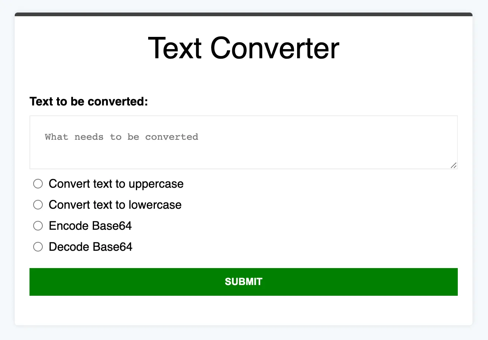

# How to build a Text Converter? | Frontend Coding Challenge | React.js | Beginner





### Demo
https://ik.imagekit.io/devtoolstech/question-images/text-converter-demo_aPlRxVCVC.mp4?ik-sdk-version=javascript-1.4.3&updatedAt=1652094380772

```jsx
import { useState } from "react"

export default function App() {
  const [textAreaData, setTextAreaData] = useState("")
  const [selectedOption, setSelectedOption] = useState(null);
  const [convertedText, setConvertedText] = useState("");
  const [showResult, setShowResult] = useState(false);
  // const options = [{ 1: "Convert text to uppercase" }, { 2: "Convert text to lowercase" }, { 3: "Encode Base64" }, { 4: "Decode Base64" }];
  const options = ["Convert text to uppercase", "Convert text to lowercase", "Encode Base64", "Decode Base64"];


  const handleChangeOption = (value) => {
    console.log(value);
    setSelectedOption(value);
  };


  const handleSubmit = (e) => {
    e.preventDefault();

    console.log({ textAreaData, selectedOption, convertedText, showResult })

    if (selectedOption === null || textAreaData.trim() === "") {
      alert("Please enter text and select an option")
    }

    let result = "";

    switch (selectedOption) {
      case 0:
        result = textAreaData.toUpperCase();
        break;
      case 1:
        result = textAreaData.toLowerCase();
        break;
      case 2:
        result = btoa(textAreaData);
        break;
      case 3:
        try {
          result = atob(textAreaData);
        } catch {
          result = "Invalid Base64 string";
        }
        break;

      default:
        result = textAreaData;
    }

    setConvertedText(result);
    setShowResult(true);

  }

  const handleConvertMore = () => {
    setShowResult(false);
    setTextAreaData("");
    setSelectedOption(null);
    setConvertedText("");
  };

  // ------------ RESULT SCREEN ------------
  if (showResult) {
    return (
      <main style={{ padding: "40px" }}>
        <h1>Text Converter</h1>
        <h3>Converted text is:</h3>

        <div
          style={{
            background: "#e5e5e5",
            padding: "20px",
            borderRadius: "8px",
            marginBottom: "20px",
            fontSize: "18px",
            wordBreak: "break-word",
          }}
        >
          {convertedText}
        </div>

        <button onClick={() => setShowResult(false)} style={{ marginRight: "20px" }}>
          Edit
        </button>

        <button onClick={handleConvertMore}>
          Convert more
        </button>
      </main>
    );
  }


  // console.log({ textAreaData, selectedOption })
  // console.log("options", options)
  return (
    <main style={{ padding: "40px" }}>
      <h1>Text Converter</h1>

      <h3>Text to be converted</h3>

      <form onSubmit={handleSubmit}>

        <textarea rows="6" cols="50" placeholder="What needs to be converted" value={textAreaData} onChange={(e) => setTextAreaData(e.target.value)} style={{ marginBottom: "20px", padding: "10px" }} />

        <div>
          {options.map((option, index) => (
            <label key={index}
              style={{ display: "block", marginBottom: "10px" }}
            >
              <input type="radio" name="level" checked={selectedOption === index} onChange={() => handleChangeOption(index)} />
              {" "}
              {option}
            </label>
          ))}
        </div>

        <button type="submit" style={{
          marginTop: "20px",
          background: "green",
          color: "White",
          padding: "14px 40px",
          fontSize: "18px",
          border: "none",
          cursor: "pointer"

        }}>
          SUBMIT
        </button>


      </form>


    </main>
  );
}

```